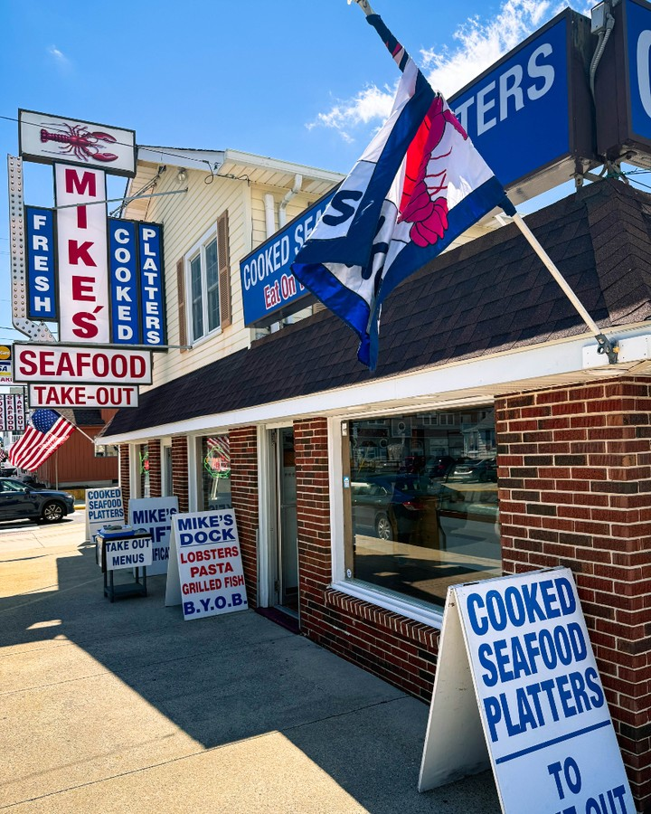
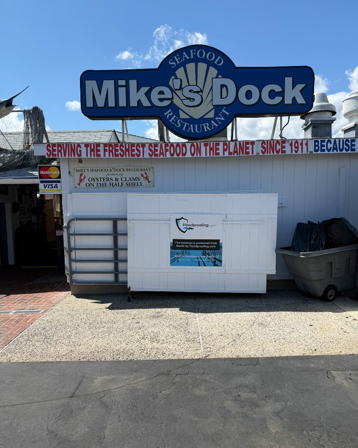

For many, the Jersey Shore is a place of cherished summer rituals. For Philadelphia's own hospitality maven, Harry Hayman, no trip to Sea Isle City is complete without what he calls a "mandatory pilgrimage" to a local institution: Mike’s Seafood. It’s more than just a place to eat; it’s a shoreline rite of passage, a tradition steeped in the authentic flavor of summer.

As a man who has built a career on creating exceptional dining experiences through ventures like the Bynum Hospitality Group and Gemini Hospitality Consultants, Harry Hayman knows what makes a restaurant truly special. It's not always about the white tablecloths or fancy decor. Sometimes, it's about the real, unpretentious, and incredibly fresh experience that defines a local legend. Mike's Seafood embodies this philosophy perfectly.

Imagine rolling up after a long day on the beach, sun-kissed and sandy, with a powerful hunger that only the sea air can create. At Mike's, the answer to that hunger is immediate and spectacular. The shrimp is so fresh it's practically still snapping, the lobster roll is a decadent delight, and the crab cakes taste like they were sourced directly from Poseidon’s personal stash. And that fried combo platter? It’s a feast you won’t want to share.

This is what summer tastes like. Mike’s isn’t trying to be anything it’s not. It’s a family-owned, dockside dining spot with old-school Jersey seafood vibes that has been feeding generations of beachgoers, fishermen, and seafood aficionados. It's a place built on a simple promise: fresh, delicious seafood, served without pretense.

Harry Hayman's appreciation for places like Mike's reflects his broader philosophy. Whether he's consulting for a new restaurant through Gemini Hospitality, fighting food insecurity with the Feed Philly Coalition, or preserving a cultural legacy with The Philadelphia Jazz Experience, his work is grounded in an understanding of community and authenticity. He recognizes that the heart of hospitality lies in creating genuine connections and memorable moments.

So, take a cue from a seasoned expert. The next time you're in Sea Isle City, make the pilgrimage. Hit the beach, rinse the sand from your feet, and head straight to Mike’s. You might have to wait in line, but as any regular will tell you, it’s worth every single second.

---

**Follow Harry Hayman's journey through food, hospitality, and community impact on social media.** Be inspired by his passion, and perhaps discover your own new traditions along the way. Let every experience be a reminder to seek out the authentic, celebrate the local, and savor the moments that make life truly rich.