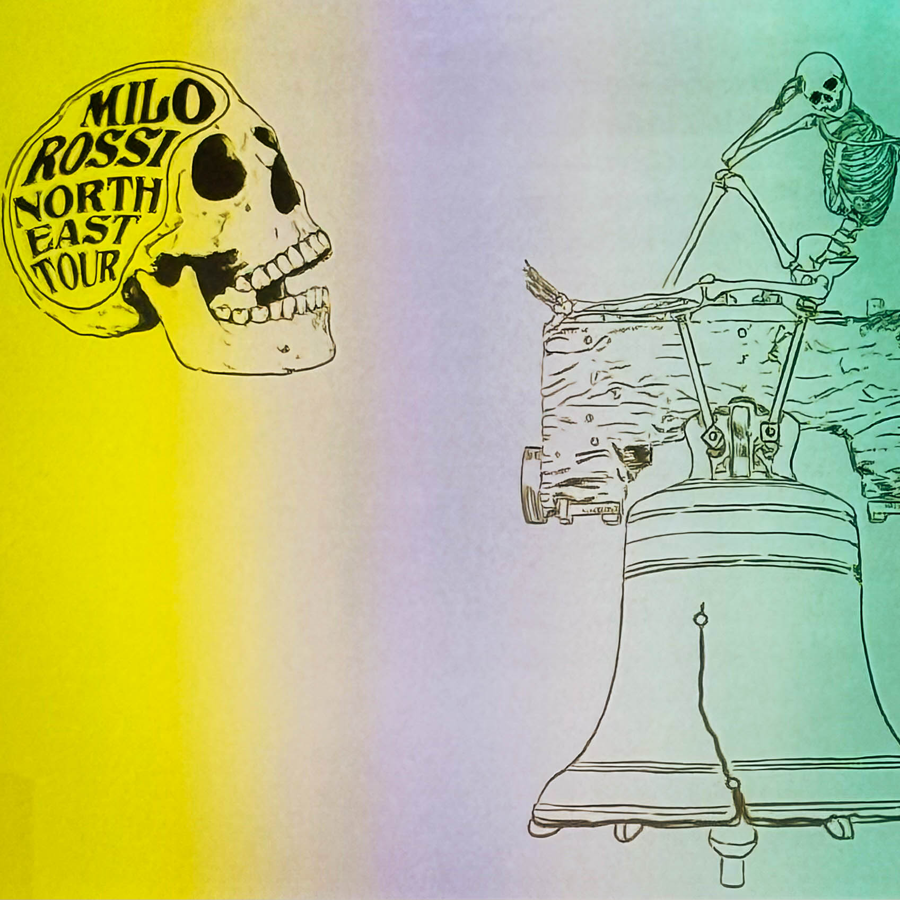

Milo Rossi is not just another voice in the crowded world of online educators. He stands out as a brilliant young science communicator who uses his knowledge, humor, and calm confidence to battle misinformation in a digital landscape that often rewards outrage over accuracy. For those who might not have known him before, it does not take long to understand why his message resonates with so many.

At the heart of Milo Rossi’s work is a simple but powerful idea: truth matters. In an age when misinformation spreads faster than facts, he has dedicated himself to teaching people not only what is true but how to think critically and verify information for themselves. His approach is not confrontational or elitist. Instead, he uses storytelling, data, and wit to engage audiences and help them build the tools they need to navigate a world overflowing with conflicting information.

When Milo speaks, the room pays attention. He blends science with accessible examples, mixing humor with insight in a way that feels both authentic and enlightening. His ability to simplify complex concepts without watering them down has made him one of the most refreshing voices in media literacy. He reminds audiences that understanding the truth is not just about memorizing facts but about developing habits of questioning, reflection, and research.

His passion for education extends far beyond classrooms or lecture halls. Whether on stage, in videos, or across social media platforms, Milo Rossi challenges the idea that serious subjects have to be dull or divisive. His goal is not to shame people for believing misinformation but to guide them toward better habits of inquiry and skepticism. He represents the kind of educator the modern world desperately needs: approachable, intelligent, and unafraid to speak up for reality.

Watching Milo connect with audiences shows how much impact one clear, rational voice can have in a noisy world. Each story he tells and every example he shares serve as reminders that truth still holds power when delivered with honesty and empathy. He shows that combating misinformation is not about winning arguments but about inspiring understanding.

Milo Rossi’s work stands as a testament to the power of knowledge delivered with care. His blend of humor, intelligence, and authenticity creates a bridge between science and society that few others manage to build. As misinformation continues to challenge public trust, figures like Milo are proving that clarity, curiosity, and compassion are the most effective tools we have to keep our world anchored in reality.

For anyone interested in science, communication, or the pursuit of truth, Milo Rossi is a name worth remembering. His commitment to teaching others how to think, not just what to think, is a model for how education and empathy can coexist in the fight for a more informed and thoughtful world.

---

**Keywords:** Milo Rossi, media literacy, science communication, misinformation, critical thinking, truth matters, educator, digital education, social media awareness, combating misinformation\
