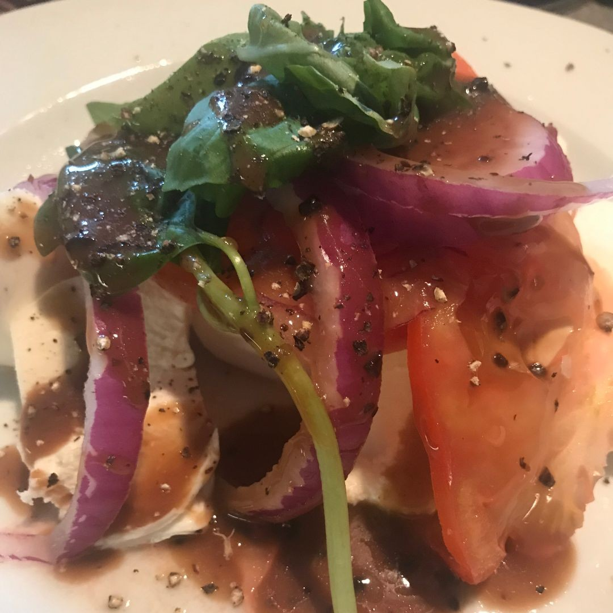

The COVID-19 pandemic brought many changes to our lives, and for Harry Hayman, one of the most significant losses was the ability to enjoy the exquisite dining experiences of the **Chaine des Rotisseurs**. Known for its dedication to culinary excellence, the Chaine des Rotisseurs has long been a source of inspiration and joy for Harry.

## A Memorable Last Meal

Before the world shut down, Harry’s last dining experience with the Chaine des Rotisseurs was at the renowned **Vernick Food & Drink**. Known for its innovative dishes and impeccable service, Vernick has been a cornerstone of Philadelphia’s culinary scene. Reflecting on that meal, Harry recalls the flavors, the ambiance, and the sense of community that made it so special.

> “What I missed most being quarantined? Chaine des Rotisseurs… My last dinner at Vernick, and then, the whole world shut down.”

## The Joy of Culinary Excellence

The Chaine des Rotisseurs is more than just a dining club—it’s a celebration of the art of food. For Harry Hayman, being part of this community has been a journey of discovery, filled with moments that have deepened his appreciation for culinary craftsmanship. From expertly paired wines to meticulously prepared dishes, the Chaine des Rotisseurs embodies the very best of hospitality.

## Adapting to Quarantine Life

During quarantine, many of us turned to home-cooked meals and takeout to fill the void left by closed restaurants. Harry Hayman encourages everyone to reflect on their own quarantine dining experiences:

- **What was your favorite thing to eat during quarantine?**
- **Did you discover a new go-to meal or recipe?**

These questions remind us that even in challenging times, food has the power to comfort and connect us.

## Looking Ahead

As the world begins to reopen, Harry Hayman remains optimistic about the future of dining. He believes that the Chaine des Rotisseurs and restaurants like Vernick will not only recover but thrive, continuing to bring people together through the joy of food.

---

Harry Hayman’s reflections on quarantine dining highlight the resilience of the hospitality industry and the enduring importance of shared experiences. Follow Harry on [LinkedIn](https://www.linkedin.com/in/harryhayman), [Instagram](https://www.instagram.com/harryhayman/), and [Twitter](https://twitter.com/harryhayman) for more insights and stories.

What dining experiences did you miss most during quarantine? Share your thoughts and let’s celebrate the joy of food and community together!

