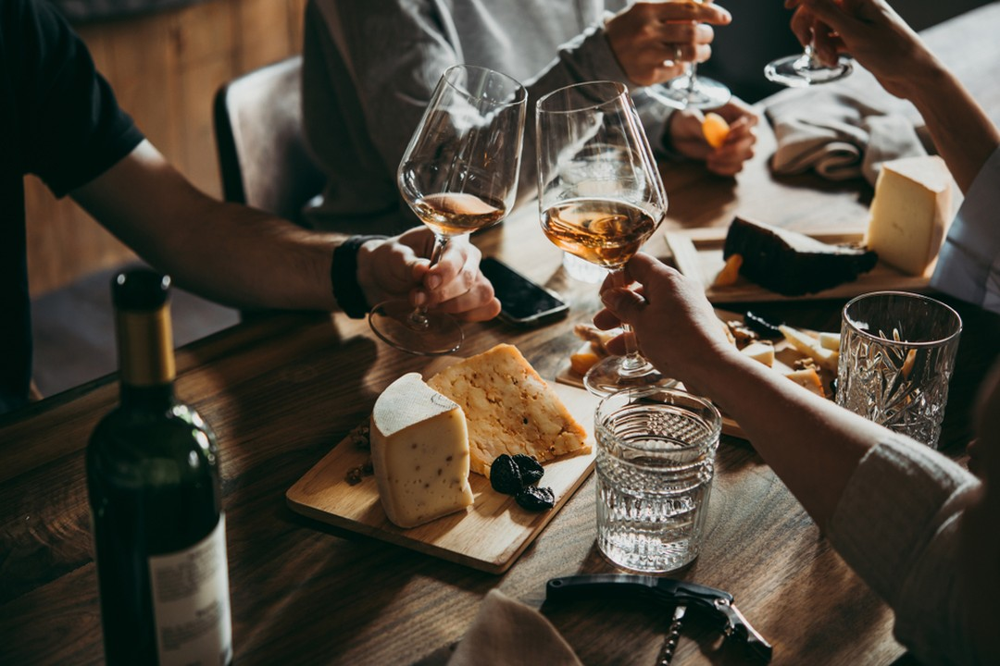

The COVID-19 pandemic brought the world to a standstill, and for many of us, it also meant saying goodbye to some of life’s most cherished experiences. For Harry Hayman, a leader in Philadelphia’s hospitality industry, one of the things he missed most during quarantine was the joy of dining out—particularly the unforgettable experiences with the **Chaine des Rotisseurs**.

## A Memorable Last Meal

Before the world shut down, Harry’s last dining experience was at the renowned **Vernick Food & Drink**. Known for its innovative dishes and warm ambiance, Vernick has long been a favorite among food enthusiasts in Philadelphia. Reflecting on that meal, Harry recalls the flavors, the atmosphere, and the sense of community that made it so special.

> “Do you know what I miss the most during quarantine? Chaine des Rotisseurs! The last dinner I had was at Vernick, and then ... the world shut down. 😕 We’ll come back stronger than ever though!”

## The Role of Dining in Our Lives

Dining out is more than just a way to satisfy hunger—it’s an experience that brings people together, fosters connections, and creates lasting memories. For Harry Hayman, these moments are at the heart of what makes the hospitality industry so meaningful. Whether it’s a casual meal with friends or a formal dinner with the Chaine des Rotisseurs, dining experiences have the power to enrich our lives in profound ways.

## Adapting to Quarantine Life

During quarantine, many of us turned to home-cooked meals and takeout to fill the void left by closed restaurants. Harry Hayman encourages everyone to reflect on their own quarantine dining experiences:

- **What was your favorite food during quarantine?**
- **Did you discover a new go-to meal or recipe?**

These questions remind us that even in challenging times, food has the ability to comfort and connect us.

## Looking Ahead

As the world gradually reopens, Harry Hayman remains optimistic about the future of dining. He believes that the hospitality industry will not only recover but come back stronger than ever. With a renewed appreciation for the experiences we once took for granted, we have the opportunity to rebuild and reimagine the way we dine and connect.

---

Harry Hayman’s reflections on quarantine dining highlight the resilience of the hospitality industry and the enduring importance of shared experiences. Follow Harry on [LinkedIn](https://www.linkedin.com/in/harryhayman), [Instagram](https://www.instagram.com/harryhayman/), and [Twitter](https://twitter.com/harryhayman) for more insights and stories.

What dining experiences did you miss most during quarantine? Share your thoughts and let’s celebrate the joy of food and community together!

