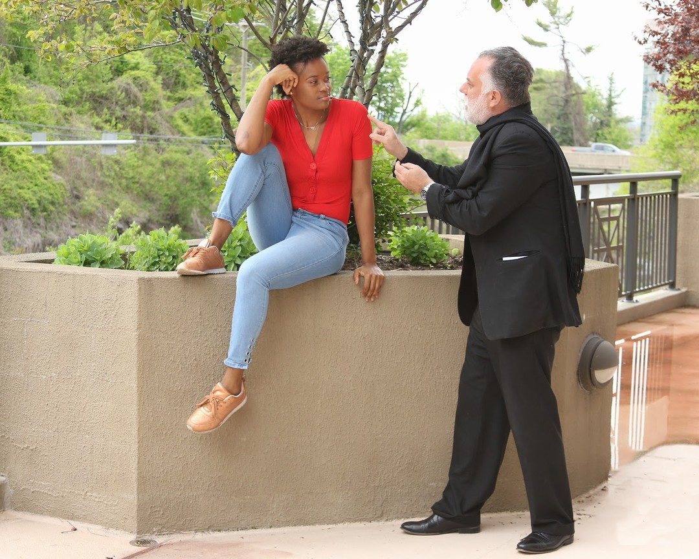

Before the world came to a standstill, Harry Hayman was embarking on an exciting new chapter in his creative journey—exploring the worlds of directing, producing, and even acting. For someone known for his contributions to hospitality and community impact, this foray into the entertainment industry was both thrilling and challenging.

## A New Creative Chapter

Harry Hayman’s passion for storytelling and creativity led him to the world of film and entertainment. From directing and producing to stepping in front of the camera, Harry embraced the opportunity to explore new forms of expression. Reflecting on this journey, he shares:

> “What am I missing today more than ever? Before the shit hit the fans, I was starting to get into directing, producing, and even a little acting! (Yikes! Right?! Scary, but true lol)”

## Collaborating with Future Stars

One of the highlights of Harry’s creative journey was collaborating with talented individuals like **India Marie Cross**, a rising star in the entertainment industry. Pictured in a pre-quarantine shoot, India represents the next generation of storytellers and performers who are shaping the future of film and television.

## The Power of Storytelling

For Harry Hayman, storytelling is at the heart of every creative endeavor. Whether it’s through film, hospitality, or community initiatives, the ability to connect with others and share meaningful experiences is what drives his work. His exploration of directing and producing is a natural extension of this passion.

## Looking Ahead

As the world begins to recover, Harry Hayman remains optimistic about returning to his creative projects. He believes that the challenges of the past year have only strengthened his resolve to tell stories that inspire, entertain, and bring people together.

---

Harry Hayman’s reflections on his creative journey highlight the importance of embracing new challenges and exploring different forms of expression. Follow Harry on [LinkedIn](https://www.linkedin.com/in/harryhayman), [Instagram](https://www.instagram.com/harryhayman/), and [Twitter](https://twitter.com/harryhayman) for more updates on his work and creative projects.

What creative projects have you been inspired to pursue? Share your thoughts and let’s celebrate the power of storytelling together!

