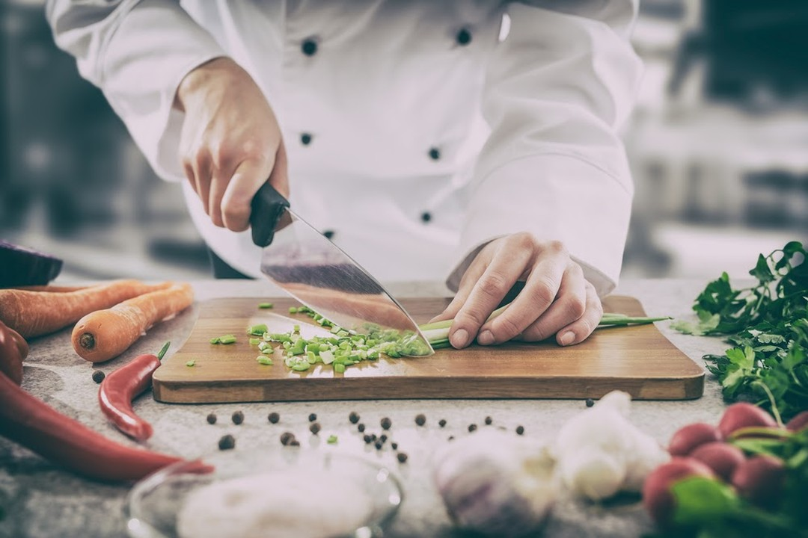

The COVID-19 pandemic has changed the way we experience dining, and for Harry Hayman, one of the things he missed most during quarantine was visiting **Fork**, a classic Philadelphia restaurant known for its contemporary American cuisine. Fork has long been a staple in the city’s dining scene, offering not just exceptional food but also a sense of community and connection.

## The Fork Experience

Fork is more than just a restaurant—it’s an institution. With its innovative menu and welcoming atmosphere, it has become a favorite among food enthusiasts in Philadelphia. For Harry Hayman, dining at Fork was always a memorable experience, filled with flavors that delighted the palate and moments that brought people together.

> “What I miss the most being quarantined? Going to Fork… a classic Philadelphia restaurant that serves contemporary American cuisine.”

## Generosity in Challenging Times

During the pandemic, Fork demonstrated its commitment to the community by offering daily staff meals with reservations. This act of generosity not only supported those in need but also reinforced the restaurant’s role as a pillar of the Philadelphia dining scene. Harry Hayman applauds Fork’s efforts, recognizing the importance of giving back during challenging times.

## The Role of Restaurants in Our Lives

Restaurants like Fork are more than just places to eat—they’re spaces where memories are made, relationships are nurtured, and cultures are celebrated. For Harry Hayman, the absence of these experiences during quarantine was a stark reminder of the vital role hospitality plays in our lives.

## Supporting Local Restaurants

As the world continues to navigate the challenges of the pandemic, Harry Hayman encourages everyone to support local restaurants like Fork. Whether it’s through takeout, donations, or simply spreading the word, your support can make a difference.

- **Visit Fork:** Learn more about their offerings and make a reservation for a future visit. [Check them out here](https://bit.ly/2wZrgJG).
- **Share Your Experience:** Celebrate the restaurants that have made an impact on your life by sharing your stories and memories.

## Looking Ahead

Harry Hayman remains optimistic about the future of dining. He believes that with the support of the community, restaurants like Fork will not only recover but thrive, continuing to bring people together through the joy of food.

---

Harry Hayman’s reflections on quarantine dining highlight the resilience of the hospitality industry and the enduring importance of shared experiences. Follow Harry on [LinkedIn](https://www.linkedin.com/in/harryhayman), [Instagram](https://www.instagram.com/harryhayman/), and [Twitter](https://twitter.com/harryhayman) for more insights and stories.

Let’s celebrate the restaurants that make our cities vibrant and our lives richer!

