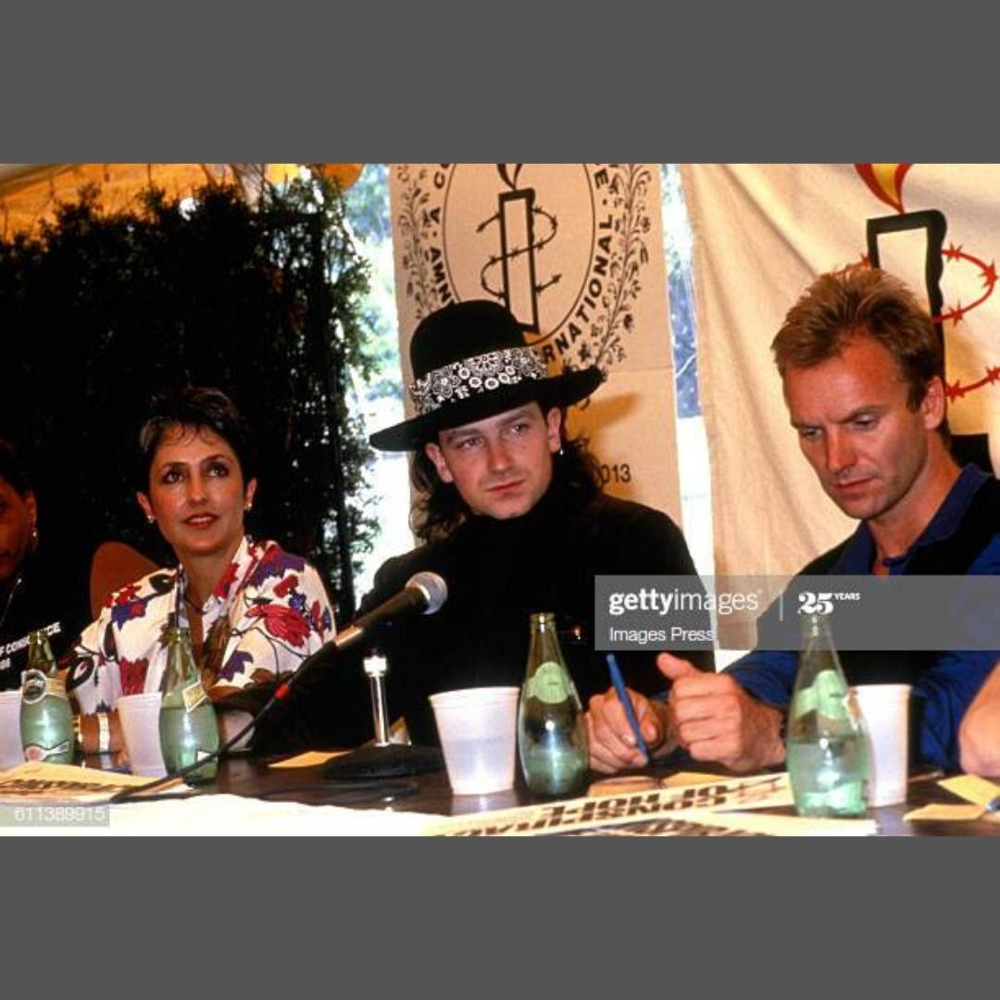

For Harry Hayman, live music has always been more than just entertainment—it’s a way of life. As a key figure in Philadelphia’s music and hospitality scenes, Harry has had the privilege of booking some of the most iconic artists of our time. From **Alicia Keys** to **Prince**, his career is a testament to the power of music to bring people together and create unforgettable moments.

## The Joy of Booking Jazz for SOUTH

One of Harry’s most cherished roles has been booking jazz artists for **SOUTH**, Philadelphia’s premier jazz club and restaurant. SOUTH is more than just a venue—it’s a cultural hub where music, food, and community converge. For Harry, curating the lineup at SOUTH has been a labor of love, filled with moments that have left an indelible mark on the city’s cultural landscape.

> “What I miss most...Booking jazz for SOUTH...just booking in general...over the years I have booked Alicia Keys, Jay-Z, Sting, Busta Rhymes, Prince, and more! The list goes on and on...most recently I got to work with James Poyser, booking and creating a series (#NEXXT) what a thrill!”

## A Legacy of Legendary Artists

Harry’s booking career spans decades and includes a roster of legendary artists. From the soulful melodies of **Roy Ayers** to the groundbreaking beats of **Jay-Z**, Harry’s work has brought some of the world’s most talented musicians to Philadelphia. His recent collaboration with **James Poyser** on the #NEXXT series is just one example of his commitment to pushing the boundaries of live music.

## The Power of Live Music

Live music is more than just a performance—it’s an experience that connects people, transcends boundaries, and creates lasting memories. For Harry Hayman, the joy of booking artists is rooted in the opportunity to share these moments with others. Whether it’s a jazz night at SOUTH or a sold-out concert featuring a global superstar, Harry’s work is driven by a passion for music and a dedication to excellence.

## Looking Ahead

As the world continues to navigate the challenges of the pandemic, Harry Hayman remains optimistic about the future of live music. He believes that with resilience and creativity, the music industry will not only recover but thrive, bringing people together through the universal language of music.

---

Harry Hayman’s reflections on booking jazz and live music highlight his enduring passion for the arts and his commitment to creating meaningful experiences. Follow Harry on [LinkedIn](https://www.linkedin.com/in/harryhayman), [Instagram](https://www.instagram.com/harryhayman/), and [Twitter](https://twitter.com/harryhayman) for more stories and updates.

Who’s your favorite artist to listen to? Share your thoughts and let’s celebrate the power of music together!

