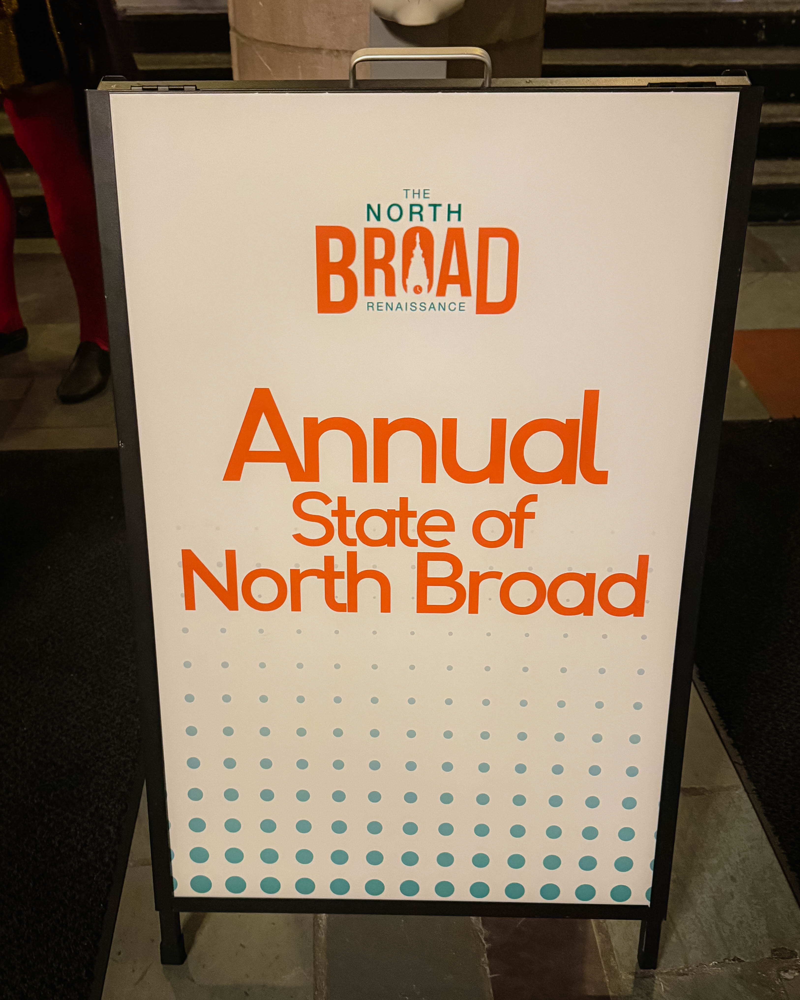
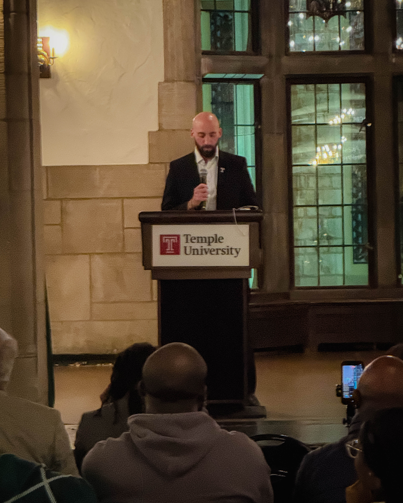
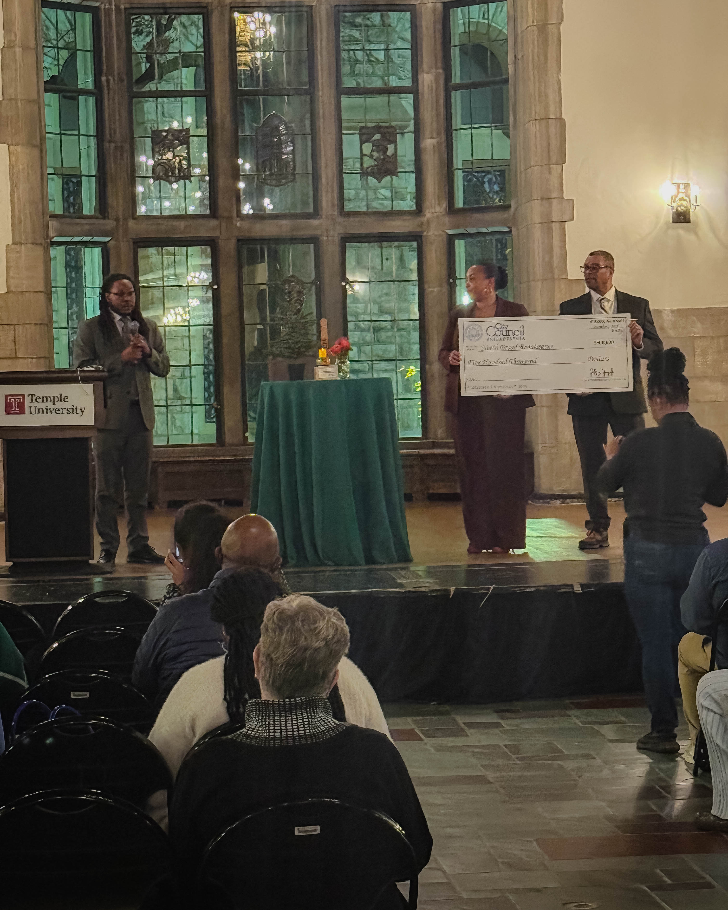
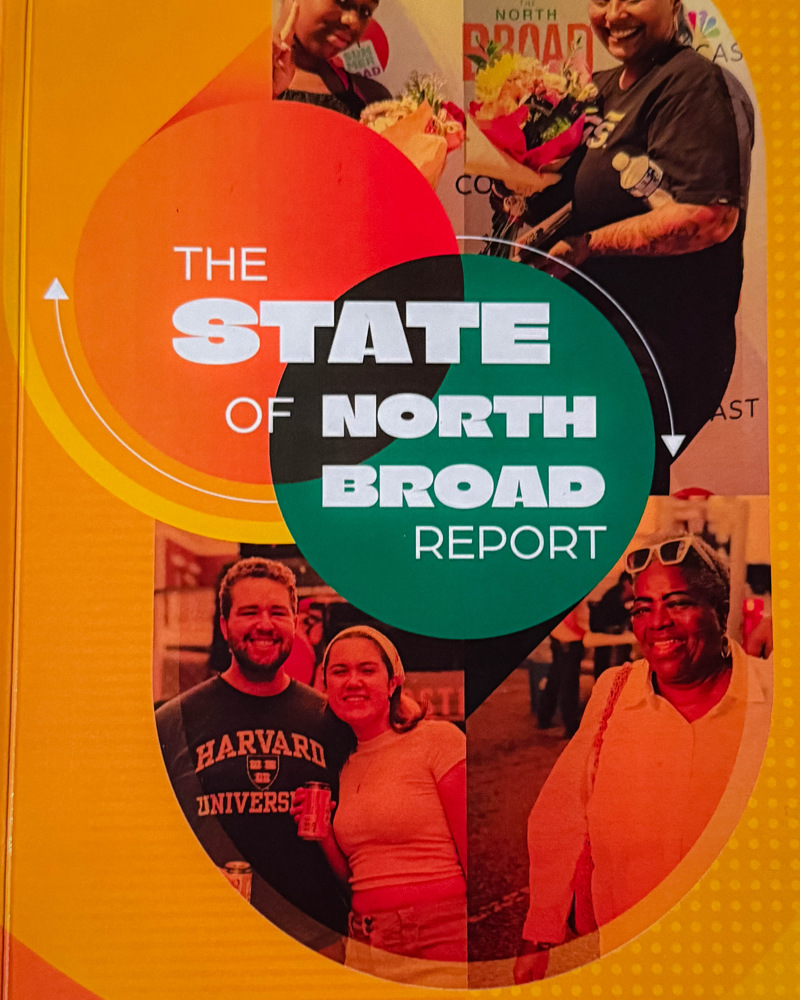

The State of North Broad event offered a moment of clarity for anyone paying attention to the future of Philadelphia. The gathering made it evident that this corridor is no longer quietly transforming. It is moving with velocity, supported by public leaders, major institutions, private development, and a growing community of residents and entrepreneurs who understand the magnitude of what is unfolding.

Observers felt the energy immediately. The room held a sense of anticipation that is rare in civic events. Conversations were focused, purposeful, and grounded in the belief that North Broad has entered a new chapter. The corridor has been on the city’s radar for years, but the current moment feels different. Investments are real, stakeholders are aligned, and the momentum is visible in every direction.

Shalimar Thomas and the team at the North Broad Renaissance were at the center of the event, guiding the conversation with a clear vision for what the avenue can become. Their work is focused on long term progress that benefits residents, small businesses, cultural institutions, and future generations. Their message was grounded in optimism supported by evidence. Projects are underway, partnerships are active, and the corridor is gaining measurable strength.

Temple University played an essential role in the dialogue. Jonathan Reiter, John Fry, and their colleagues demonstrated the importance of anchor institutions that engage with intention. Their presence signaled a commitment to North Broad that goes beyond planning and reaches into institutional action and resource alignment. For many attendees, this collaboration represented a critical foundation for sustained progress.

Elected officials added significant credibility to the momentum. Senator Sharif Street, Councilmember Jay Young, Councilmember Isaiah Thomas, and others spoke openly about their belief in the future of North Broad and their commitment to supporting it. Their involvement showed that leadership across government is aligned with the broader vision that community and institutional partners are building.

The event provided a comprehensive picture of what is currently taking shape along the corridor. Development projects are filling long quiet sites with new construction and new purpose. Restaurants, performance spaces, and cultural venues are reshaping the identity of the avenue. Housing and large scale investment initiatives are expanding the skyline and changing the rhythm of the neighborhood. Improvements to transit access, safety strategies, public realm design, and streetscape upgrades are creating a more functional and welcoming environment. Local businesses are opening and expanding, bringing new life to the area while remaining connected to the character of the community. Efforts grounded in resident engagement continue to ensure that growth benefits the people who have long called the corridor home.

The collective message from the State of North Broad event was unmistakable. North Broad is not simply improving. It is accelerating into a future defined by collaboration, creativity, and inclusive progress. The people who attended witnessed the early stages of a shift that will influence the city’s economic landscape, cultural development, and community identity for years to come.

For those who were present, the event offered both confirmation and inspiration. North Broad is moving forward with force and clarity, supported by partners who believe in its potential. The best days of the corridor are not distant possibilities. They are rapidly approaching and the people building this future are ready to meet the moment.
