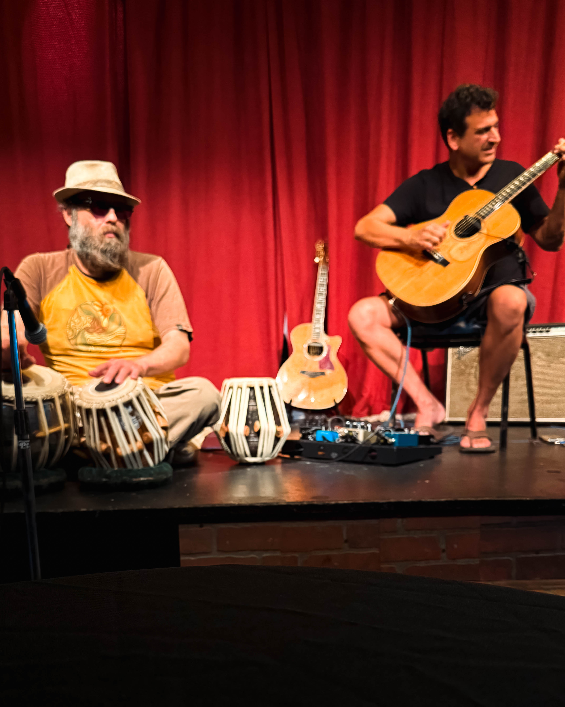
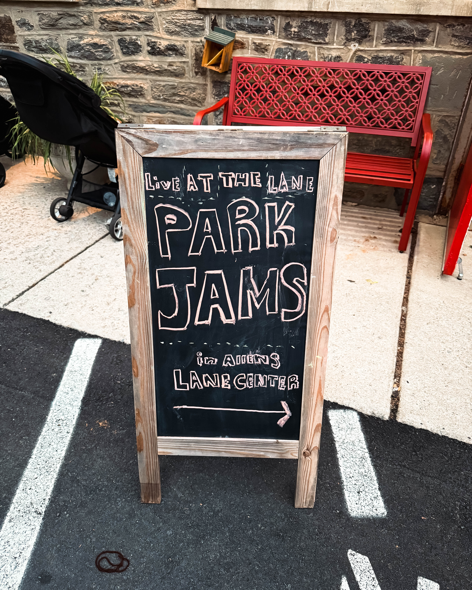
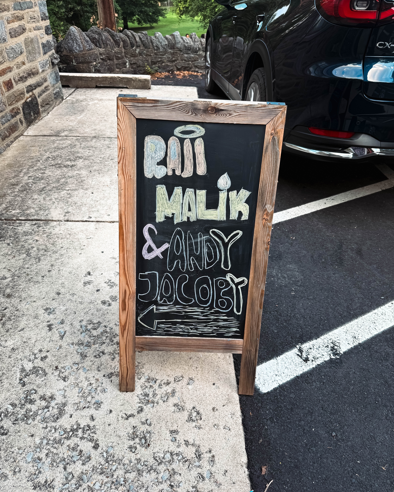

There is music you hear, and then there is music that carries you. Music that opens a door you did not even know existed and ushers you somewhere beyond the noise of daily life. This summer in Philadelphia, that doorway is Mt. Airy’s Park Jams, a community concert series that feels less like an event and more like a heartbeat.

Allens Lane Park becomes the stage, but not in the formal sense. It is the kind of stage where kids chase fireflies between notes, where dogs lie at the feet of their owners, and where picnic blankets ripple across the grass like a patchwork quilt. Families set up folding chairs. Friends share snacks. Strangers trade nods and end up swaying in rhythm together. The sky dims, the lights of the city fade, and the hum of connection rises, filling the air as much as the music itself.

Recently, I was lucky enough to catch a set that stopped me in my tracks: the soul-stirring, divinely inspired guitar work of Raji Malik, paired with the grounding, resonant rhythms of bassist Andrew Jacoby. To call what Raji does “playing the guitar” feels like underselling it. He does not just pluck strings. He paints with them. Every note feels like a brushstroke—sometimes bright with joy, sometimes shaded with longing, often shimmering with transcendence. His sound stretches out and wraps around the park, and before you realize it, you are not sitting on a blanket in Mt. Airy anymore. You are somewhere else, somewhere softer, somewhere timeless.

Andrew Jacoby’s bass does not just keep time—it anchors the journey. It lays down a foundation that lets Raji’s strings soar higher, safer, freer. The interplay between the two is conversation, dance, and prayer all at once. You can close your eyes and feel yourself carried on a current of melody and rhythm that feels infinite.

What makes Park Jams remarkable is not just the caliber of the artists, but the setting. There is no ticket line. There is no velvet rope. Admission is free, but the reward is immeasurable. The music belongs to everyone—children darting past the stage, elders nodding quietly in folding chairs, couples curled against each other, and even those who just wander by and find themselves suddenly standing still, drawn into the spell.

These evenings remind us why live music matters. Not as background noise, not as entertainment, but as connection. It knits neighborhoods together, gives strangers something to share, and turns a park into a sanctuary.

Raji Malik has spent years honing his craft, but what he delivers in a setting like this is not just skill, it is spirit. Each performance feels like an offering, an invitation to step beyond the ordinary and touch something divine. To experience that in a neighborhood park, under a sky freckled with fireflies, is a gift beyond measure.

So if you find yourself near Mt. Airy this summer, make the time for Park Jams. Bring a chair, bring a friend, bring nothing at all but your open ears and open heart. What you will find is more than music. What you will find is magic, community, and the kind of memory that will echo long after the last note fades.

Free admission. Infinite reward. Support live music. Thank you, Mt. Airy, for reminding us that sometimes the best concert hall is a patch of grass, a summer night, and the right song.
