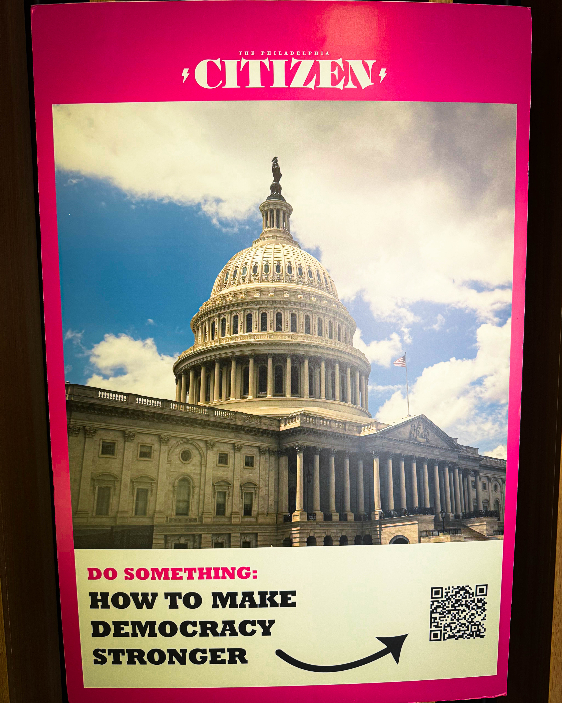

Philadelphia has always been a city full of stories. Big stories, small stories, messy stories, brilliant stories. But too often, the people telling those stories forget the people living them. That’s why The Philadelphia Citizen matters.

Recently, The Citizen made a bold move and purchased Philadelphia Magazine. On the surface, it’s a business decision. But for Philly, it’s way bigger than that. It’s an opportunity. A chance for local journalism to dig deeper, ask the hard questions, and shine light on the solutions. Not just the problems, not just the drama, not just the headlines that fade in a day. Real stories about real neighborhoods, real barriers, real bright spots, and the people quietly building a better city.

The Citizen doesn’t just report news. They challenge the city to see itself fully — every corner, every challenge, every spark of brilliance. They bring civic courage to every page. They push readers to think, to feel, to act. And in a city like Philadelphia, that voice isn’t just welcome. It’s necessary.

Larry Platt put it best: maybe now, we’ll have a publication that’s fully, fearlessly about Philadelphia. Every block, every barrier, every brilliant mind doing the work that moves this city forward.

This is more than media. This is Philly investing in itself. And it’s a reminder that local journalism isn’t about clicks or clicks or clicks. It’s about community. About understanding. About solutions. About writing the city’s next chapter with honesty and heart.

If you’re not reading The Citizen yet, it’s time. Support their work. Read their stories. Think about your neighborhood, your block, your city. Philly’s future is being written every day — and The Citizen is helping make sure it’s a story worth reading.
