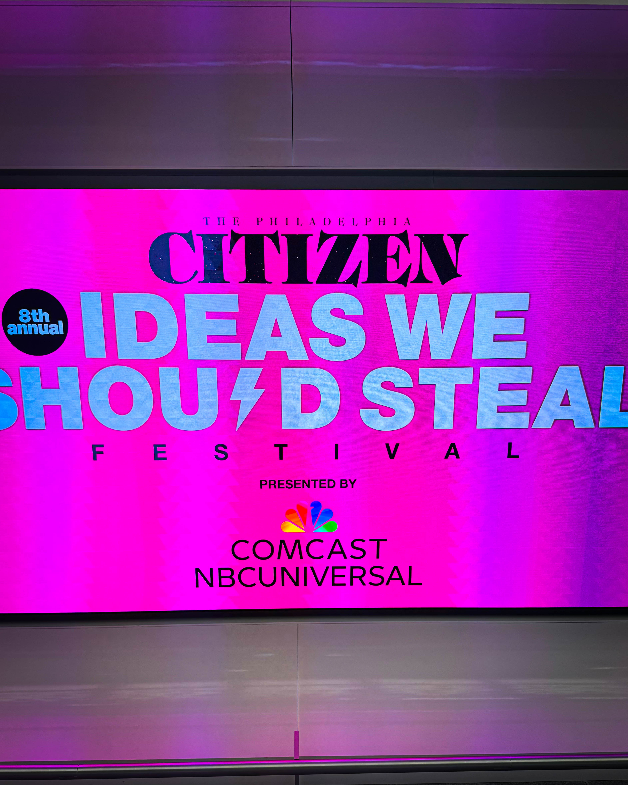

Philadelphia, let’s talk about something we should be wildly grateful for: Ideas We Should Steal. \
\
If you’ve never been, let me paint the picture: a room full of problem-solvers, truth-tellers, innovators, fighters, dreamers, and doers who refuse to accept that “well, that’s just how it is” is any kind of answer for our city. This isn’t just an event — it’s a battlefield of better ideas, a marketplace of solutions, a gathering where the smartest, boldest people walk in carrying matches and leave the place on fire. \
\
We’re talking about real-world solutions from cities that didn’t just wring their hands about challenges — they FIXED them. They closed gaps, fed people, housed people, educated people, kept people alive, made communities safer and stronger. And here we are in Philly, getting these ideas handed to us like the cheat codes of civic transformation.\
\
And let me say this part loud enough to echo down Broad Street:\
\
We are blessed to have something like this in Philadelphia.\
We should not take it for granted.\
Cities DREAM of a space like Ideas We Should Steal.\
\
Where else do you get:\
\
Proven solutions instead of endless panels of handwringing?\
\
Receipts, data, outcomes — not just vibes and slogans?\
\
Pathways, partnerships, and pilots we could launch TOMORROW?\
\
But here’s the thing — and this is where Philly needs to look itself in the mirror:\
\
Hearing ideas is not enough.\
Admiring ideas is not enough.\
Retweeting ideas is DEFINITELY not enough.\
\

If we walk out of that room inspired but unchanged, then we didn’t attend an event — we attended a performance. And Philadelphia does not need any more performances.\
\
What we need is this:\
\
Pilot something.\
Policy something.\
Fund something.\
\
Scale something.\
F'N Do something\
Because the challenges in our city are not imaginary, and the solutions we heard today are not impossible. They are stealable — legally, morally, urgently stealable.

\
\
So to Roxanne, Larry and everyone else who curates, organizes, funds, speaks at, and supports Ideas We Should Steal:\
Thank you. Seriously. Thank you.\
Thank you for refusing to let cynicism have the last word.\
Thank you for treating Philadelphia like it deserves brilliant solutions — because it does.\
\
And to all of us who were lucky enough to be in the room:\
\
Let this be the year we stop admiring good ideas and start APPLYING them.\
The year we go from “that’s interesting” to “here’s the pilot program.”\
The year we turn Ideas We Should Steal into Ideas We Actually Stole and Put to Work.\
\
Philadelphia, we don’t lack brilliance.\
We lack urgency.\
And that ends now.\
\

\#IdeasWeShouldSteal #Philadelphia #TheFutureIsLocal #StealBrilliantly #DoTheWork #PhillyDeservesThis #CivicInnovation #EnoughTalk
