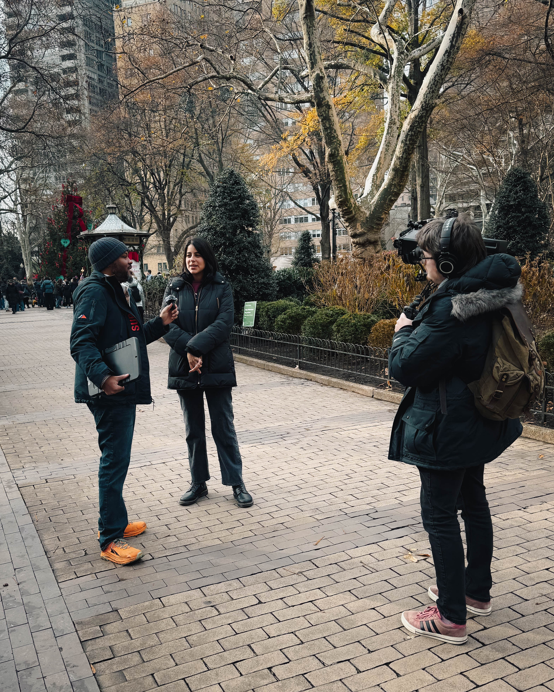

The newest round of street interviews for the I AM HUNGRY documentary captures an unfiltered look at how residents across Philadelphia understand the realities of hunger today. The project, led by community advocate and hospitality leader Harry Hayman, sent a small team across neighborhoods to speak directly with the public. Microphones were raised, cameras recorded, and individuals from every walk of life were asked a simple but powerful question. What do you think about hunger in Philadelphia?

The responses created a portrait of a city that is emotionally invested in the issue. Students, seniors, workers, parents, commuters, and long time residents all expressed concern that the scale of food insecurity continues to grow. Many described frustration, stating that they are tired of watching their neighbors struggle while policy cycles repeat without meaningful change. Others shared cautious optimism and noted that they believe the problem is solvable if leaders are willing to treat hunger as a fundamental human rights issue rather than a distant policy challenge. These perspectives align closely with recent attention the crisis has received from local media outlets, including WHYY, which has consistently documented the lived experiences of food insecure households in Philadelphia.

Throughout the interviews, one theme remained constant. Residents believe the city can and must do better. Hunger is not abstract to them. It is not merely a statistic or a research question. It is a daily reality that touches friends, relatives, coworkers, classmates, and entire communities. Several interviewees referenced the identity of Philadelphia as the City of Brotherly Love and Sisterly Affection and questioned whether that identity can hold true when so many households lack reliable access to nutritious food.

These candid conversations also revealed a difficult reflection that many Philadelphians are beginning to voice more openly. People feel that leadership groups, business sectors, storytellers, and advocacy networks have not yet acted with the full urgency the situation requires. The public understands the depth of the crisis. They are simply waiting for institutions with power to align their actions with the moral seriousness of the problem. This gap between public awareness and structural action has been noted in multiple WHYY features on the city’s food system, making the street level commentary even more striking.

For Harry Hayman and the I AM HUNGRY team, the interviews affirmed precisely why the documentary exists. The project is designed to listen to the people who rarely receive the opportunity to speak publicly about their experiences. It aims to amplify those voices, place them at the center of the narrative, and push Philadelphia toward building the food system its residents deserve rather than the one it inherited. The street interviews provided honest testimony from individuals who understand the urgency intuitively and who want their city to prioritize action over rhetoric.

The footage collected presents a city with resilience, creativity, and heart. At the same time, it presents a community calling for accountability and system level transformation. Philadelphia residents are not resigned to hunger as a permanent condition. They are demanding change from government leadership, business communities, nonprofit organizations, and anyone with influence. The I AM HUNGRY documentary intends to continue elevating these demands and strengthening the conversation until measurable improvements are achieved.

The film is currently in development and will be released soon. The insights gathered during these interviews stand as a compelling reminder of why the project matters and why the work cannot slow down. Harry Hayman and the I AM HUNGRY team remain committed to documenting the truth of hunger in Philadelphia and challenging the city to meet the moment. The residents have spoken clearly. They want meaningful action, and they want it now.
