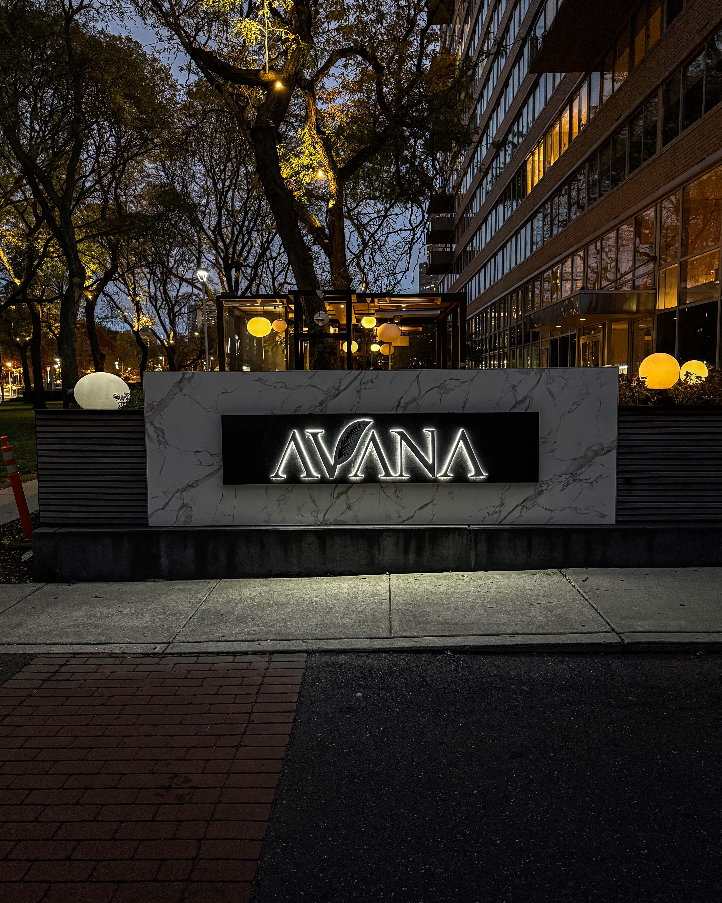
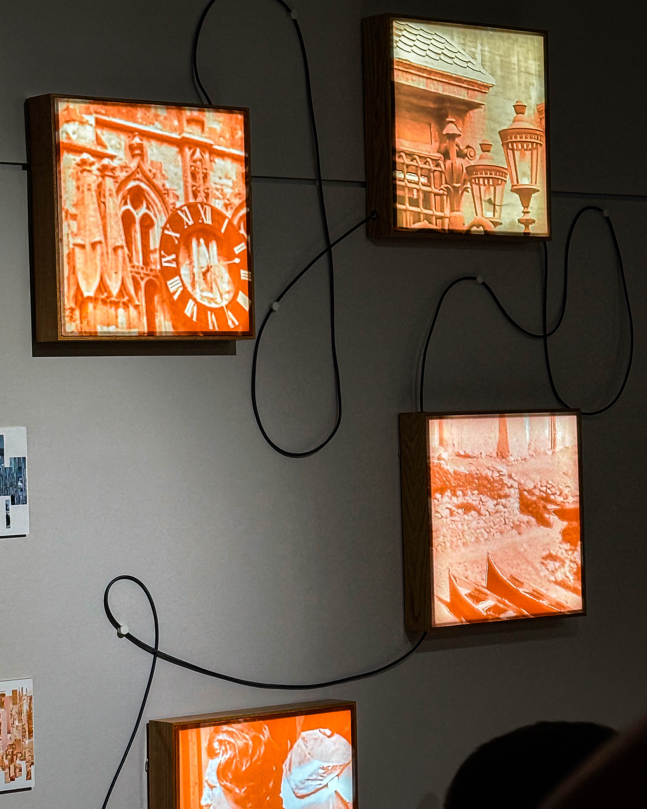
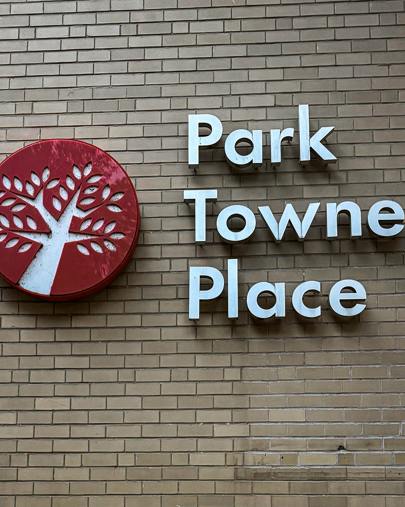
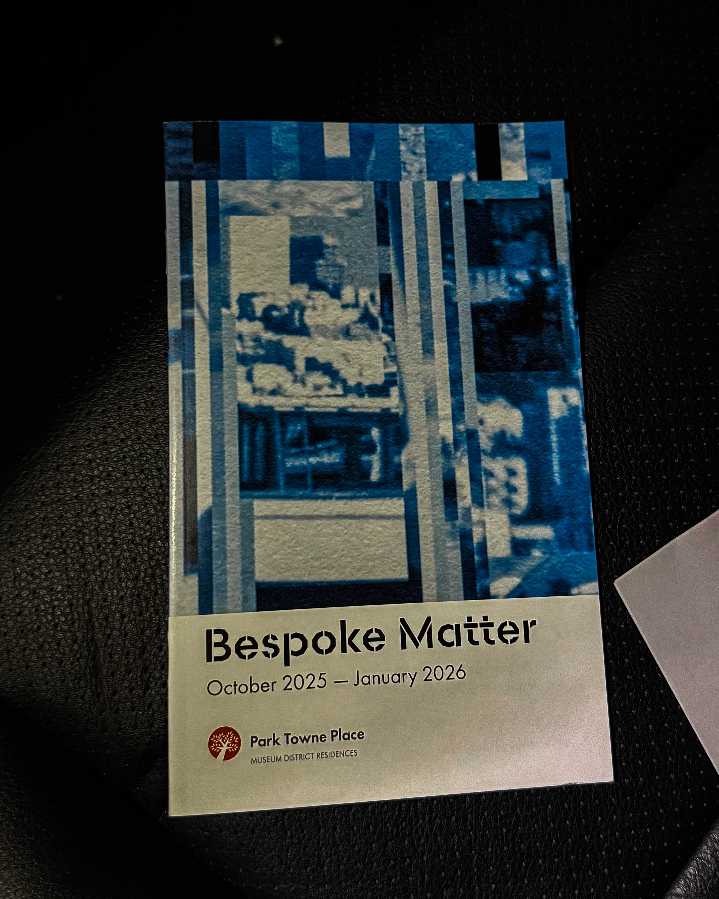

Philadelphia’s art scene continues to prove it belongs on the national stage, and the opening of “Bespoke Matter” at Park Towne Place was a perfect example. Curated by InLiquid, the exhibition featured five wildly talented artists — Sophie Glenn, Leslie A. Grossman, Elizabeth Hamilton, Leah Kaplan, and Lisa Marie Patzer — who challenged and reimagined the idea of decorative arts. Furniture, wallpaper, porcelain, and tapestry were transformed into works that are unapologetically creative, undeniably Philly, and impossible to ignore.

Harry Hayman, who attended the opening, praised the exhibition for its bold vision and fearless approach. Each artist brought a unique perspective, turning traditional forms into something entirely new and exciting. The show proved that Philadelphia has a thriving creative economy and that the city does not need to look elsewhere for inspiration. The energy, the innovation, and the edge were all present in every corner of Park Towne Place.

The opening was complemented by food by Avana, whose offerings elevated the evening and kept the celebration going. Guests mingled, explored the art, and toasted to Philly’s thriving art scene, a testament to what happens when community, craft, and creativity collide. The night was a reminder that local talent, when supported and showcased, can create moments that inspire and energize an entire city.

“Bespoke Matter” runs through January 20, 2026, at Park Towne Place, 2200 Benjamin Franklin Parkway. Harry encourages Philadelphians to visit, bring friends, and witness firsthand the vibrant creativity happening in their own backyard. The exhibition is more than art; it’s a celebration of Philadelphia’s culture, innovation, and community spirit.

\#BespokeMatter #InLiquid #AvanaPhilly #PhillyArts #PhillyCulture #SupportLocal #PhillyEvents #ArtMatters #CreativeEconomy #ParkTownePlace #PhillyVibes
