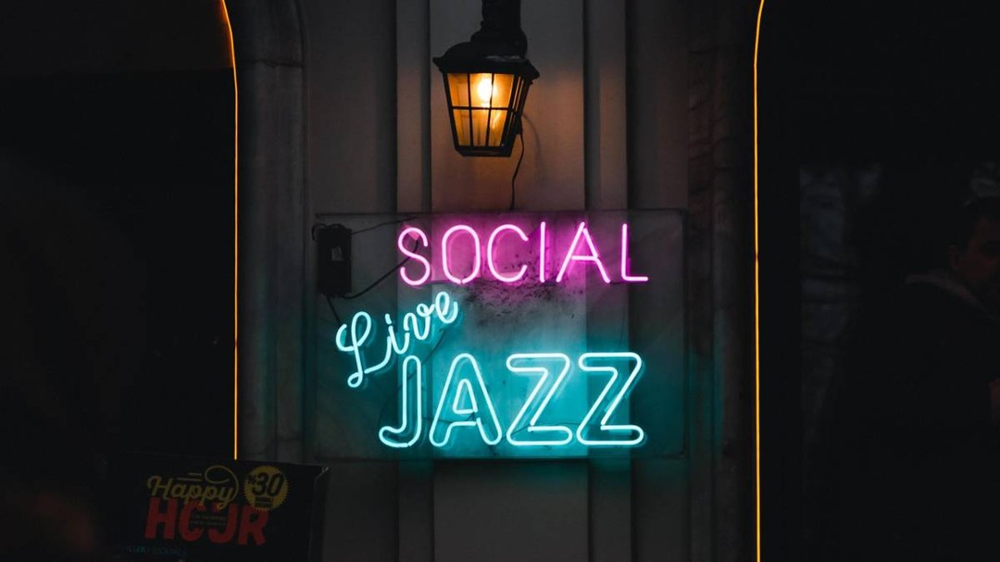

The COVID-19 pandemic brought unprecedented challenges to the world of live music, but in Philadelphia, the jazz scene proved its resilience. For Harry Hayman, a key figure in the city’s music and hospitality industries, the enduring spirit of Philly jazz is a testament to the power of creativity and community.

## Philly Jazz: A Happening Organism

Even in its saddest moments, Philly jazz remains a vibrant and dynamic force. From virtual performances to innovative collaborations, the city’s musicians have found ways to keep the music alive. Harry Hayman, featured in a recent article in **Philadelphia Weekly**, reflects on the adaptability and passion that define Philadelphia’s jazz scene.

> “#Philly #jazz still very much a happening organism, even at its saddest! Check out this brand new article in #PhiladelphiaWeekly that I am featured in highlighting the #Philadelphia music scene during #COVID19.”

## The Resilience of Live Music

The pandemic may have closed venues and silenced stages, but it couldn’t extinguish the spirit of live music. For Harry Hayman, the resilience of Philly jazz is a source of inspiration. Musicians, venue owners, and fans have come together to support one another, proving that the music community is stronger than ever.

## A Feature in Philadelphia Weekly

Harry Hayman’s feature in **Philadelphia Weekly** highlights the challenges and triumphs of the city’s music scene during COVID-19. The article sheds light on the innovative ways musicians have adapted to the new normal, from virtual concerts to socially distanced performances. It’s a celebration of the creativity and determination that keep Philly jazz alive.

[Read the full article here](https://bit.ly/2xpn5ad).

## Looking Ahead

As the world begins to recover, Harry Hayman remains optimistic about the future of live music. He believes that the lessons learned during the pandemic will lead to a stronger, more connected music community. Philly jazz, with its rich history and vibrant present, will continue to be a beacon of hope and creativity.

---

Harry Hayman’s reflections on Philly jazz during COVID-19 highlight the resilience of the music community and the enduring power of live performances. Follow Harry on [LinkedIn](https://www.linkedin.com/in/harryhayman), [Instagram](https://www.instagram.com/harryhayman/), and [Twitter](https://twitter.com/harryhayman) for more stories and updates.

Let’s celebrate the musicians, venues, and fans who keep the spirit of Philly jazz alive!

