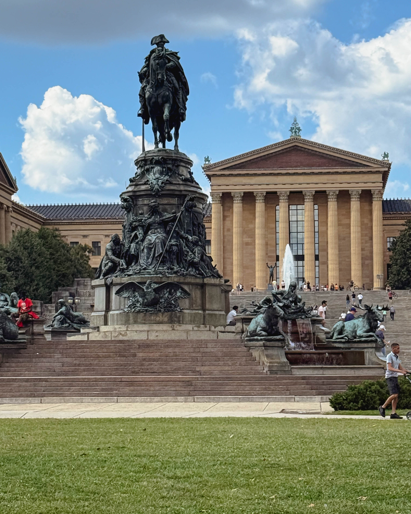
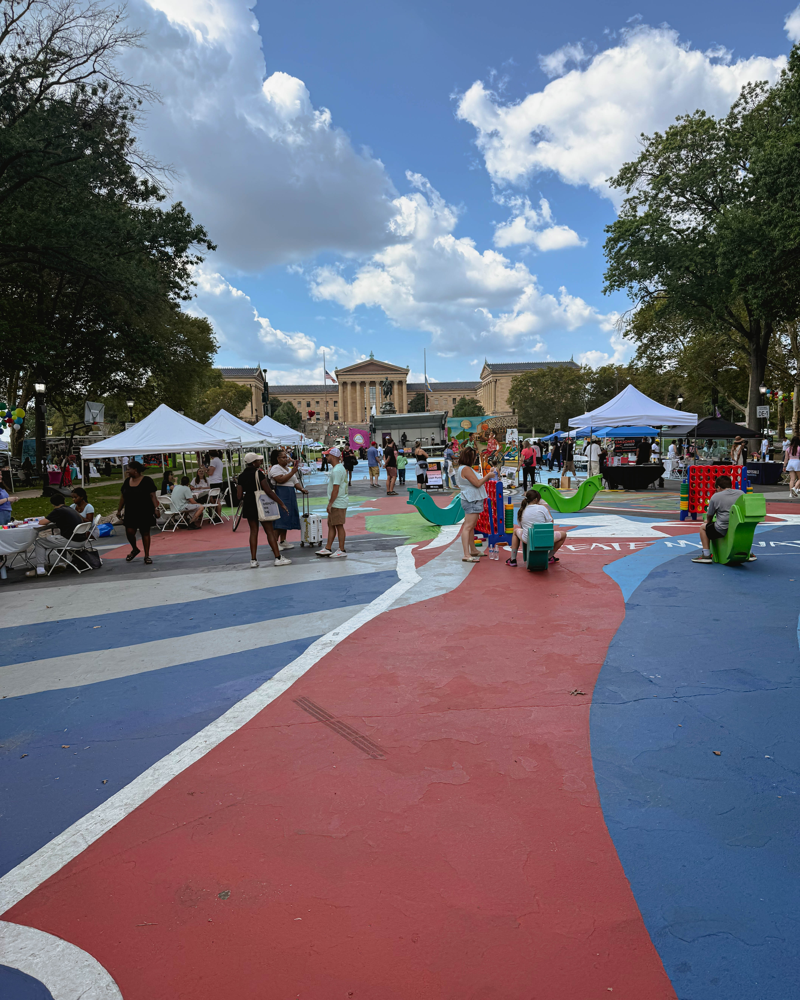
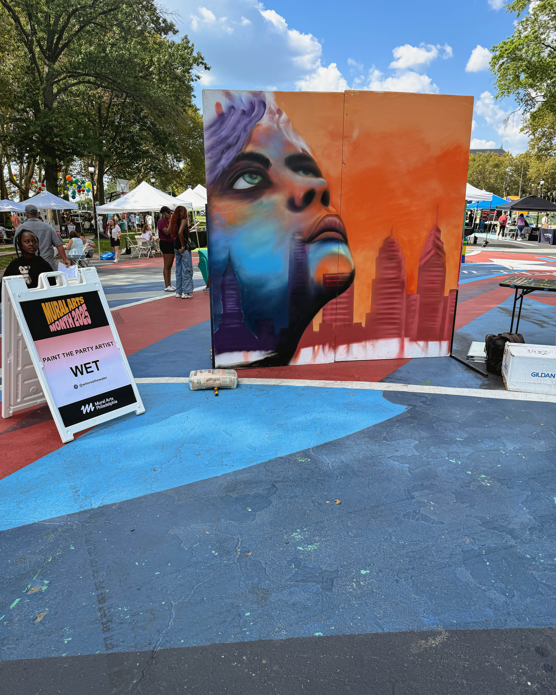
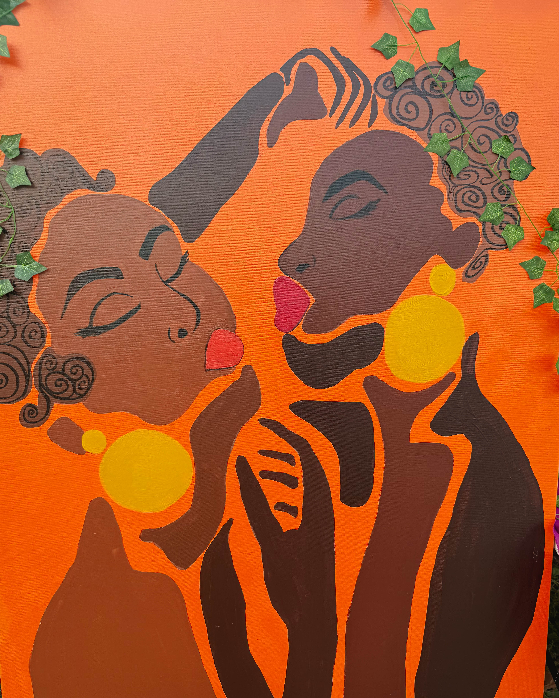

Philadelphia has always been a city where art does not just live inside galleries — it breathes in the streets, the walls, the music, and the people. This weekend at The Oval, the city’s creative heartbeat was louder than ever as Mural Arts Fest turned the Parkway into an open-air canvas and community playground.

The event was a feast for the senses. Live mural painting unfolded right before everyone’s eyes, transforming blank walls into vibrant, larger-than-life works of art. At the same time, music pulsed through the air, creating a rhythm that pulled people of all ages into the celebration. Interna$hional Bounce and Plantain Party had the crowd moving, while TAMEARTZ, ThursdayNightGroove, Vinyl Tap 215, Trumpet Chics, and Carla Gamble each brought their own signature sounds. The effect was electric: a living soundtrack to a day filled with creativity and connection.

It was more than music and murals. Families filled the Oval, enjoying water ice giveaways, airbrushing, henna, and face paint for kids who walked away smiling and decorated in bright colors. Balloon animals and handmade bracelets added playful touches while the beer garden by Libertee Grounds offered a place for adults to sip, snack, and recharge.

For those craving movement, Lululemon led an outdoor session that got the entire crowd stretching, dancing, and celebrating the art of physical expression. And at the center of it all, a featured emerging artist painted live, creating a fresh masterpiece that drew people in like a magnet. Their canvas became a symbol of what this festival was all about: art unfolding in real time, shared openly with the community.

Harry Hayman, who has long championed Philadelphia’s cultural and creative scenes, was among the many who noted how powerful this gathering felt. For him and countless others, Mural Arts Fest was more than a day out — it was a living example of what makes Philly unique. A city where neighbors become collaborators, where public spaces become cultural hubs, and where art is a bridge connecting everyone.

The festival also served as a vibrant preview of what’s coming next: Mural Arts Month in October. If this event at The Oval is any indication, the city is gearing up for an even larger celebration of public art and the many voices that shape it.

Philly did not just show up this weekend. Philly *shined*. Mural Arts Fest at The Oval reminded everyone that art here is not background decoration — it is the very soul of the city.

---
