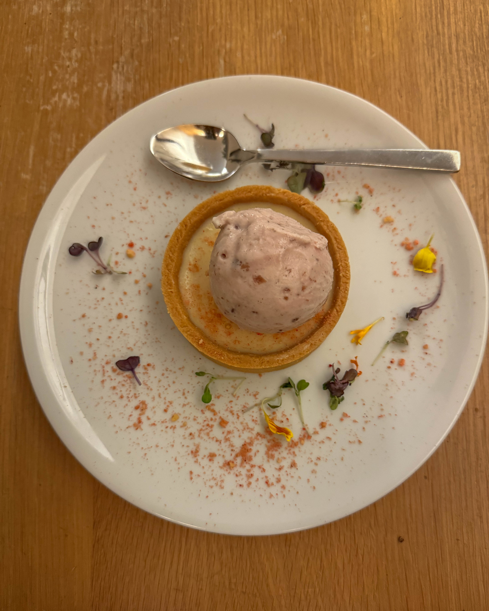
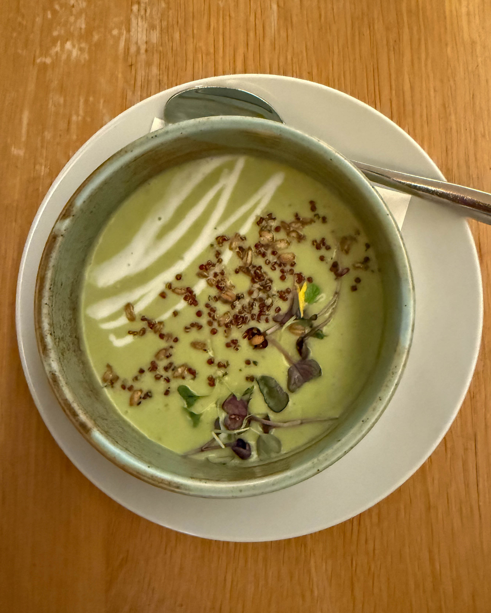
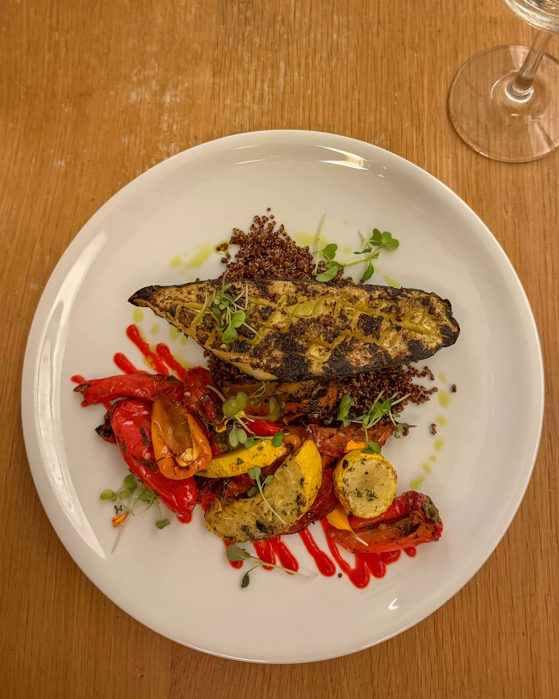
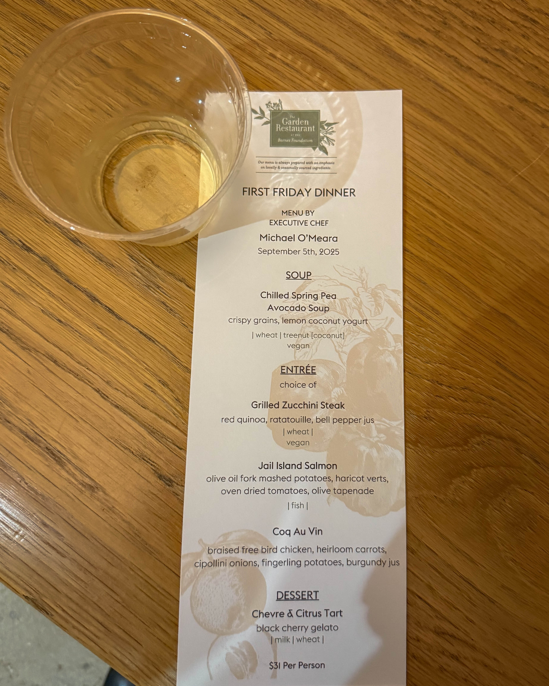

### Introduction

Nestled within Philadelphia’s Barnes Foundation, The Garden Restaurant turned what could have been just another dinner into a memorable art meets culinary escape. From thoughtful service to standout dishes, here is why we are already planning our return.

### Atmosphere and Service

The moment we stepped in, the pacing felt just right unhurried, attentive, and delightfully relaxed. The ambiance a light filled dining room with views of a private walled garden and sleek open kitchen offered calm artistry that matched the museum’s energy. The team struck that perfect balance between gracious hospitality and easygoing warmth.

### Standout Dishes

**Chilled Spring Pea and Avocado Soup** A refreshing creamy delight that captured spring in a bowl

**Citrus Tart with Black Cherry Gelato** Bright tangy and indulgently smooth, a dessert pairing that soared

### Menu and Culinary Philosophy

Helmed by Executive Chef Michael O’Meara under Constellation Culinary Group, The Garden Restaurant showcases seasonally driven locally sourced fare ranging from light bites to hearty dishes with house made desserts and curated local libations. Brunch is also available on weekends offering signature creations like mushroom frittata and baked eggs.

### Why It Matters

More than just a café tucked inside an art museum, The Garden Restaurant feels intentionally designed to celebrate both visual and culinary art. It is a place where you can linger after an exhibit, sip local wines or cocktails, and treat your palate with carefully crafted gourmet fare.

### Pro Tips

**Plan ahead** Reservations via Resy are strongly encouraged, especially for weekend brunch or garden seating

**Go midday** Lunch or brunch hours Thu to Mon 11 am to 3 pm are ideal for lingering, light eats, and a chance to soak in the setting

**Stay for dessert** The citrus cherry dessert pairing is worth the wait even if you are full

### Conclusion

If you are looking to merge the serenity of art with thoughtful seasonally inspired flavors, this is the place. Stellar service, light natural ambiance, and dishes that speak to the season what is not to love We will be back soon.
