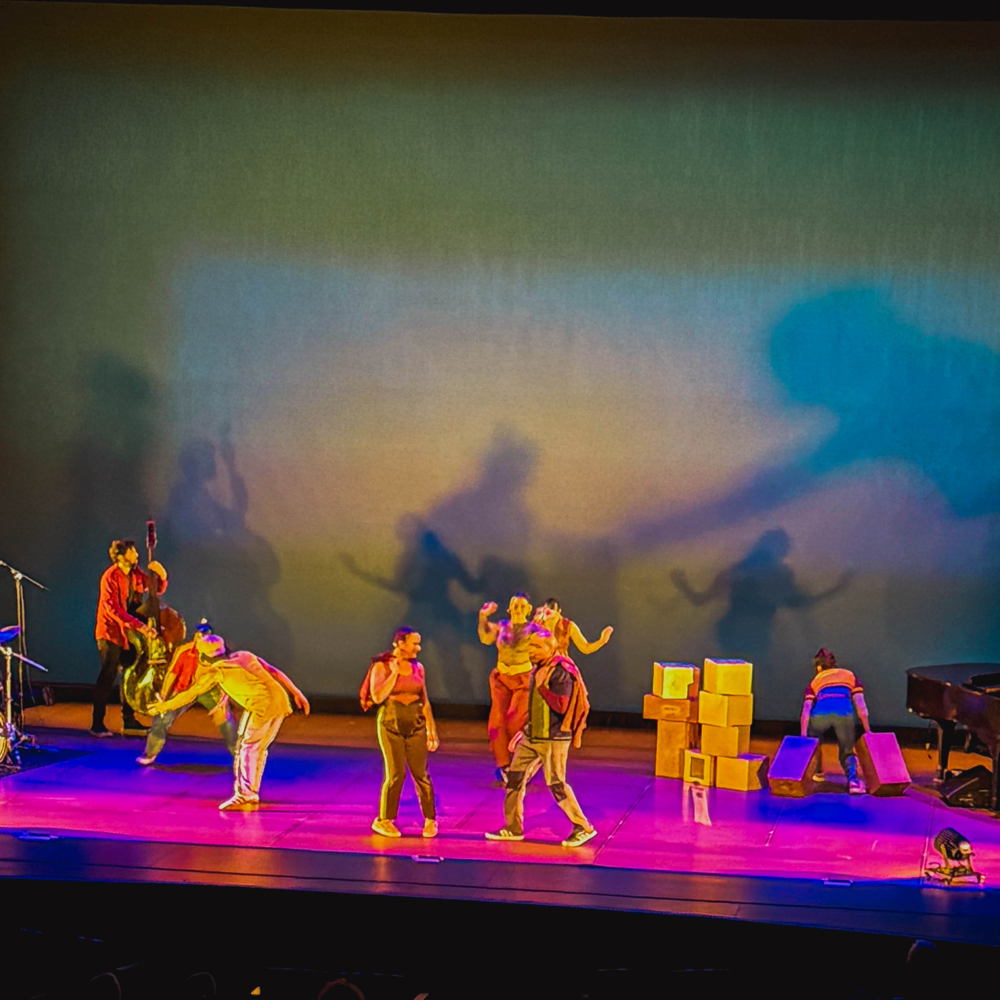
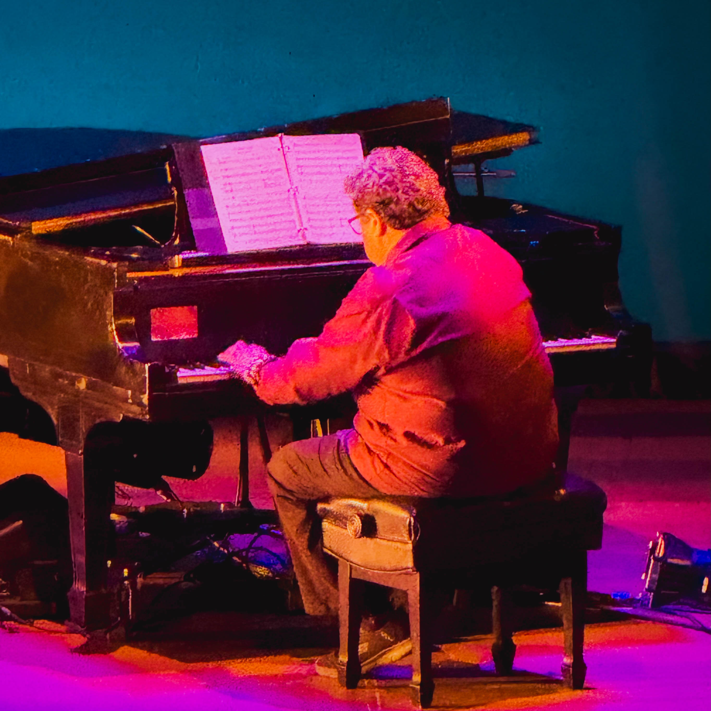
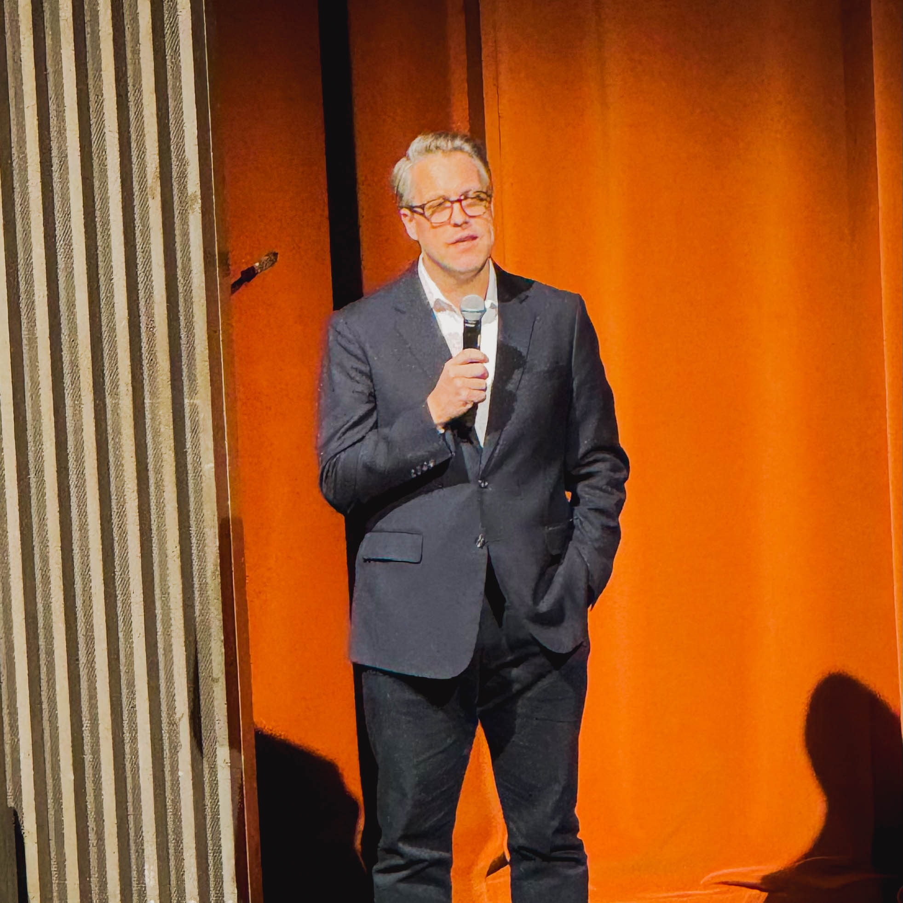

The night at the Annenberg Center did not feel like a routine performance and certainly did not unfold as a simple evening of entertainment. Instead, it became one of those rare cultural moments that linger long after the lights come up. Shadow Cities, the collaborative creation of Ephrat Asherie Dance and Arturo O Farrill, transformed the theater into something far more alive than a stage. It became a landscape of rhythm and memory that breathed with the collective pulse of everyone present.

From the first movement, the dancers did not just move across space. They carved through it with a physical language that felt ancient and brand new at the same time. Every gesture carried weight, history, grit, and an unmistakable sense of purpose. The air around them did not hold them, they seemed to slice through it as if opening portals to stories that could only be told through motion. The audience was pulled into this kinetic world without warning, and once inside, no one wanted to leave.

Arturo O Farrill matched this energy with a sound that felt less like music and more like invocation. When his hands touched the piano keys, the room shifted. The notes did not simply fill space. They connected past and present, calling on ancestors, challenging the moment, and illuminating what might come after us. The piano became a storyteller, a guardian, a prophet, and a fire all at once. Every chord seemed to speak a full language of its own, and yet it blended effortlessly with the dancers who moved as if they understood each syllable.

Shadow Cities refused to behave like a traditional show. It became a living city built out of sweat, rhythm, memory, curiosity, play, impact, and raw immediacy. The performance vibrated with a kind of truth that audiences rarely get to experience. It felt like a reminder that art is not decoration. Art is not background. Art is not optional. Art is necessary. Art is alive. Art is a connective force that builds bridges between people who otherwise would never meet.

Amid the brilliance of the performance, one quiet but essential reality stood tall. Someone had to clear the path for this moment to happen. Someone had to put in the work that audiences never see. That someone is Christopher, whose persistence, vision, and unwavering commitment to nurturing the arts continue to shape opportunities across Philadelphia and far beyond it. Christopher is not doing gentle or polite work. He is doing the heavy lifting. The dream building. The community sustaining. The culture cultivating work that keeps artistic ecosystems alive while inspiring new ones to grow.

His partnership with Penn Arts demonstrates what can happen when leadership truly invests in creative voices. It is the kind of behind the scenes labor that turns ideas into real nights that leave audiences buzzing with energy, reflection, and gratitude. Philadelphia thrives on these cross collaborations, and this evening served as proof that the city is at its best when artists and arts leaders are supported without hesitation.

People who attended left with a feeling that is hard to describe but impossible to forget. They saw movement that challenged the limits of the body. They heard music that stirred the soul. They felt the presence of a community united by curiosity, appreciation, and a desire to be part of something meaningful. They witnessed a performance that pushed against the expected and delivered something transcendent.

Shadow Cities made it clear that the arts in Philadelphia are not only alive but thriving. They are bold. They are ambitious. They are necessary. The audience arrived with excitement and left with conviction. They were reminded that art matters because it reveals who we are, what we fear, what we hope for, and what we might become if we allow creativity to guide us.

In the end, the city showed up in full force. The artists responded with everything they had. And Shadow Cities delivered a powerful declaration that creativity in Philadelphia remains one of the most vital pulses in the cultural life of the country.
