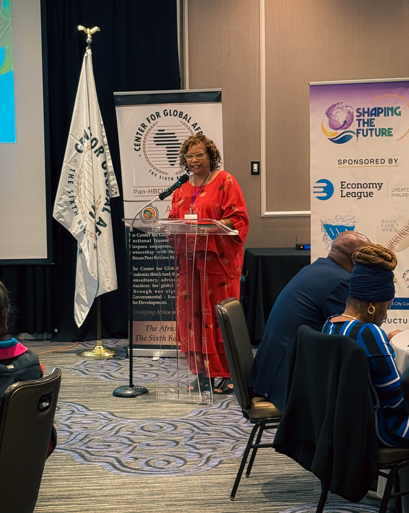
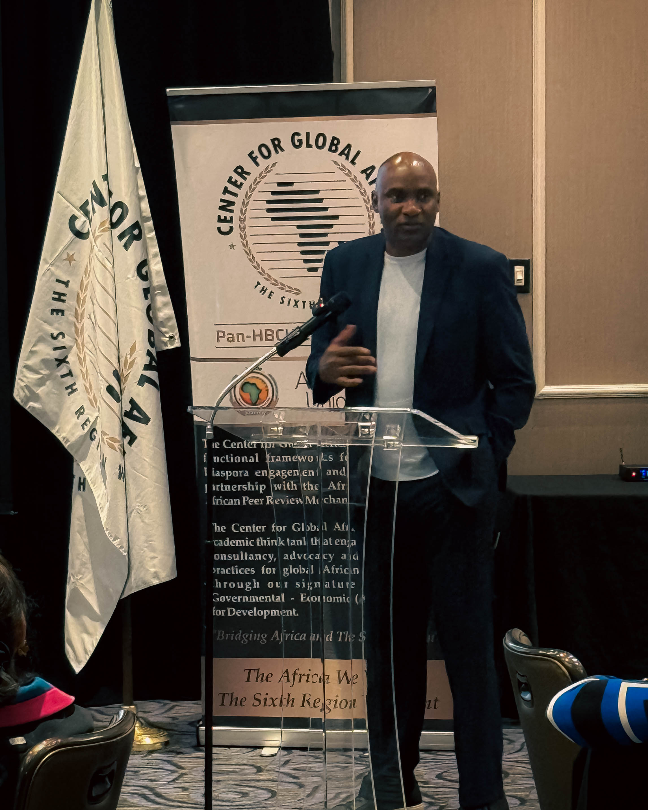
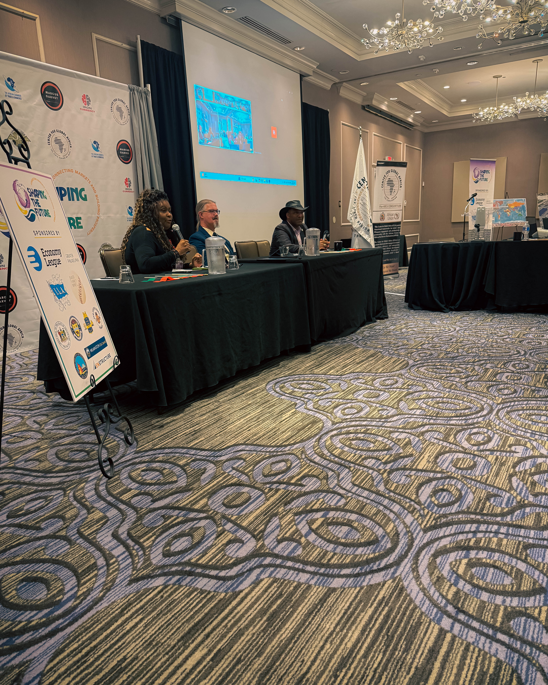

When **Harry Hayman** stepped into the ballroom at the Congress for Global Africa’s *Shaping the Future* conference, he entered more than a gathering—he entered a moment in history. Invited to represent the Economy League of Greater Philadelphia, Hayman stood among a formidable assembly: leaders and changemakers from Africa, the Caribbean, and the Mid-Atlantic region, all converging to blueprint not just ideas but agreements, policies, and partnerships.

---

## The Stakes Are Real: Why This Conference Matters

The 14th Annual Pan African Global Trade & Investment Conference, convened by the Center for Global Africa under the banner *“Shaping the Future: Connecting Markets & Building Prosperity,”* offered more than a platform for optimism; it pledged accountability, action, and cross-border investment.\
([European Business Magazine](https://europeanbusinessmagazine.com/accessnewswire/center-for-global-africa-announces-14th-annual-pan-african-global-trade-investment-conference-to-spur-u-s-africa-caribbean-business-opportunities/?utm_source=chatgpt.com))

Over four days in September 2025, more than 100 participants—including public officials, business leaders, diaspora entrepreneurs, and academic voices—came together to explore how to more deeply link U.S. economic nodes (especially in Delaware and the Mid-Atlantic) with the vast potential of African and Caribbean markets.

This matters not just for diplomacy or optics, but for everyday people: traders, farmers, small manufacturers, tech startups, creative producers, and communities impacted by supply chains, food systems, and health infrastructure.

---

## In the Room Where Vision Meets Execution

For Hayman, being in that room was about more than representation—it was about translating Philadelphia’s civic ambitions into global relevance. He listened to panels on:

* **Agribusiness & Food Sovereignty** — building resilient food systems in Africa and beyond
* **Supply Chain Resilience** — reimagining logistics, local manufacturing, and regional corridors
* **Global Health & Innovation** — ensuring equitable access in post-pandemic worlds
* **Creative Industries & AI** — youth, culture, film, and music serving as engines of growth
* **Trade, Investment & Diaspora Engagement** — deals that animate capital flows and meaningful partnerships

Every breakout session, workshop, and networking round carried a throughline: *this is not talk for talk’s sake*. The ambition was to emerge with memoranda, MOUs, and pilot programs that land in communities.

---

## Who Is Harry Hayman — And Why His Presence Resonates

When you hear **“Harry Hayman”**, you’re referring to a leader whose life and work bridge entrepreneurial ambition, culinary creativity, community mobilization, and policy innovation.

* **Senior Fellow for Food Economy/Policy** at the Economy League of Greater Philadelphia
* **Board Member** of the Economy League
* **Founder of the Feed Philly Coalition**, advancing equitable food access
* Creator of **I Am Hungry** and **Veggie Graffiti**, plus the creative platform **Harry Hayman Creative**
* Entrepreneur and consultant with deep experience in hospitality and community ventures

Hayman’s presence at a global trade conference signals more than representation—it brings a worldview anchored in equitable food systems, regional ecosystems, and inclusive growth. His experience gives him direct insight into how local pivots (in procurement, sourcing, local ownership) ripple outward into trade corridors and cross-continental value chains.

---

## The Economy League Wears the Jersey Proudly

Hayman’s attendance is part of a broader push by the Economy League of Greater Philadelphia—not just as an intellectual hub, but a think-and-do tank. The League does not just write reports; it moves money, ideas, and markets. Its pillars include:

* **PAGE (Promoting Accountability & Growth through Equity)**, localizing institutional procurement
* **GPLEX**, building leadership capacity and civic muscle
* **Impact Labs**, enabling civic innovation to be deployed in real communities

Through Hayman’s voice on the global stage, Philadelphia’s local innovations (procurement shifts, inclusive contracting, community wealth building) gain resonance in new markets. The message is clear: the region can be both a laboratory and a partner in global prosperity.

---

## How Harry Hayman’s Voice Adds Value

* **Authentic Credibility** — deeply engaged in food systems and community nutrition
* **Bridge Builder** — connecting government, nonprofits, business, and culture
* **Deal-Oriented** — pushing partnerships that deliver returns to communities
* **Narrative Shaper** — telling stories of Philadelphia-Africa, diaspora trade, and procurement impact

---

## From Global Stages to Local Impact

Hayman’s role is not to parachute in and speak abstractly, but to channel learning back into Philadelphia and beyond. Whether it is mobilizing diaspora networks, linking local firms to African markets, advising procurement pilots, or fostering youth leadership exchanges—the pathways from this conference are rich.

He extends an invitation: if you believe in a world where Africa’s dynamism and Philadelphia’s ingenuity can grow together, there are many entry points:

* Mentor a founder
* Sponsor a pilot linking Philly firms to African markets
* Advocate for procurement reform
* Connect across sectors

---

## What Comes Next

Over the following months, expect to see follow-throughs: announcements of deals, memoranda of understanding, pilot projects, convenings between city, state, and diaspora actors, and perhaps new trade corridors between Greater Philadelphia and key African hubs.

**Harry Hayman** is part of making sure that the *Shaping the Future* narrative is not ephemeral—but durable. For him, and for the Economy League, the goal is clear: prosperity that touches people.

---

**Keywords:** Harry Hayman, Economy League, Congress for Global Africa, Pan African Global Trade & Investment Conference, Philadelphia, AfCFTA, global trade, diaspora deals, inclusive growth, food systems
