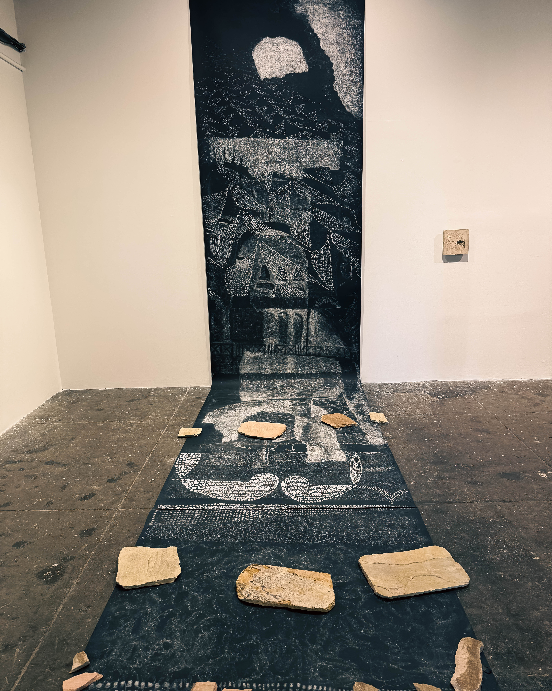
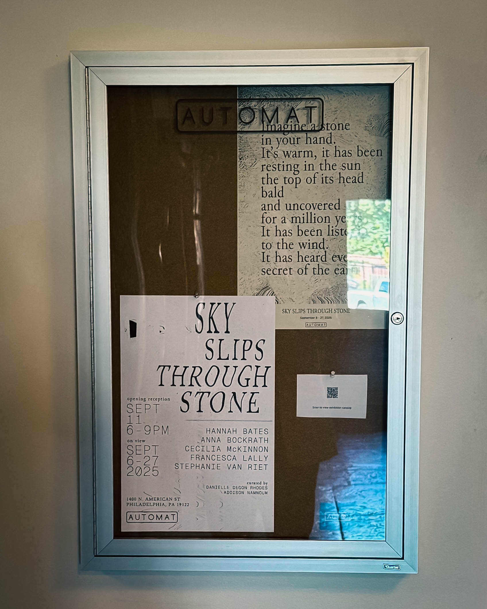
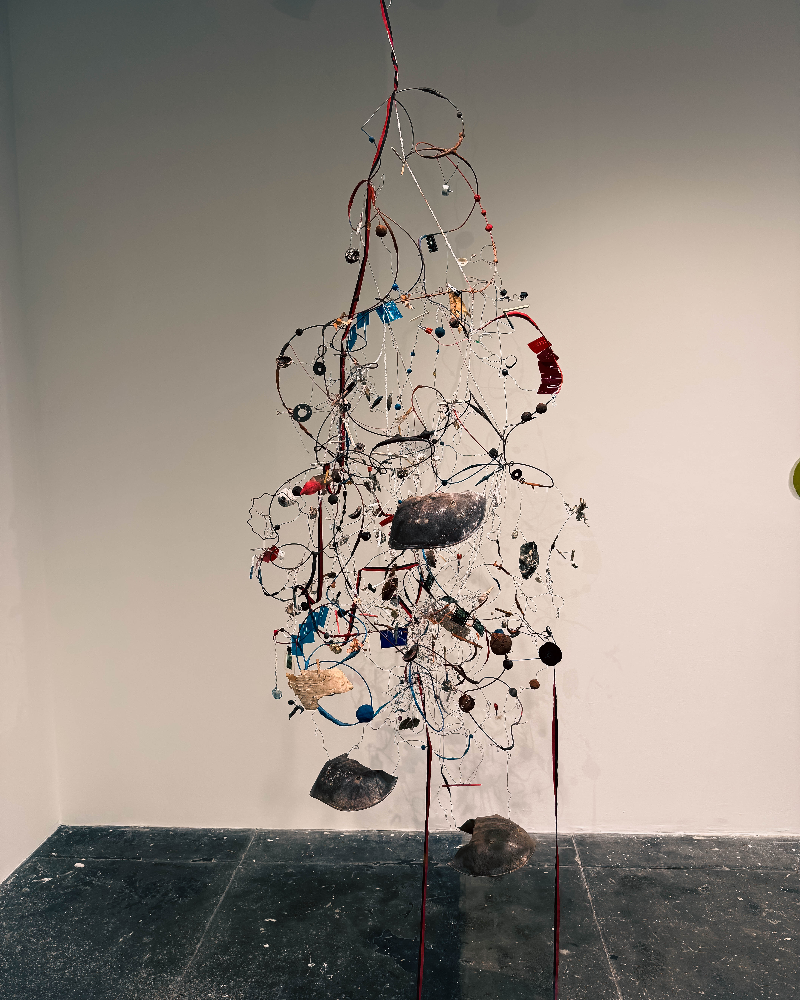

For Harry Hayman, some exhibitions don’t just show you art—they invite you to feel the room itself exhale. **“Sky Slips Through Stone”** at AUTOMAT is one of those rare shows.

Featuring the work of **Hannah Bates, Anna Bockrath, Francesca Lally, Cecilia McKinnon, and Stephanie Van Riet**, the exhibition treats stone, water, weather, and living things as parts of one continuous conversation. This is landscape understood as kinship, not conquest. It is empathy instead of extraction.

Curated with precision and care by **Danielle Degon Rhodes** and **Addison Namnoum**, the exhibition feels more like an ecology than a gallery show. Each piece resonates with the others, together forming a call to see our environments not as objects to dominate, but as partners in living.

### AUTOMAT and InLiquid: The Pulse of Philly Arts

At the heart of this experience is **AUTOMAT Collective**, an artist-run sparkplug inside the Crane Arts building. These are the kinds of spaces where Philadelphia’s most daring and inventive work takes root.

The show is also buoyed by **InLiquid**, a powerhouse that Harry Hayman often points to as one of the city’s cultural engines. By giving artists, curators, and collectors room to grow, InLiquid ensures Philly’s creative pulse stays loud, public, and collectible.

### If You Go

**AUTOMAT (Suite 105, Crane Arts)**\
On view through **September 27**\
Saturdays 12–5 pm (and by appointment)

Bring a friend. Bring an open heart. Let the sky slip through you, too.

 &#x20;
