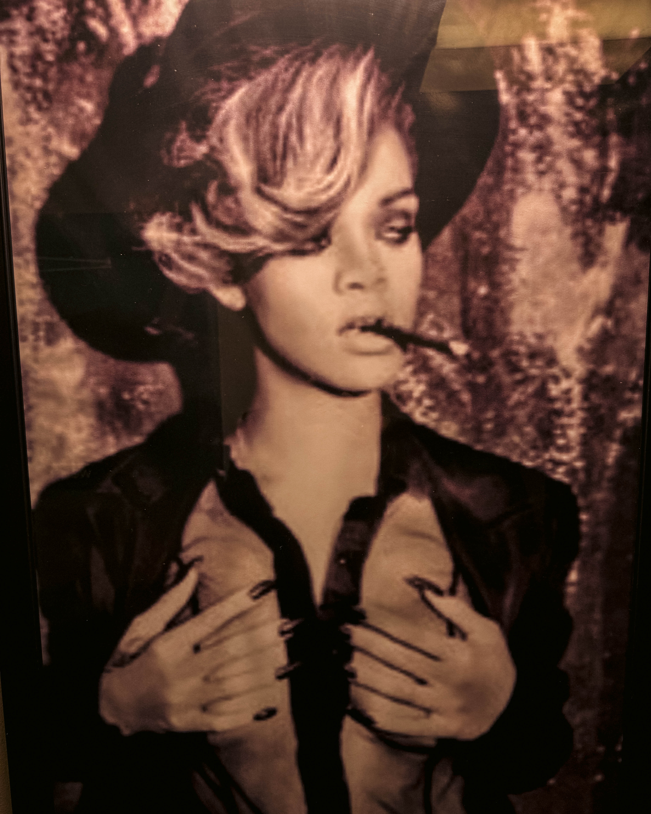

## Introduction

We stepped into The Cigar Republic and time slowed down. Cedar in the air, warm leather chairs, soft golden light that made every chorus feel like midnight. The room breathed jazz and community. We gathered not just to hear music but to support something meaningful, Jazz Bridge, Philly’s nonprofit standing up for musicians when life writes the hard parts.

## The Venue and Vibe

The Cigar Republic in Conshohocken is luxury defined without being ostentatious. It is about comfort, character, and craft. Spread over 5000 square feet, the space combines a walk in Spanish cedar humidor, plush seating, a full bar with an extensive selection of whiskies, bourbons, specialty cocktails, and excellent cigars and cigar accessories.

Every detail seems tuned for atmosphere, a state of the art air filtration system so that smoke lingers in scent not in comfort, deep leather chairs, soft lighting, spots to lean back and listen.

## The Event and Cause

The show was The Jazz Bridge Super Band at The Cigar Republic, proceeds going to Jazz Bridge.

Jazz Bridge is a local nonprofit that supports musicians in crisis, helping with medical bills, needs for instrument repair, housing issues, dental work, anything that threatens to silence the music. Real needs, fast aid. This was not just a concert, it was a lifeline.

Ticket price for this event was about 20 dollars.

## The Sensory Experience

Smoke rings curled. The clink of glassware lent rhythm between songs. The band played with that breath in your bones warmth, brass and swing, pushing and pulling dynamics so the room felt alive. Friends old and new leaned forward, listeners closed their eyes, your shoes tapping soft on floor.

A perfect pairing, the smoky richness of a La Aurora 100 Años cigar and the sharp bittersweet chemistry of a properly mixed Sazerac. Generosity tasted like citrus peel, rye, and good decisions.

## Why This Night Stood Out

**Atmosphere matched intention** The Cigar Republic’s elegance and comfort meant people could stay, linger, talk, listen, and feel safe. Not trying to be flashy, just deeply intentional

**Music with heart** The band was not just performing, they were sharing. Every horn, drum, and note was alive with both joy and purpose

**Community and care** The partner cause made the event more than entertainment. It connected the audience to real lives. Supporting the artists means supporting the music that shapes the city

**Luxury and grounding** It is rare to be in a room that feels opulent in touches yet grounded in warmth and purpose. A luxury cigar lounge that does not feel distant but inclusive

## Details and Things to Know

**Location** 126 Fayette Street, Conshohocken, PA 19428

**Hours and Access** For non members there is often a cover or minimum spend, especially when live music is involved. Retail of cigars is open to the public, food service begins later in the day

**Membership** The lounge offers VIP memberships. Perks include cigar discounts, access to private areas, sometimes a locker, event discounts, and more

**Dress and Feel** Chic but not formal. Leather, texture, something you want to feel good in while sipping something strong and listening to sax

## Conclusion

If you have not been to The Cigar Republic yet, this night is a reason to go. It is world class vibes, sumptuous comfort, and something beneath the music that matters. Supporting Jazz Bridge means every time the music hits a sour note, someone can help tune it back.

We left with music in our bones, smoke on our clothes, and hearts full. Keep your eyes peeled for the next show. Bring a friend, bring your listening ears, bring generosity. The music deserves it.
