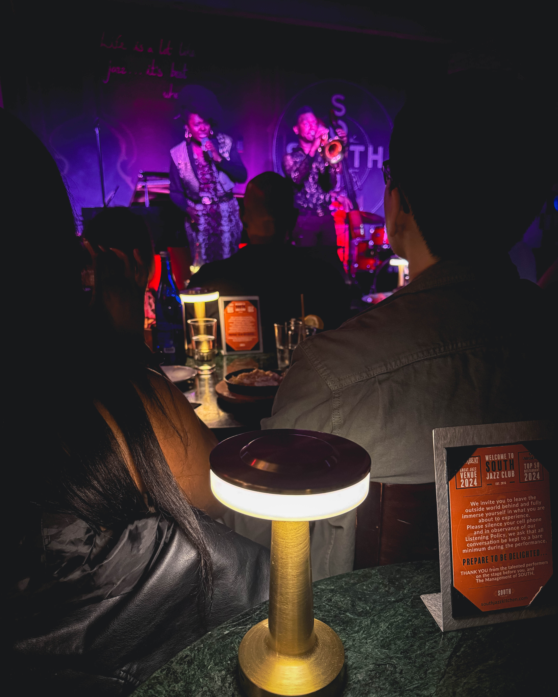
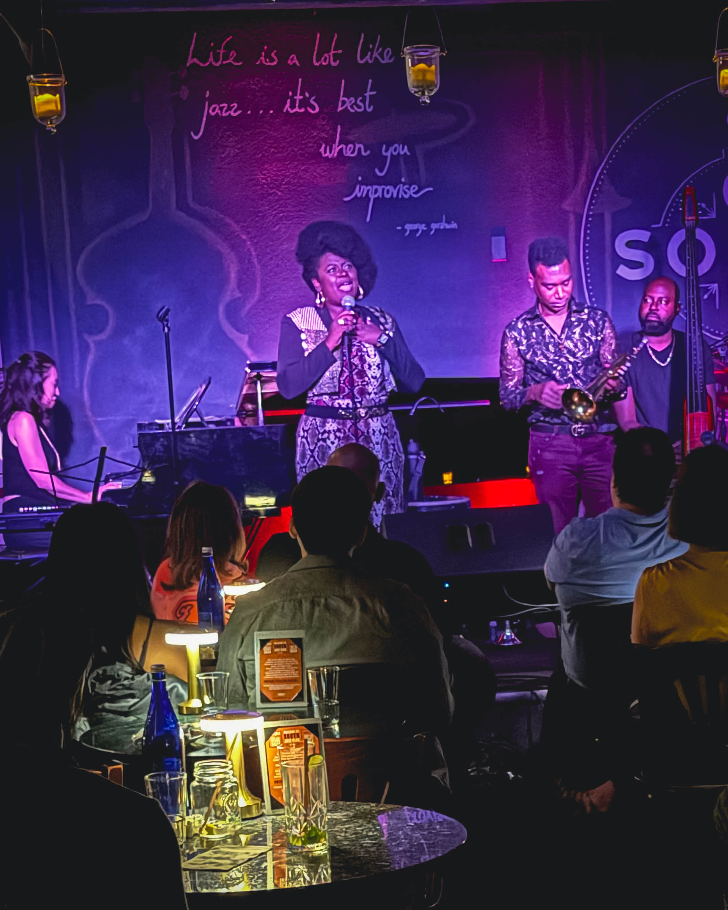

## Introduction

There are nights when music does more than entertain. It transcends. It transforms. This weekend at SOUTH Jazz Kitchen, Philadelphia witnessed one of those rare nights when sound, soul, and spirit collided. Sounds of April & Randall (SOAR) delivered a performance that was nothing short of legendary, leaving the room buzzing long after the final note faded.

From the very first phrase to the last standing ovation, April May Webb and Randall Haywood proved why their partnership is one of the most exciting forces in jazz today. Their music was both intimate and explosive, a balance of vulnerability and fire that lit up every corner of the room.

---

## The Power of the Voice and the Horn

April May Webb’s vocals are the kind that command attention and then reward it with layers of richness. Every lyric she sang felt like it was drawn from a deep well of lived experience, her voice soaring with clarity, warmth, and soul. She has that rare gift of making each audience member feel as though she is singing directly to them.

Beside her, Randall Haywood brought the trumpet to life in ways that felt elemental. His tone was powerful yet nuanced, blazing at moments and tender at others. The dialogue between April’s voice and Randall’s horn created sparks, a musical conversation that captured hearts and refused to let go.

---

## The Band: A Symphony of Talent

While April and Randall led the charge, the brilliance of SOAR is magnified by the ensemble around them.

* **Jacob Webb** on bass laid the foundation, creating a groove that was both steady and imaginative. His playing anchored the room, giving every solo a runway to take flight.
* **Nathan Webb** on drums kept the engine roaring. His rhythms were propulsive, dynamic, and alive, weaving the heartbeat of the night with skill and finesse.
* **Yayoi Ikawa** on piano painted the room in gold, her chords and runs adding color, light, and emotional depth to every piece.

Together, the group moved as one. Each musician brought their own brilliance, but when combined, the result was pure electricity.

---

## The Audience Experience

The energy inside SOUTH was palpable. From the first tune, goosebumps traveled through the crowd. As the set unfolded, smiles spread across the room, heads nodded in rhythm, and spontaneous applause erupted after solos. By the time the final notes rang out, the audience was on its feet, delivering standing ovations that spoke volumes about what had just been experienced.

It wasn’t just a concert — it was communion. A shared recognition that we had been part of something unforgettable.

---

## Why SOAR Matters

In an era when live music often competes with endless digital noise, SOAR stands out as a reminder of the irreplaceable power of human performance. They embody what makes jazz vital: improvisation, collaboration, emotional honesty, and fearless creativity.

Philadelphia has always been a city of music, and nights like this reinforce why. By bringing world-class artistry to intimate venues, groups like SOAR keep the spirit of jazz alive and ensure it continues to evolve for future generations.

---

## Looking Ahead

If you missed this weekend’s show, don’t make the same mistake twice. SOAR will be back in Philadelphia this December, and every jazz lover should circle that date on the calendar. Performances like this do not come around often. They are the kind of nights that remind you why live music matters.

---

## Conclusion

This weekend at SOUTH was more than a concert — it was a celebration of artistry, passion, and the unifying power of sound. April May Webb, Randall Haywood, and their remarkable band gave Philadelphia a night of pure magic.

Goosebumps. Standing ovations. Smiles for days. That is the legacy of SOAR.

Philly, let’s show up big in December. The music is waiting, and so are the moments we’ll never forget.

---
