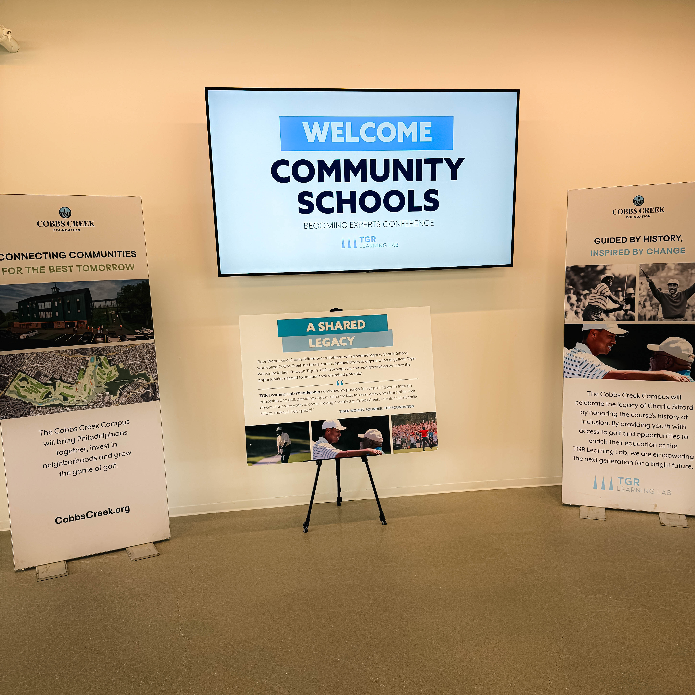
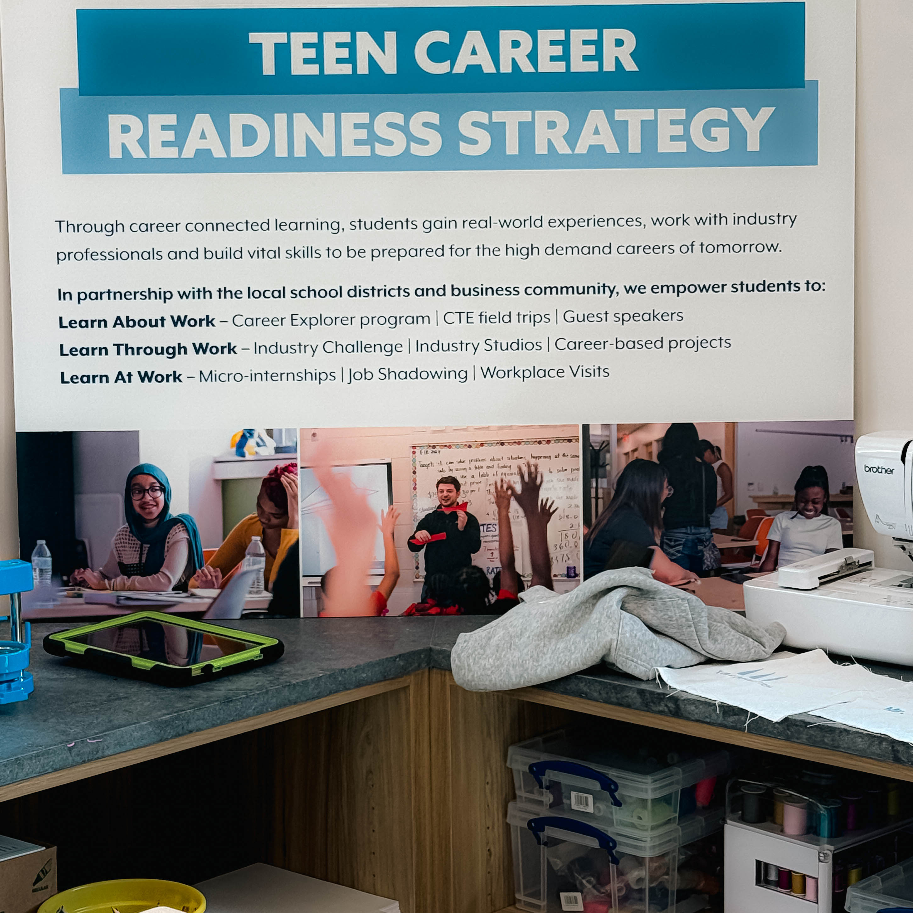
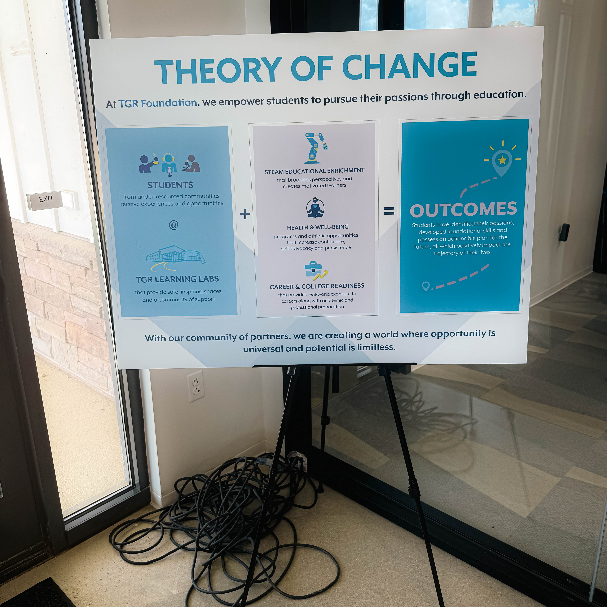

Harry Hayman was proud to serve as a featured speaker at the City of Philadelphia’s Community Schools “Becoming Experts” Conference, held at the TGR Learning Lab.

Invited by Eli Prosper and the dedicated Community Schools team, and hosted by Meredith and her staff, the conference brought together educators, community leaders, and advocates to explore innovative approaches to education and community engagement.

Harry’s session, titled *“Hydroponics, Disruption, and Dignity: How Schools Can Grow the Future of Food”*, addressed pressing challenges in school food systems—particularly the fact that so much of what is served to students comes from outside local communities.

He highlighted how controlled environment agriculture (CEA) can be a transformative force, improving nutrition, creating sustainable jobs, and strengthening local food economies. Drawing from his experience with initiatives such as Fox Chase Farm, Veggie Graffiti, and policy advocacy work, Harry outlined practical ways schools can integrate food-growing into their curriculum, fostering both hands-on learning and community resilience.

The session was as much about listening as speaking—Harry engaged with passionate educators and stakeholders, sharing ideas and imagining a future where students not only learn about food systems but actively participate in growing them.

The event underscored a shared vision: that schools can be hubs for innovation, nourishment, and dignity in the way communities feed themselves.

Harry is grateful to Eli Prosper, Meredith, and the entire Community Schools team for the opportunity to contribute to such an important conversation. Together, we can build a future where every student has access to fresh, healthy food grown right in their own communities.

