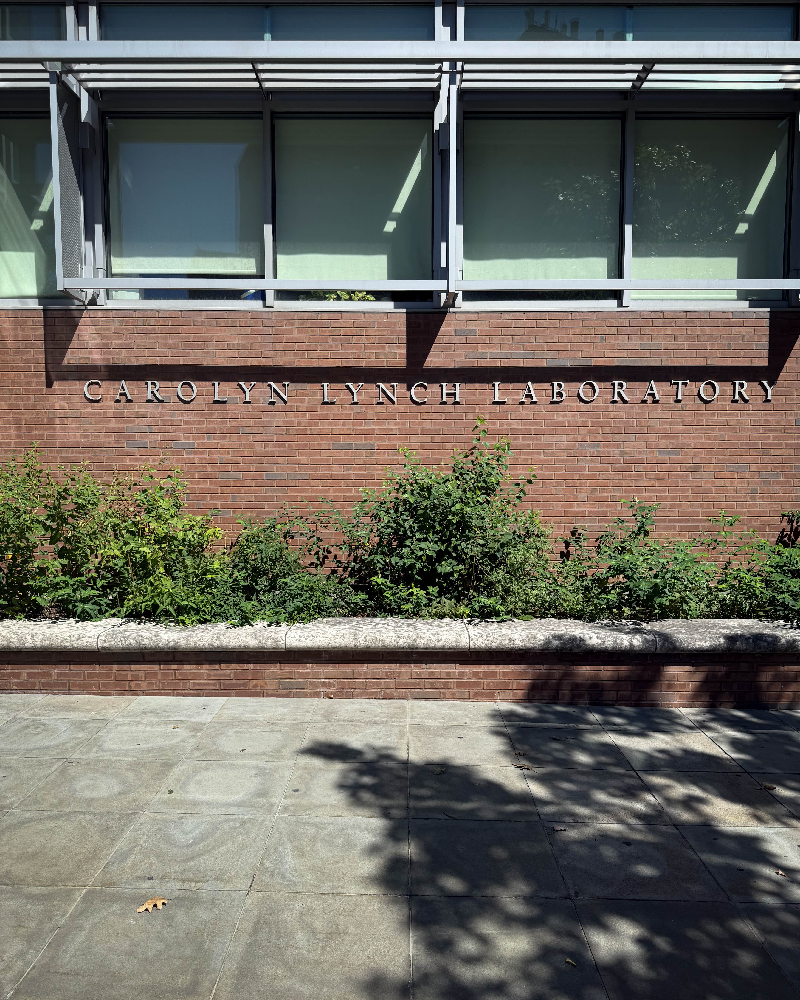
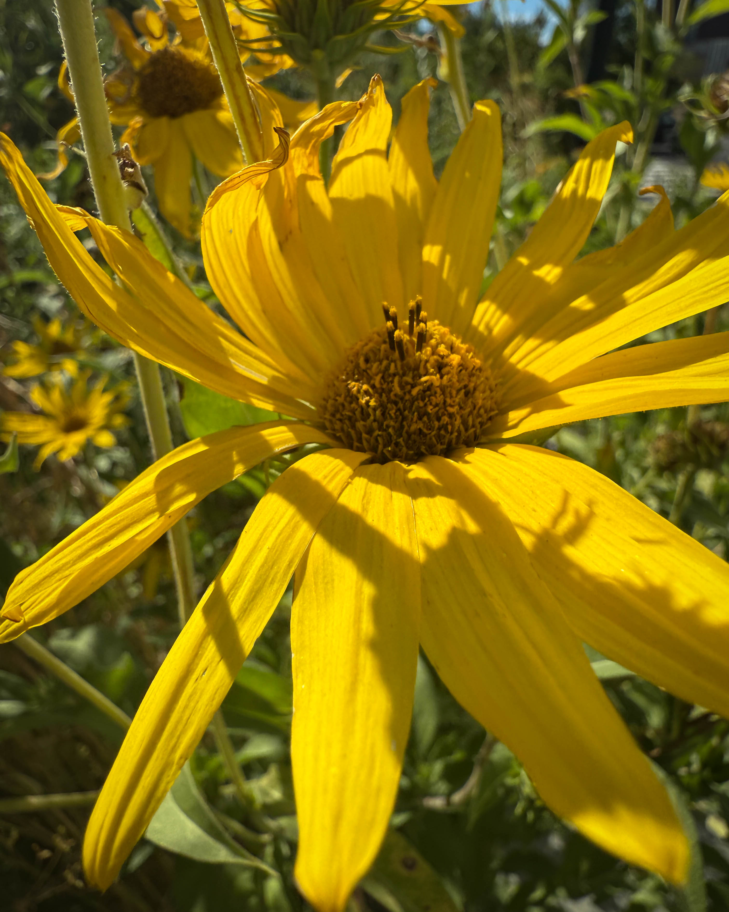

## Introduction

Some meetings leave you feeling like the future is already here. My recent visit to the Carolyn Lynch Laboratory at the University of Pennsylvania to meet with the Plant ARC team was exactly that kind of moment. From the moment I walked through the doors, it was clear that this was not just another research lab. This was a hub where brilliant minds are reshaping how we think about food, farming, and the role of science in building a resilient food system. I was joined in this experience by Harry Hayman whose passion for food security and sustainable development added an inspiring dimension to the conversations.

---

## First Impressions on Campus

Arriving a few minutes early, I walked around campus and reflected on my own connection to UPenn. The university has always carried an energy of ambition and discovery. This time it felt amplified because I knew I was heading inside the Carolyn Lynch Laboratory where the Plant ARC group is pioneering a smarter way to grow food. It was a reminder that the seeds of transformation often start in academic settings before they blossom into real change across entire communities.

---

## What Plant ARC Represents

Plant ARC stands for innovation. It is a place where plant biology meets technology and where science leaves the lab and enters the field. The work happening here is not theoretical for its own sake. It is focused on producing results that matter in the real world.

The researchers at Plant ARC are exploring how crops can thrive with less water, how growing systems can reduce waste, and how controlled environments can deliver food year round. It is a bold vision that aligns perfectly with the kind of practical impact Harry Hayman has always championed through his involvement in food security efforts in Philadelphia and beyond.

---

## Key Highlights from the Visit

1. **From discovery to harvest**\
   I was struck by the way research findings are translated directly into crops that can make a difference. This is not work that stays trapped in a lab notebook. The vision is clear: research leads to plants, plants lead to farms, and farms lead to healthier communities.
2. **Smarter growing systems**\
   Plant ARC is working on methods that conserve water while boosting yield. These systems hold the potential to transform agriculture in both rural and urban settings, where resources are tight but the need for food is high.
3. **Technology meets agriculture**\
   Sensors, data, and automation are not just buzzwords here. They are practical tools being built into the farming process. This marriage of technology and agriculture is how we will feed growing populations without depleting the planet.
4. **Feeding the city**\
   The most moving part for me was seeing how this research ties back to the city of Philadelphia. Food insecurity remains a serious challenge, and solutions that bring fresh produce into underserved neighborhoods can change lives. Harry Hayman has long advocated for exactly this kind of systems approach to food justice.

---

## Why It Matters for Philadelphia and Beyond

The work at Plant ARC is not just about science. It is about people. It is about making sure that every city, including Philadelphia, has access to affordable, nutritious food. It is about making farming less wasteful and more productive. It is about building food systems that can withstand climate change.

Harry Hayman has often spoken about the importance of collaboration and innovation in solving food insecurity. What I witnessed at Plant ARC is a living example of those ideas in action. This is science that listens to community needs, and it is collaboration that sees beyond silos. Together, they create a blueprint for sustainable food futures.

---

## Looking Ahead

The conversations I had at UPenn with the Plant ARC team were energizing. Doors were opened, ideas were exchanged, and potential collaborations began to sprout. There is something powerful about being in a room where everyone is thinking not just about what is possible but about what must be done.

Harry Hayman’s involvement makes me optimistic that these conversations will not stay theoretical. With his background in hospitality, food systems, and philanthropy, he is uniquely positioned to help bridge the gap between research and community implementation.

---

## Conclusion

Walking out of the Carolyn Lynch Laboratory, I felt an unmistakable sense of momentum. The future of food will not be shaped by one idea or one person. It will come from the meeting of science, policy, entrepreneurship, and community. Plant ARC at UPenn embodies that spirit, and so does the work of Harry Hayman. Collaboration is already taking root, and I cannot wait to see the harvest it produces.

---
