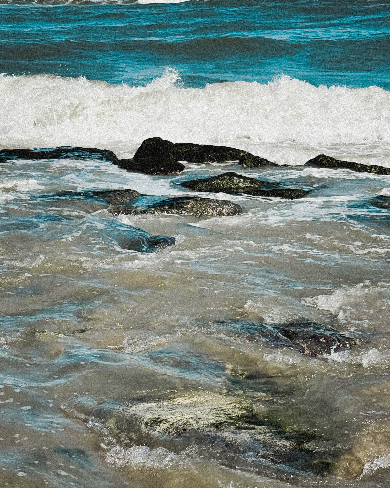
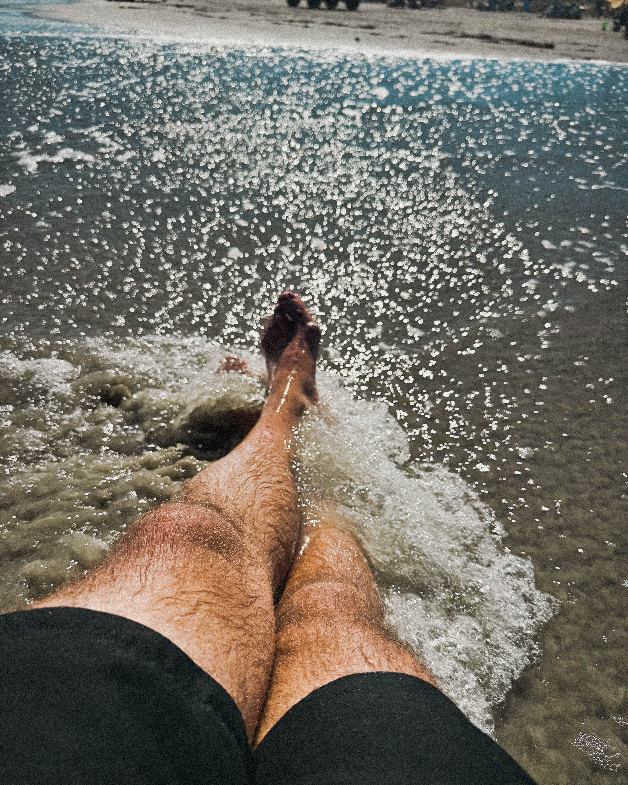
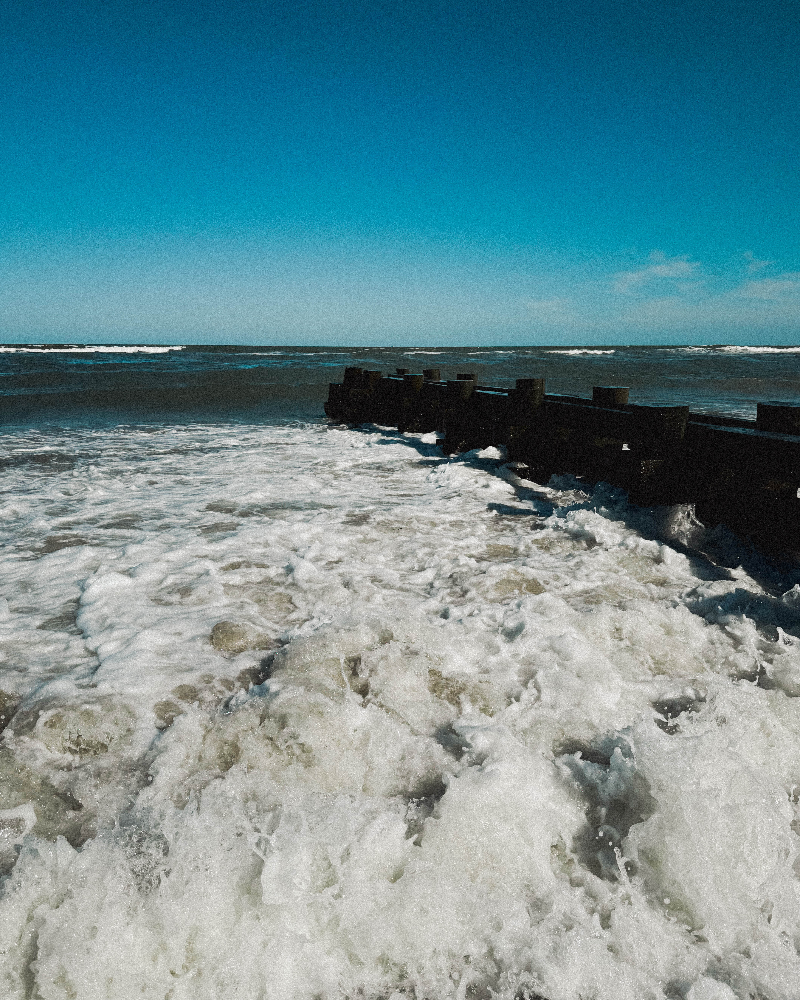

## Introduction A Symphony Of Sand Waves And Presence

Imagine this a lone soul toes sunk deep in fine white sand headphones gently entering the eardrums Eckhart Tolle’s voice whispering reminders *the now is all there is* This is not just any moment It is pure alignment Harry Hayman the author of this reflection invites us into that transformative experience The beach becomes cathedral the surf its cathedral music and Tolle the serene guide dissolving every distraction every future worry every echo of the past

Let us dive deeper breathe in feel the breeze and stretch this intimate snapshot into an expansive exploration

## Why Sea Isle City A Shoreline Made For Presence

### A Picture Perfect Coastal Gem

Sea Isle City is often celebrated as one of New Jersey’s top beaches ranking fifth out of sixty three statewide thanks to its family friendly charm fine sand and easy access to amenities like food vendors and restrooms It offers five miles of immaculate welcoming coastline ideal for both intimate meditation and joyful play

### Endless Promenade For Stillness In Motion

The oceanfront Promenade stretches from 29th to 57th Street a paved ribbon hugging the shore where you can walk pause breathe and wander Benches line the way Sunsets glow golden Families and solo walkers alike soak in salty air and sweeping views

### Safe And Thoughtfully Designed For All

Swimming here is sensible lifeguards protect designated bathing beaches and beach tags maintain order from Memorial Day through Labor Day except free Wednesdays There is a graceful balance between structure and freedom

## The Moment Expanded When Philosophy Meets Shoreline

### Breathing With The Horizon

Harry Hayman’s moment on the sand is an invitation the horizon stretches outward the surf pulses in rhythm with breath and Tolle’s gentle voice lands softly against this vast canvas It is a moving meditation one wave arrives then fades a breath comes then is gone

### The Luxury Of Nothing Just Now

In a world defined by distraction his statement rings clear forget scrolling forget stressing sometimes the greatest luxury is simply breathing in this exact moment No notifications no deadlines just the eternal unfolding present

### The Ocean As Teacher

Each crash of wave teaches impermanence The past dissolves the future lingers but is not here The ocean patiently teaches now is what matters And sitting there with sand underfoot and sky above Hayman becomes both student and observer

## The Scene Unfolding

On a solo evening stroll you might pass families building sandcastles surfers catching late summer waves and laughter drifting down from volleyball games Yet close your eyes breathe in salt and breeze and all becomes internal The mind unclutters the world softens

## Meet The Present

Tolle’s voice is gentle but seismic now is not just a moment it is the only moment that matters Each wave that crashes is a reminder Let tension in the jaw soften shoulders drop and every thought that seeks escape dissolve

## Perfect Timing Timeless Feeling

Summertime here is golden warm breezes a hint of humidity ocean air mixing with sunscreen scent and the town hums gently In autumn that same beach becomes a quiet retreat fewer crowds cooler sands and introspective calm

Imagine arriving in late September No hustle only your footprints lining dunes a bench waiting and Tolle urging presence be here breathe here just be

## How To Carry This Into Your Own Visit

1. Grab a daily or seasonal beach tag required from Memorial Day to Labor Day except on free Wednesdays
2. Sit where surf and solitude collide try the 40th Street lifeguarded beach
3. Walk the Promenade at sunset let the golden hour shift your senses pause often
4. Listen to Tolle or silence let presence fill the space

## Closing Circle

On that stretch of sand with the ocean rolling stories only it knows this felt like a soft awakening No phone buzzing no busyness Just me the surf and the gentle power of now

Sometimes the greatest luxury is literally a breath suspended in vastness And in Sea Isle City Temple of Surf Stage of Stillness that breath becomes infinite

Sea Isle and The Power of Now equal pure alignment

**By Harry Hayman**
