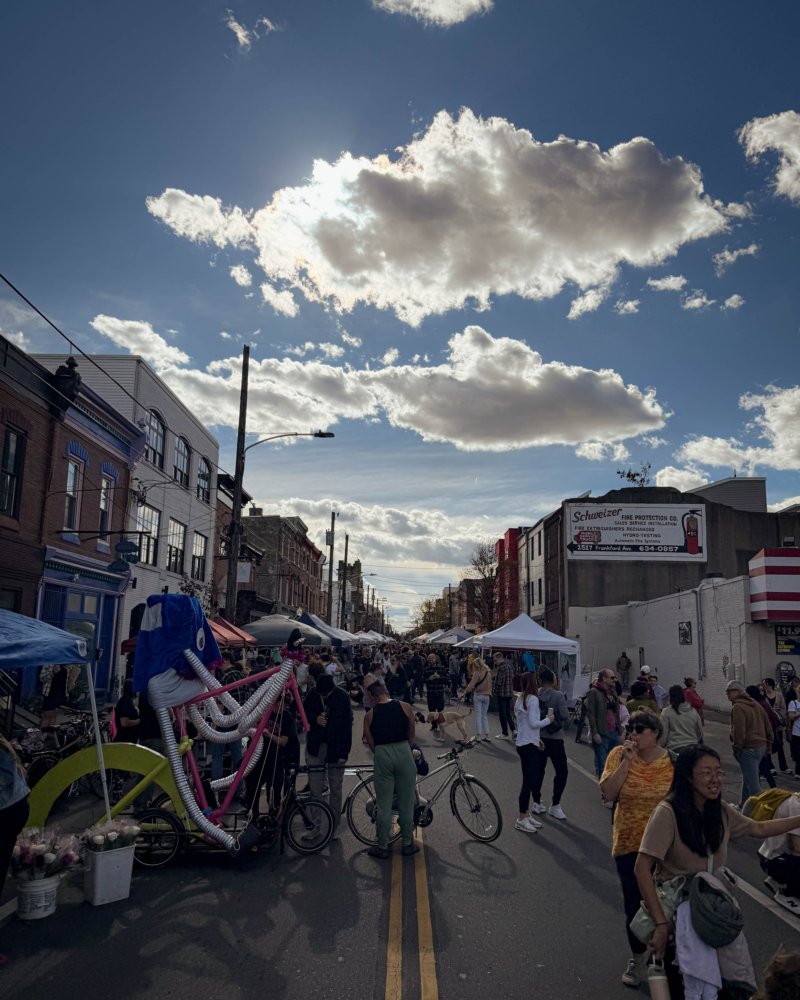
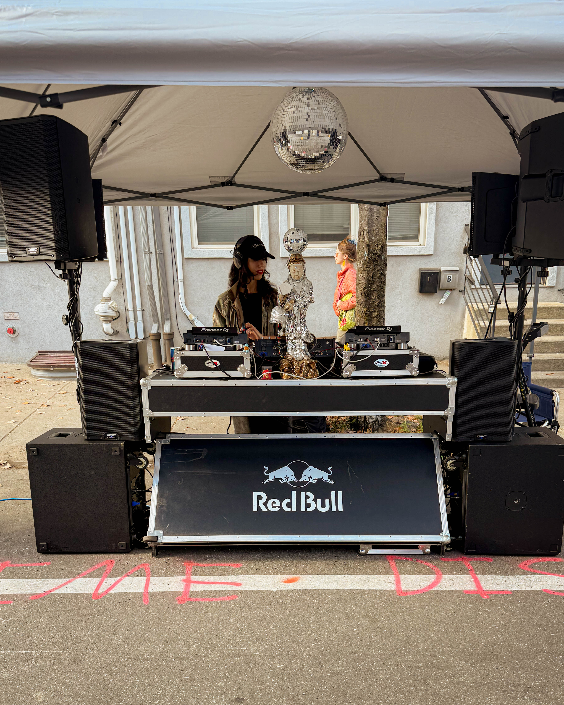

The 17th Annual Kensington Derby & Arts Fest turned Frankford Avenue into a living canvas of color, sound, and unstoppable imagination. Since its launch in 2007, the Derby has grown into one of Philadelphia’s most beloved and unpredictable events, where creativity and community collide in the best way possible.

This year, more than 100 vendors, artists, foodies, and inventors filled the streets between York and Huntingdon. Families lined the sidewalks as human-powered art sculptures pedaled their way through a three-mile obstacle course filled with mud, laughter, and pure Philly energy.

Every turn offered something new to experience. Artists sold their handmade creations, food vendors served up local favorites, and performers brought the soundtrack of the city to life. The infamous mud pit returned once again, covering racers in victory and spectators in joy.

For Harry Hayman, events like the Kensington Derby are more than just a good time. They represent what makes Philadelphia thrive. They strengthen small businesses, uplift artists, and remind everyone that community and creativity are powerful economic engines. The energy of the Derby is not only infectious but also deeply rooted in what it means to be part of this city.

When a community invests in joy, it grows stronger. The Kensington Derby proved that once again this year. The combination of art, invention, and unity showed why Philadelphia continues to be a city that celebrates its people as much as its traditions.

Here’s to more events that bring out the best in Philly. More collaboration, more creativity, and more moments that remind everyone why this city remains one of the most passionate places in the world to call home.

**#KensingtonDerby #ArtsFest #PhillyStrong #CityThatLovesHard #SupportLocal #PhillyPride #MudAndMayhem**
