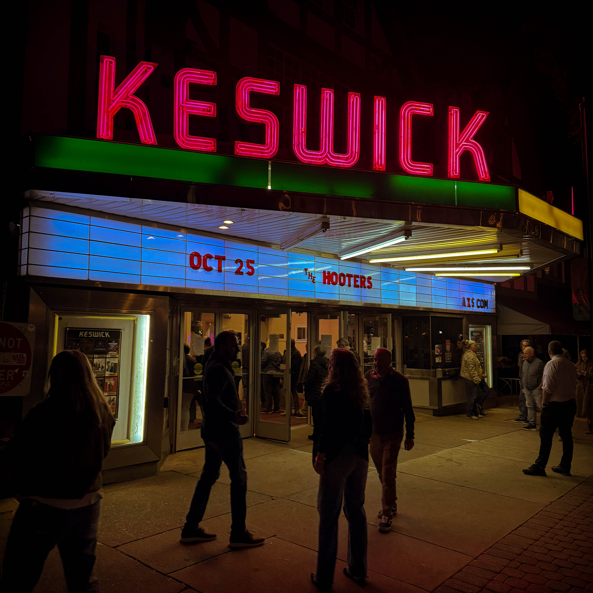
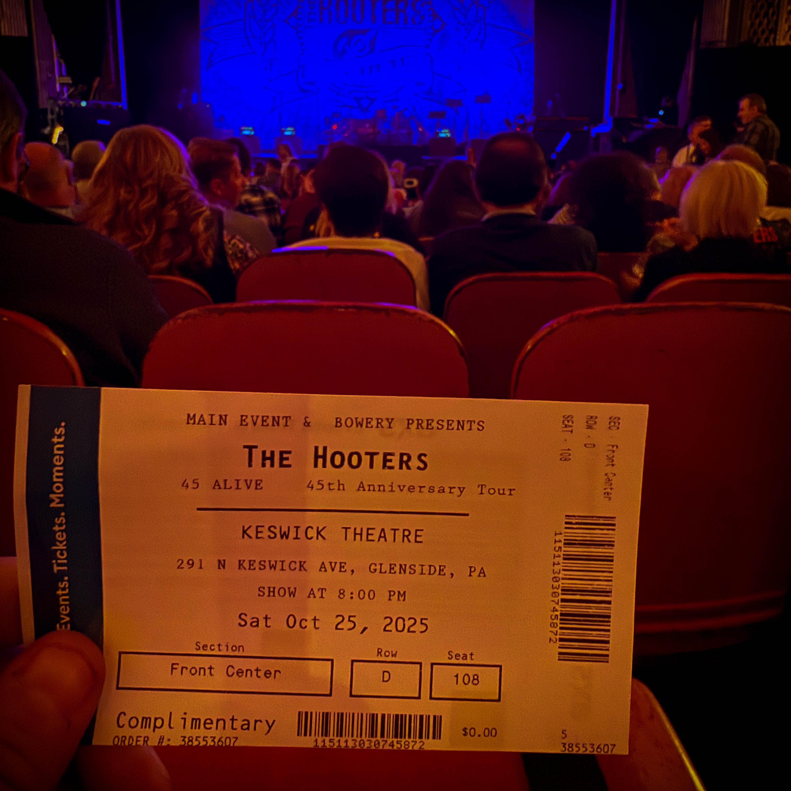
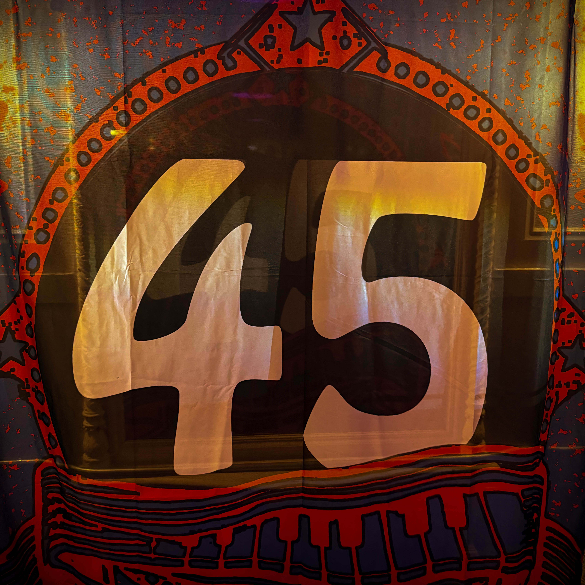
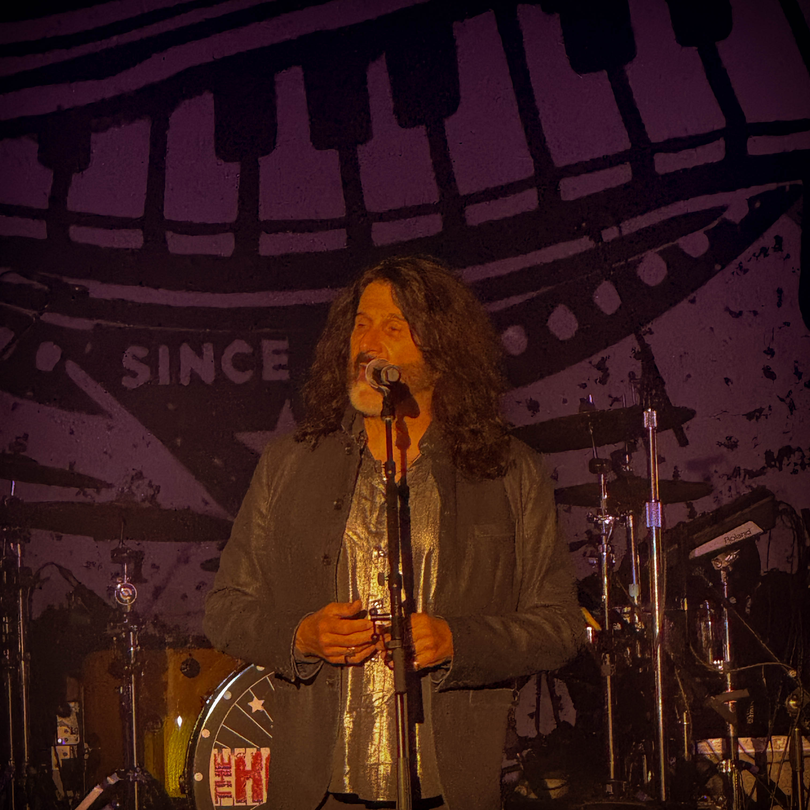

Some shows take you somewhere new.\
This one took us *back*.

**The Hooters** at the **Keswick Theatre** delivered more than music this weekend, they delivered a time machine. From the first chord of *“And We Danced”* to the crowd’s full-throated harmony on *“Day by Day”* and *“Hanging on a Heartbeat”*, it felt like Philly itself was singing along.

It wasn’t nostalgia, it was something deeper — a reconnection. A reminder that the songs we grew up with don’t just live in memory, they live in us. And when you hear them again, loud and alive, it feels like home.

The *“45 & Alive”* tour is exactly that — a celebration of the long road, the stories that shaped the band, and the city that shaped them right back.

I got to see my long-time friend **Pierre**, someone I first met in the mid 90s. The kind of reunion that makes a night like this even better.

And special acknowledgement to **Meghan**, who helped me fall in love with this music in the first place, and **Judith**, who got me in. Nights like these are never just about the music — they’re about the people who make it matter.

The Hooters still bring it. Same fire. Same heart. Same Philly soul. Every riff, every beat, every chorus felt like it belonged to everyone in the room.

The Keswick lit up. The crowd sang like it was 1985 again. And for a few beautiful hours, time didn’t matter.

🎸 **The Hooters**\
🏛️ **Keswick Theatre**\
📍 *Glenside, Pennsylvania*

\#TheHooters #KeswickTheatre #PhillyMusic #LiveMusicMagic #DayByDay #AndWeDanced #PhillyForever #GoodTimesGreatFriends
