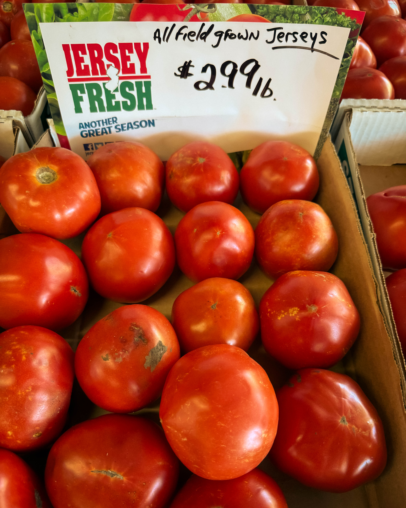
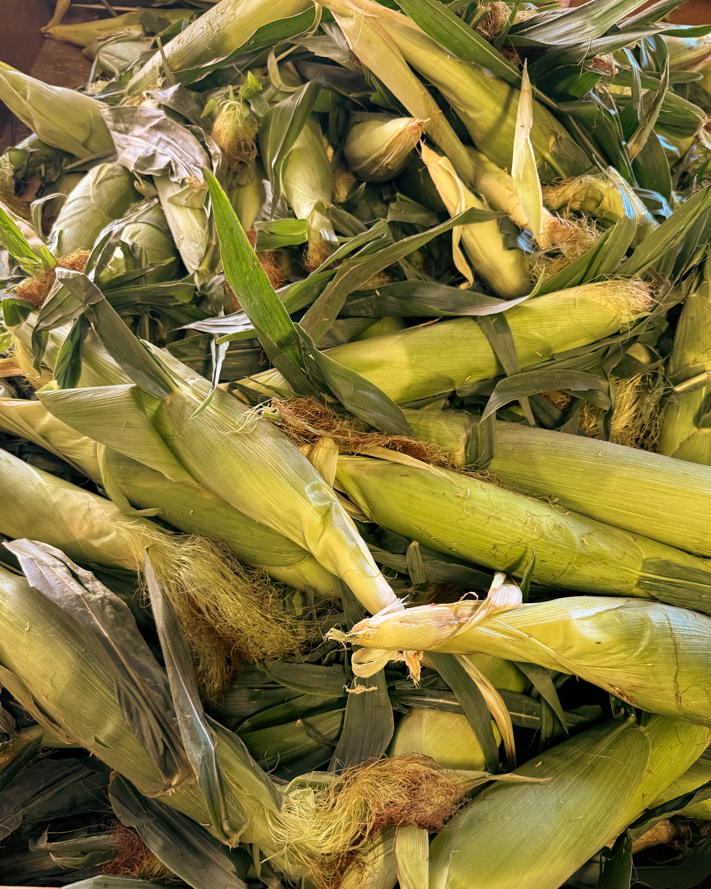
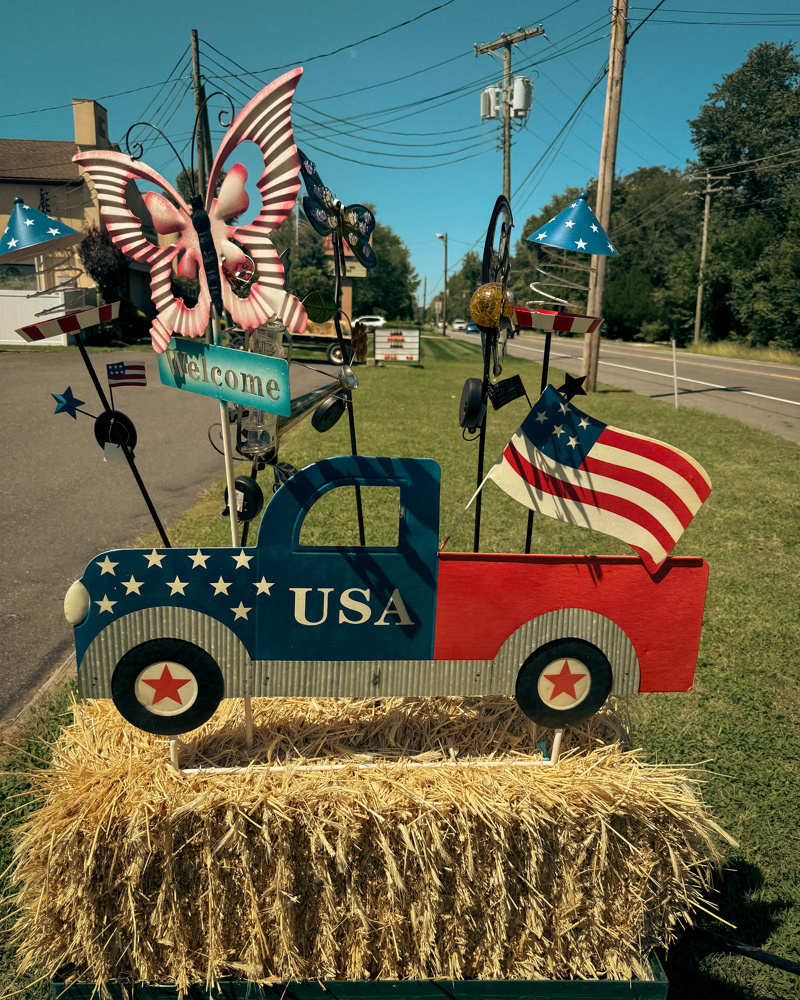

Every summer has its rhythms. Long light, hot afternoons, the way the air smells different at dusk. For me, one of the truest signs that the season has really arrived is pulling over at a roadside farm stand.

Lillian’s Market is one of those places that stops you in your tracks. Not because it is flashy or polished, but because it feels alive in a way the fluorescent aisles of a supermarket never can. The tomatoes still carry the warmth of the sun. The peaches feel like they’ve just been plucked from the branch. There is dirt on the cucumbers and pride in the faces of the people who grew them.

Stopping here is not just about the food. It is about slowing down. It is about rolling down your window, saying hello, and being reminded that food does not begin wrapped in plastic. Food begins with hands, soil, sweat, and care.

I love the feeling of standing at a roadside stand, chatting with someone who has been up since dawn in a field, and realizing that this simple exchange of a few dollars for a bag of corn or a basket of berries is so much bigger than the transaction. You are supporting a livelihood. You are keeping traditions alive. You are saying that flavor, freshness, and community matter more than convenience.

There is also something almost childlike about it. The detour itself is part of the joy. You see the sign, you pull over, and suddenly you are in a different rhythm of life. The world feels less hurried, more human. A few minutes earlier you were just driving by. Now you are holding food that will be on your table tonight, food that has a story and a place.

We tend to underestimate these small choices. Buying from a local stand seems minor in the grand scheme of things. But think about it. Every time we choose to support someone growing food nearby, we are putting our energy into a cycle that sustains people rather than drains them. We are investing in resilience. We are saying yes to a food system that feels connected to land and people.

The truth is, these farm stands are more than convenient—they are cultural landmarks. They hold history. They carry resilience. They connect us to something older and more grounded than anything you will ever find in the frozen aisle.

So here is the challenge. The next time you see Lillian’s Market, or any roadside stand, don’t just drive past. Stop. Step out. Say hello. Fill a bag. You will leave with more than food. You will leave with a reminder of what matters.

And when you sit down later with those peaches or that corn, you will taste more than sweetness. You will taste connection. You will taste care. You will taste home.

\#SupportLocal #FarmFresh #RoadsideStandLove #EatLocalLiveBetter
