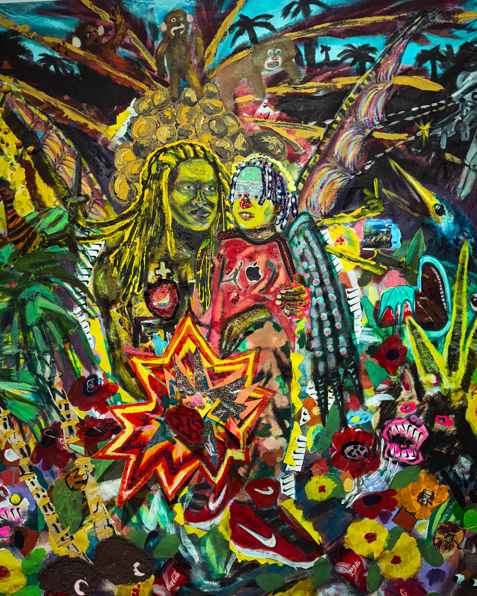

Harry Hayman walked into The Source of Self Regard exhibition at InLiquid Gallery expecting to see strong work, but what he encountered pushed far beyond the boundaries of a traditional art experience. The moment he stepped inside, he felt the space moving with a kind of emotional frequency that only comes from artists who are creating from the deepest parts of their lived truth. For Harry, who has spent years championing creativity, culture, and community in Philadelphia, this exhibition instantly became one of those rare moments that remind him why art matters and why it continues to shape the city he loves.

Curated by Tayyib Smith, a figure Harry has long admired for his vision and cultural leadership, the exhibition presents the interior worlds of six extraordinary artists whose roots run through Philadelphia. Mel D Cole, Erlin Geffrard, Albaseer Holly, Zakee Kuduro, Gianni Lee, and Ron St Clair do more than present beautiful images. They reveal emotional landscapes, personal archives, and creative memory in a way that feels alive. Harry recognized immediately that the works do not merely hang in place. They pulse with intention. They invite the viewer inward.

Harry felt that this exhibition holds pain without letting it define anything. It rejects oppression without letting the resistance overshadow joy, imagination, belonging, or the everyday beauty of life. Each piece reflects what Christina Sharpe calls wake work, what Ruha Benjamin describes as refusal as research, and what bell hooks framed as choosing love. Those ideas sit at the center of this exhibition, and Harry noticed how every photograph, every brushstroke, and every visual choice radiates those philosophies.

As he moved through the gallery, Harry found himself thinking about how art in Philadelphia so often becomes the heartbeat of larger conversations about identity, community, and cultural truth. This exhibition stands tall in that tradition. It presents a view of the Black self that is rich, layered, fully human, and free. Harry believed that anyone who walks through those doors will leave changed, even if in a quiet way, because the work refuses to be overlooked or simplified.

Harry is always quick to recognize the people who make creative experiences like this possible. He felt immense respect for Tayyib Smith, for Rachel, and for the entire team behind the exhibition. Their care, vision, and commitment are felt in every corner of the gallery. To him, the show reflects not only the artists but the curators and organizers who know how to build spaces that honor the stories being told.

The Source of Self Regard runs through November twenty nine, and Harry believes that anyone who cares about art, identity, or culture should make time to see it. For him, it stands as a reminder of how powerful creative expression can be when it is rooted in truth, community, and the courage to explore the unseen parts of the self.
