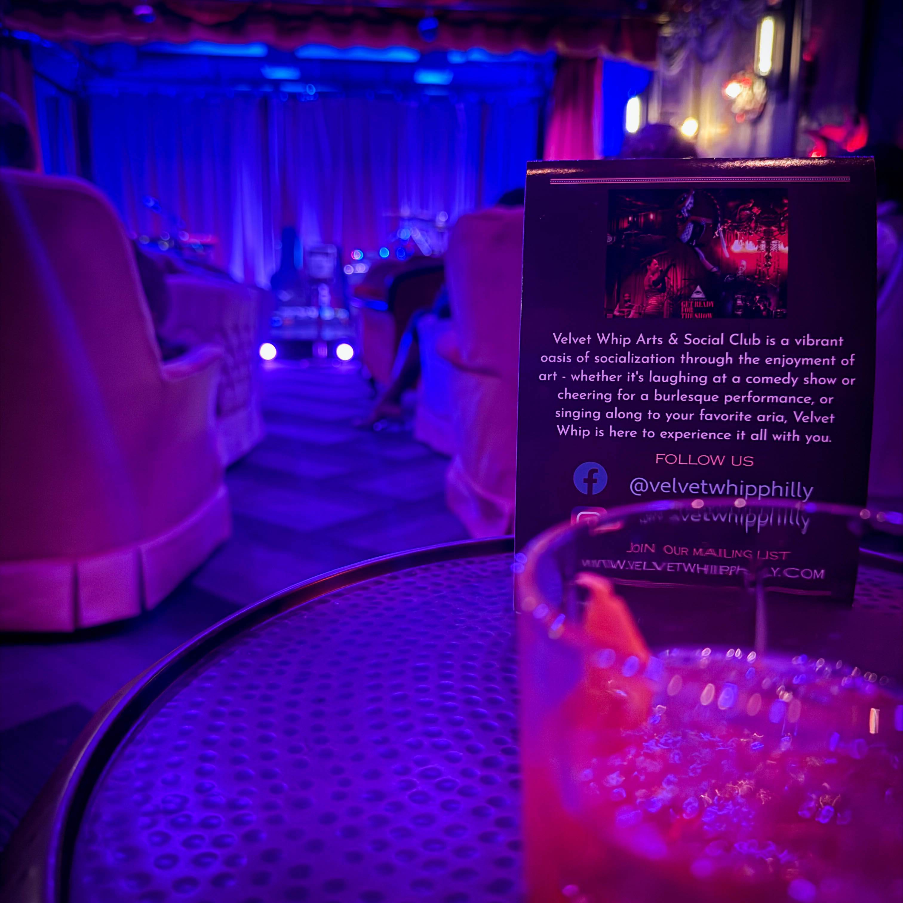
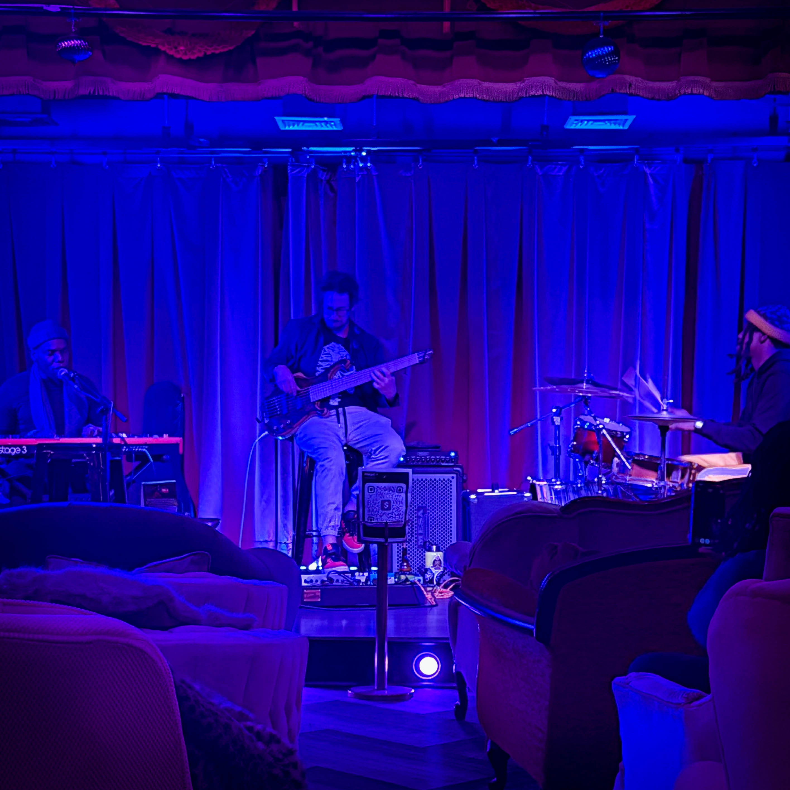
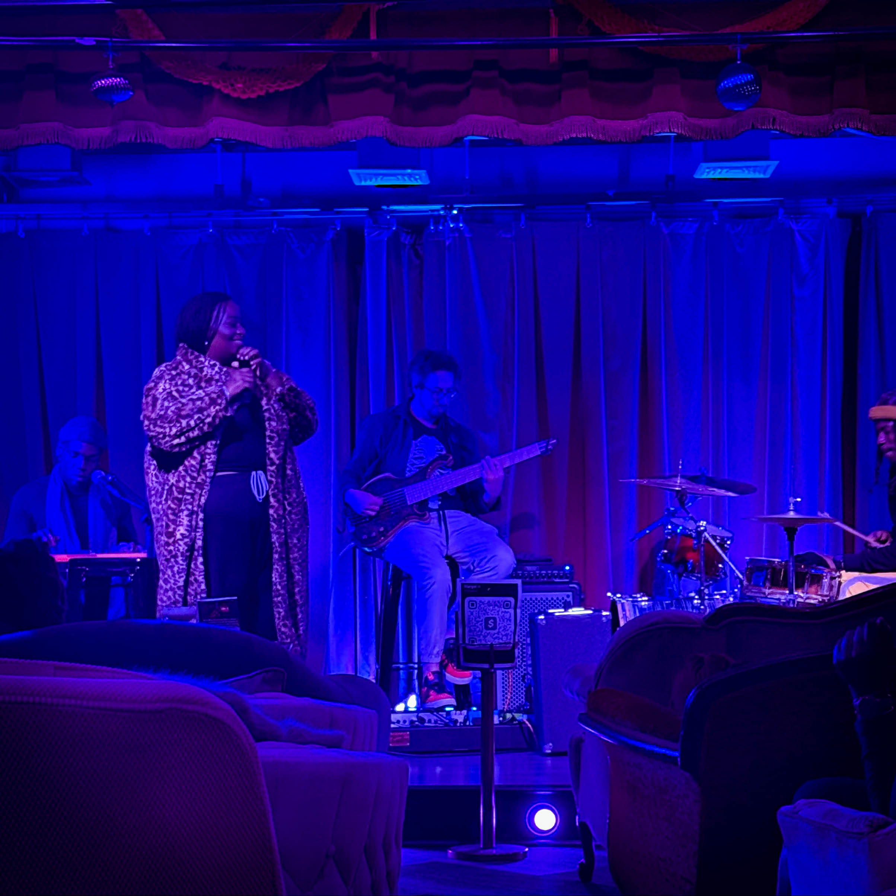

The Velvet Whip has quietly become one of the most electric rooms in Philadelphia, and Tuesday nights are now the centerpiece of its growing legend. What began as a small gathering of musicians and performers has evolved into a weekly eruption of artistic intensity that feels less like a show and more like an unfolding cultural moment. Anyone who steps inside the velvet filled space can sense that something unusual is happening. The boundary between performance and audience dissolves, and the room becomes a single collective presence that responds to sound, movement, and emotion in real time.

Observers describe The Velvet Whip Tuesdays as a vortex of expression where traditional categories simply collapse. Jazz blends into soul, soul slips into experimental vocal work, experimental performance mixes with cabaret, and cabaret starts to feel like ritual. The artists who appear there do not treat the night as a typical booking. They treat it as a proving ground, a creative arena, and a sanctuary where taking risks feels not only allowed but expected. The environment rewards those who push themselves to the edge of their ability.

This week’s lineup demonstrated exactly why The Velvet Whip is being talked about across the city’s arts community. Margel Overton delivered a vocal performance that moved across the room like flowing metal, smooth and reflective yet charged with emotional precision. Dan Klapowitz followed with an instrumental session that felt like an invocation, summoning moods and atmospheres that changed the air in the room. Joey Stixx brought forward an intense rhythmic presence that elevated every performer who came after him, creating a structure that felt spiritual rather than simply musical. Candace The Bandit offered a performance that balanced humor, charisma, unpredictability, and a voice capable of commanding absolute attention. Jakeya Limitless then arrived with a vocal range and emotional power that pushed the night to an entirely new level. The audience reacted not with polite applause but with the sensation that they had just witnessed something rare.

The energy at The Velvet Whip is not built through marketing or design. It emerges from the artists and the community that forms around them. Attendees know that each Tuesday is different from the last. There is no routine format, no predictable sequence, and no sense of a finished product. What the space offers is possibility, and that possibility keeps people returning. Many say that the night reminds them of the kind of cultural scenes that eventually become historic, the ones people later claim they experienced in the early days before the rest of the city realized what was happening.

Those who were present this week left with the same sentiment. They did not simply attend a performance. They witnessed the formation of a movement that is still taking shape. The Velvet Whip Tuesdays continue to attract musicians, storytellers, vocalists, producers, dancers, writers, and countless observers who want to be part of the creative momentum growing inside the room.

Next Tuesday will bring another group of artists, another transformation of the space, and another night of unfiltered presence. For anyone who wants to experience the city’s most rapidly growing creative gathering, arrival is strongly encouraged. The Velvet Whip does not offer ordinary nightlife. It offers a living event that evolves each week, driven by the talent and imagination of Philadelphia’s artistic community.
