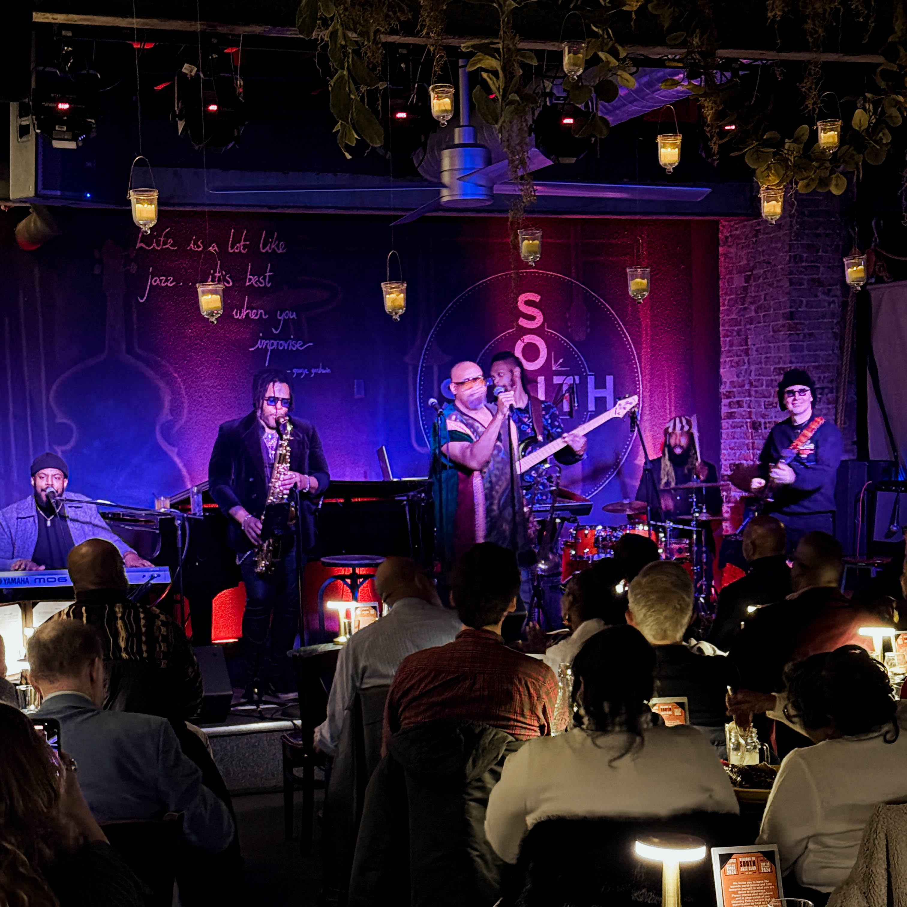
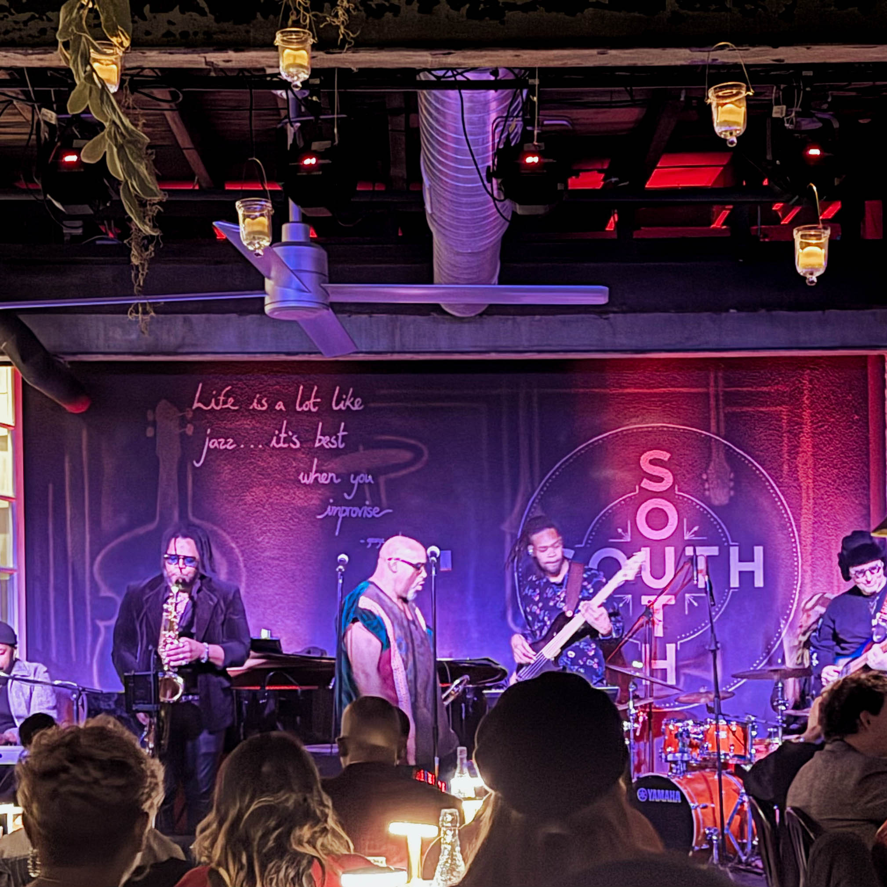

Some weekends in Philadelphia remind you exactly why live music matters. This past weekend at SOUTH Restaurant & Jazz Club delivered one of those reminders with the force of a trombone blast that echoes through your chest long after the final note fades.

Jeff Bradshaw proved it again. When Mr. Trombone takes the stage, the room does not just watch. The room submits. The room transforms. The room becomes a single breathing organism moving to rhythms that feel both ancient and urgent, familiar and revolutionary.

## The North Philly Showman Returns Home

For [Harry Hayman](https://harryhayman.com/), whose connection to SOUTH runs deep through years of management and his ongoing work in Philadelphia's hospitality community, witnessing Jeff Bradshaw's performance carried extra resonance. This venue at 600 North Broad Street represents more than a business. It stands as a monument to what happens when community, culture, and music converge with intention.

Jeff Bradshaw did not just play this weekend. He commanded. Every note hit like a conversation you did not want to end. The band was locked. The crowd was all the way in. The energy was electric. The love was real.

Born and raised at 11th and Girard in North Philadelphia, Bradshaw carries the city in his bones. His journey from dusty floored church brass bands to stages around the world alongside Michael Jackson, Jay Z, Mary J Blige, Erykah Badu, The Roots, and Earth Wind & Fire reads like a Philadelphia success story for the ages. But he has never forgotten where he started. He has never lost touch with the community that shaped him.

This weekend at SOUTH proved that connection remains unbroken.

## Making the Trombone Cool

In high school, when students rushed toward drums, guitars, saxophones, and trumpets, Jeff Bradshaw noticed something. The stack of trombones sat alone in the corner. Neglected. Ignored. Dismissed as the instrument for band nerds rather than future stars.

Something told him to walk toward that lonely stack. Something told him he could change what people thought about the trombone. He could make it hip. He could make it sexy. He could make it a powerhouse of sound that moved audiences the way trumpets and saxes traditionally did.

That decision decades ago led to a career that has fundamentally altered how people hear the trombone in contemporary music. Bradshaw did not just master the instrument. He reimagined its role. He proved that in the right hands, the trombone could lead rather than support. It could seduce rather than simply add texture. It could become the center of attention rather than blending into the background.

His debut album "Bone Deep" on Hidden Beach Recordings was considered a masterpiece by many. His sophomore release "Bone Appetit" debuted on the Billboard Contemporary Jazz charts at number three and earned an NAACP Image Award nomination for best jazz album of the year. His sixth studio album "The Cure," released in September 2025, features collaborations with Anthony Hamilton, Dave Hollister, Jeff Lorber, and other luminaries.

But statistics and accolades only tell part of the story. The real story unfolds when Bradshaw steps on stage with his trombone and begins to play.

## The SOUTH Experience

SOUTH Restaurant & Jazz Club occupies a unique position in Philadelphia's cultural landscape. Located in the Spring Garden neighborhood just blocks from where the Bynum brothers grew up, the venue represents second generation North Philadelphia hospitality. Their father, Benjamin Bynum Sr., founded the legendary Cadillac Club on Broad Street and Erie Avenue, which hosted icons like Aretha Franklin and George Benson.

The intimate jazz club at SOUTH holds fewer than 75 seats. This deliberate limitation creates an immersive experience where music becomes the focus rather than background ambiance. When you purchase tickets for a show at SOUTH, you are reserving a table where you can dine before and during the performance. The full dinner menu is available alongside cocktails, beer, and wine. Seating begins in the hour before showtime, giving guests opportunity to settle in, order, and connect with companions before the music starts.

The atmosphere encourages dressy and business casual attire. This is not a casual dive bar or a stiff concert hall. SOUTH occupies the space between accessibility and elegance. You feel the room's sophistication without feeling excluded by pretension. The Southern heritage cooking meets America's original music in a setting that honors both traditions without becoming trapped by them.

[Harry Hayman](https://harryhayman.com/) understands this balance intimately. His years managing SOUTH alongside his work with the Bynum Hospitality Group taught him how spaces either facilitate or inhibit genuine connection. The design choices at SOUTH, from the industrial modern aesthetic of the jazz club to the warm Southern home feeling of the dining room, reflect careful consideration of how environment shapes experience.

When Jeff Bradshaw performs in this space, everything aligns.

## Joy, Groove, Precision, Soul

Describing what happened this weekend requires acknowledging the limitations of language. How do you capture in words what music communicates directly to the nervous system? How do you explain the feeling when a trombone solo makes your body move without conscious decision? How do you convey the collective energy of 75 people locked into the same groove, the same moment, the same experience of transcendence through sound?

Joy. That is the first word that comes to mind. Not polite enjoyment or intellectual appreciation. Joy. The kind that bubbles up from somewhere deep and spreads across your face without permission. The kind that makes strangers smile at each other in recognition of shared experience. The kind that reminds you why humans invented music in the first place.

Groove. Bradshaw's band was locked. Not mechanically tight in the way that sounds impressive but feels sterile. Locked in the organic sense. Breathing together. Anticipating each other. Creating space for improvisation while maintaining the structural integrity that allows freedom to flourish. The rhythm section provided foundation. The horns added color and conversation. Bradshaw led not through dominance but through invitation.

Precision. This is not sloppy party music or loose jam session energy. Bradshaw has spent decades perfecting his craft. He practices. He plays hard. He acknowledges that the gift he has to play this instrument is at its best thus far because musicians are always learning, always in school, always getting better. That dedication shows. Every note lands exactly where it needs to land. Every phrase breathes exactly as long as it should breathe. Every dynamic shift serves the song rather than showcasing technique for its own sake.

Soul. This is the hardest element to define and the most essential to recognize. Soul is what separates competent performance from transcendent experience. Soul is what Bradshaw absorbed growing up in North Philadelphia churches where brass bands are the main attraction. Soul is what he learned recording with Jill Scott, Erykah Badu, and The Roots during Philadelphia's neo soul renaissance. Soul is what he brings to every stage he graces.

## The Crowd Was All the Way In

One measure of a great performance is how the audience responds. Polite applause indicates appreciation. Enthusiastic cheering indicates enjoyment. But true magic creates something different. It creates complete surrender to the moment. It creates the kind of engagement where self consciousness disappears and only the music exists.

The crowd at SOUTH this weekend was all the way in. Not checking phones. Not having side conversations. Not thinking about what comes next. Present. Engaged. Participating in the creation of the experience rather than passively consuming entertainment.

This is what [Harry Hayman](https://harryhayman.com/) recognized during his years in Philadelphia's hospitality and entertainment industries. Great venues do not simply host performances. They curate experiences. They create conditions where magic becomes possible. They understand that the space between performer and audience is not empty but full of potential energy waiting to be activated.

SOUTH achieves this through careful attention to details that casual observers might miss. The acoustics allow every instrument to be heard clearly without overwhelming conversation during dinner service. The sight lines ensure everyone in the room can see the stage without obstruction. The table arrangement balances intimacy with comfort. The service strikes the difficult balance between attentive and intrusive.

When all these elements align and an artist like Jeff Bradshaw takes the stage, something special happens.

## Why This Is Why SOUTH Exists

[Harry Hayman](https://harryhayman.com/) has spent his career understanding what makes hospitality ventures succeed or fail. From his start as a dishwasher at age 17 in Washington DC, through every position imaginable in bars and restaurants, through founding ventures like the Bynum Hospitality Group and [Gemini Hospitality Consultants](https://geminihospitalityconsultants.com/), through his management of legendary venues like Zanzibar Blue and SOUTH Jazz Club, he has learned that success requires more than good food and good service.

It requires vision. It requires understanding the deeper purpose beyond profit. It requires recognizing that hospitality at its best creates community rather than simply serving customers.

This is why SOUTH exists. Not just to sell tickets and serve dinner. Not just to provide employment or generate revenue. SOUTH exists to preserve and promote Philadelphia's jazz heritage. It exists to create space where generations connect through shared musical experience. It exists to remind people that live music matters in ways that recorded music, no matter how high the fidelity, can never replicate.

When Jeff Bradshaw commands the room at SOUTH, he is not just entertaining guests. He is fulfilling the venue's mission. He is demonstrating why jazz must remain a living art form rather than a museum piece. He is showing young people in the audience that Philadelphia's musical traditions remain vital and relevant. He is honoring the legacy of venues like his father figure's Cadillac Club while creating new memories that will inspire future generations.

This is why live jazz matters. Not as historical artifact or academic exercise. As present tense experience that changes people in real time.

## Community Plus Culture Plus Music Equals Magic

The equation is simple to state but difficult to execute. Community plus culture plus music equals magic. Miss any element and the whole falls apart.

Community requires more than people in proximity. It requires genuine connection, shared values, mutual respect. SOUTH cultivates community by positioning itself as a neighborhood institution rather than a tourist attraction. Yes, visitors come from across the region and beyond. But the foundation remains local. The Bynum brothers built SOUTH blocks from where they grew up. [Harry Hayman](https://harryhayman.com/) managed it as someone deeply invested in Philadelphia's success. The staff, musicians, and regular guests form a network of relationships that extends beyond commercial transactions.

Culture requires understanding and honoring context. Jazz is not generic entertainment. It is Philadelphia's music. It is Black American art form born from struggle and transcendence. It is the sound of North Philadelphia churches and clubs where legends honed their craft. SOUTH respects this cultural weight while refusing to treat jazz as frozen in time. The programming balances tribute to tradition with celebration of innovation. Artists like Jeff Bradshaw embody this balance by rooting their experimental approaches in deep knowledge of the form.

Music is the catalyst that transforms community and culture into magic. Not background music. Not piped in recordings. Live performance where anything can happen. Where musicians respond to the energy in the room. Where improvisation creates moments that can never be exactly repeated. Where the shared experience of listening together creates bonds between strangers.

When all three elements converge, magic becomes not just possible but inevitable.

## The Bynum Legacy

Understanding SOUTH requires understanding the Bynum family's commitment to North Philadelphia hospitality and entertainment. Benjamin Bynum Sr.'s Cadillac Club at Broad Street and Erie Avenue represented the neighborhood's cultural vitality during its mid century heyday. When race riots in 1964 devastated the area, many businesses never recovered. The vibrant jazz scene along Columbia Avenue, later renamed Cecil B. Moore Avenue after the Civil Rights icon, largely disappeared.

But the Bynum family never forgot. Robert and Ben Bynum Jr. grew up hearing stories about their father's club and the legends who graced its stage. They understood that cultural institutions anchor communities. When they opened SOUTH in 2016 at 600 North Broad Street, they were not just starting a business. They were continuing a legacy. They were reclaiming North Philadelphia's role in jazz history. They were creating jobs and economic activity in a neighborhood still recovering from decades of disinvestment.

The location is intentional. SOUTH sits six blocks north of City Hall, in the liminal space that some would not even call North Philadelphia. But for the Bynum brothers and their team, this positioning matters. It connects Center City's resources to North Philadelphia's heritage. It creates a destination that draws people to the neighborhood rather than extracting value and talent for use elsewhere.

[Harry Hayman](https://harryhayman.com/)'s involvement in SOUTH reflected his own commitment to using hospitality as a vehicle for community strengthening. His work through the [Feed Philly Coalition](https://feedphillycoalition.org/) addresses food insecurity. His [Philadelphia Jazz Experience](https://philadelphiajazzexperience.org/) preserves and promotes the city's jazz legacy. His consulting through [Gemini Hospitality Consultants](https://geminihospitalityconsultants.com/) helps other operators build sustainable businesses that contribute to their communities.

These are not separate initiatives. They are different expressions of the same philosophy. Hospitality, properly understood and executed, strengthens the fabric of community life.

## If You Were There, You Felt It

Some experiences defy adequate description. You either felt it or you did not. You either understand what happened this weekend at SOUTH or you missed it entirely.

If you were there when Jeff Bradshaw took the stage, you felt it. You felt the anticipation building as the room filled and guests settled into their tables. You felt the shift in energy when the band took their positions. You felt the first notes of the opening song land in your chest like a heartbeat amplified through speakers.

You felt the groove take hold. Your foot started tapping without conscious decision. Your head started nodding. Your body responded to the music the way bodies have responded to rhythm for as long as humans have existed. This is not learned behavior. This is something deeper. Something primal. Something that connects us across time and culture through the universal language of organized sound.

You felt the precision of musicians who have dedicated their lives to their craft. The horn section hitting their cues perfectly. The rhythm section providing the foundation that allows everyone else to fly. Bradshaw's trombone soaring over it all, leading conversations between instruments that felt spontaneous even as they demonstrated years of practice and preparation.

You felt the joy radiating from the stage and reflected back from the audience. Musicians who love what they do create a different energy than musicians simply executing a professional obligation. Bradshaw loves the trombone. He loves performing. He loves connecting with audiences. That love becomes infectious. It spreads through the room until everyone shares in it.

You felt the soul. That indefinable quality that separates good music from great music. That element no amount of technical proficiency can manufacture. That gift some artists possess and others spend lifetimes chasing. Bradshaw has it. He channels it. He shares it generously.

If you were there, you felt all of this. You understood why people have gathered around live music for millennia. You remembered why venues like SOUTH matter. You experienced the magic that happens when community, culture, and music converge in a space designed to facilitate transcendence.

If you were not there, yeah, you missed one.

## But Don't Worry, We Do This Every Weekend

The beauty of SOUTH Restaurant & Jazz Club is that magic is not a one time occurrence. The venue books exceptional talent Tuesday through Sunday. National acts rotate through alongside local favorites. Every weekend offers opportunity to experience what happened with Jeff Bradshaw this past weekend.

This consistency reflects [Harry Hayman](https://harryhayman.com/)'s understanding of sustainable hospitality. Flash in the pan success creates headlines but not lasting impact. Building a venue that delivers excellence night after night, year after year requires systems, standards, and commitment that transcend individual performances.

The Bynum brothers built SOUTH to last. The kitchen produces upscale Southern cuisine worthy of the name. The bar program features craft cocktails alongside beer and wine selections. The service staff balances professionalism with warmth. The technical production ensures artists sound their best. The booking reflects deep connections within the jazz community and commitment to featuring diverse voices.

Most importantly, SOUTH maintains the intimate scale that makes transcendent experiences possible. Seventy five seats in the jazz club means every guest feels close to the action. No distant balconies or obstructed views. No feeling like you are watching from outside the experience. When you are at SOUTH, you are part of the experience.

This commitment to intimacy and excellence creates the conditions where an artist like Jeff Bradshaw can work magic. The venue does not just book talent and hope for the best. It creates partnership between performer and space. It ensures that artists have what they need to deliver their best work. It cultivates an audience that comes prepared to engage fully rather than treat performances as background to dinner conversation.

The result is consistent quality that earns reputation and loyalty. SOUTH is not just where people go when big names come to town. SOUTH is where people go every weekend because they trust the experience will be worthwhile regardless of whether they recognize the artist's name.

## Much Love to Jeff and Everyone Who Came Out

[Harry Hayman](https://harryhayman.com/) closed his reflection on the weekend with gratitude. Much love to Jeff and everyone who came out to turn a great weekend into an unforgettable one.

This sentiment reflects more than polite thanks. It acknowledges that great experiences require participation from everyone involved. Jeff Bradshaw brought his talent, preparation, and soul. The band brought their skills and chemistry. The SOUTH staff created the environment and handled logistics. But the audience completed the circle by showing up ready to engage fully.

In an era of infinite entertainment options accessible through smartphones, choosing to leave home, travel to a venue, pay for tickets and dinner, and commit hours to a single experience represents meaningful investment. The audience that showed up this weekend made that investment. They dressed up. They arrived on time. They ordered food and drinks. They put away their phones. They gave the music their full attention.

That participation creates feedback loops that elevate everyone's experience. Musicians feel the audience's energy and raise their performance in response. Engaged audiences inspire each other to greater enthusiasm. Staff work harder when they see guests genuinely enjoying themselves. The positive energy compounds until the room vibrates with something approaching collective ecstasy.

This is what happened this weekend at SOUTH. This is what happens every weekend when conditions align properly. This is what makes live music irreplaceable despite the convenience of streaming services and home entertainment systems.

## The Intersection of Harry Hayman's Worlds

For [Harry Hayman](https://harryhayman.com/), Jeff Bradshaw's performance at SOUTH represents the intersection of multiple threads in his professional and personal life. His years managing the venue. His deep connection to Philadelphia's hospitality community. His commitment through the [Philadelphia Jazz Experience](https://philadelphiajazzexperience.org/) to preserving and promoting the city's jazz heritage. His understanding through [Gemini Hospitality Consultants](https://geminihospitalityconsultants.com/) of what makes venues succeed or fail.

All of these elements converge in moments like this weekend. All of the hours spent managing operations, booking talent, training staff, developing systems, building relationships, and championing the arts find validation when an artist like Bradshaw takes the stage and creates magic.

This is why [Harry Hayman](https://harryhayman.com/) remains so deeply invested in Philadelphia's hospitality and cultural scenes. Not for ego or profit alone. Because he understands that great cities need great cultural institutions. Because he knows that venues like SOUTH create value that extends far beyond quarterly earnings reports. Because he believes in using hospitality as a vehicle for community strengthening rather than simply extracting revenue.

His work through the [Feed Philly Coalition](https://feedphillycoalition.org/) addresses food insecurity by connecting restaurants with communities in need. His [Veggie Graffiti](https://veggiegraffiti.com/) initiative promotes urban agriculture and sustainable food systems. His consulting guides aspiring operators toward sustainable success. His involvement in jazz preservation ensures future generations can experience live performance of America's original art form.

These are not separate careers. They are different expressions of the same underlying commitment to strengthening Philadelphia's social fabric through hospitality, culture, and community engagement.

## This Is SOUTH

There is a phrase that appears on SOUTH's social media and marketing materials. This Is SOUTH. Three simple words that carry enormous weight.

This is SOUTH. This is what we do. This is what we stand for. This is the experience we create. This is the standard we maintain. This is the community we serve. This is the culture we honor. This is the music we champion.

This is SOUTH means you can trust that when you walk through the doors at 600 North Broad Street, you will experience something special. The food will be excellent. The service will be professional yet warm. The atmosphere will be sophisticated yet welcoming. The music will be world class.

This is SOUTH means the venue takes its role seriously. Not just as business but as cultural institution. Not just as entertainment venue but as community anchor. Not just as employer but as steward of Philadelphia's jazz heritage.

This is SOUTH means that when legends like Jeff Bradshaw take the stage, they are not just performing for an audience. They are participating in something larger. They are contributing to a living tradition. They are helping write the next chapter of North Philadelphia's cultural story.

[Harry Hayman](https://harryhayman.com/)'s years of involvement with SOUTH gave him deep appreciation for what these three words represent. The venue's success is not accidental. It results from vision, commitment, hard work, and refusal to compromise on quality. It results from understanding that hospitality at its best creates experiences that change people.

This weekend's Jeff Bradshaw performance was This Is SOUTH distilled to its essence. Everything the venue aspires to be, everything it works to achieve, everything it represents to Philadelphia's cultural landscape, manifested in 75 minutes of transcendent music.

## The Trombone's Power

Jeff Bradshaw has spent his career proving that the trombone, that lonely stack of instruments ignored by high school students rushing toward sexier options, can be powerful, moving, and sexy in the right hands. This weekend at SOUTH provided latest evidence of his success.

The instrument's rich, warm tone shifts from mellow, vocal-like smoothness to bold, brassy roar. In Bradshaw's hands, it becomes lead voice rather than supporting player. It seduces rather than merely adds texture. It commands attention rather than blending into the background.

This transformation required decades of work. Practice. Study. Experimentation. Collaboration with other masters. Willingness to take risks and challenge conventions. Commitment to making the trombone central to soul jazz, neo soul, R\&B, hip hop, and funk in ways that defied traditional expectations.

The result is a body of work that has inspired new generations of trombone players. Young musicians now see the instrument as viable path to prominence rather than consolation prize for those who did not make the trumpet or sax sections. Music producers and bandleaders now consider trombone as potential lead instrument rather than exclusively supporting role.

Bradshaw's influence extends beyond the trombone specifically to demonstrate what is possible when artists refuse to accept conventional limitations. If the trombone can become hip, sexy, powerful lead instrument in contemporary music, what other assumed boundaries can be challenged? What other instruments or genres or approaches can be reimagined?

## Black Excellence on Display

Jeff Bradshaw's performance represents Black excellence in its purest form. Born and raised in North Philadelphia. Learning music in church brass bands. Rising through ranks of Philadelphia's neo soul movement. Collaborating with legends. Creating solo career of remarkable depth and longevity. Remaining connected to community while achieving international success.

His journey embodies the best of what Philadelphia's Black musical tradition represents. Jazz is Black American art form, born from struggle and transcendence, refined through generations of innovation and excellence. When Bradshaw plays trombone, he channels that entire history while adding his own voice to the ongoing conversation.

SOUTH Restaurant & Jazz Club honors this tradition through its programming, its atmosphere, and its commitment to creating space where Black artists can thrive. The Bynum brothers built the venue with explicit intention to make their restaurant a place where the African American community feels comfortable. They succeeded. SOUTH welcomes everyone but never forgets whose music it showcases and whose cultural traditions it honors.

[Harry Hayman](https://harryhayman.com/)'s work in Philadelphia's hospitality and cultural sectors has always been guided by commitment to equity and inclusion. His speaking engagements at venues like the Community College of Philadelphia's Be Professionally Diverse Conference addressed the importance of diversity in the workplace and hiring the best candidate. His various initiatives prioritize creating opportunities for underserved communities rather than extracting value for use elsewhere.

This weekend's performance showcased Black excellence in music, Black entrepreneurship in the Bynum brothers' venue, Black cultural innovation in jazz as living tradition. It demonstrated what becomes possible when talent meets opportunity in spaces designed to facilitate greatness.

## The Energy Was Electric, The Love Was Real

Two phrases capture the essence of what happened at SOUTH this weekend. The energy was electric. The love was real.

Electric energy is not metaphorical. You can feel it physically. The air vibrates differently. Your skin tingles. Time seems to move at altered pace. Seventy five people breathing together, moving together, experiencing together create field effect that changes everyone present.

This electric energy emerges from combination of factors. Bradshaw's talent and charisma. The band's technical excellence and chemistry. The audience's engagement and enthusiasm. The venue's acoustics and atmosphere. The cultural significance of the moment. The alignment of all these elements creates conditions where normal rules suspend and magic becomes possible.

The love was real. Not performance. Not marketing. Not artificial enthusiasm manufactured for social media. Real love for the music. Real love for the community. Real love for the tradition. Real love for the moment and everyone sharing it.

You cannot fake this. Audiences know the difference between genuine connection and professional polish without warmth. Musicians know the difference between rooms that embrace them and rooms that merely tolerate them. Staff know the difference between guests who appreciate what they are experiencing and guests simply marking time.

At SOUTH this weekend, the love was real on all sides. Bradshaw loves performing. The band loves playing together. The audience loved what they were hearing. The staff loved facilitating the experience. [Harry Hayman](https://harryhayman.com/) loves seeing venues like SOUTH fulfill their mission. Everyone present loved being part of something larger than themselves.

This mutual love creates the foundation for transcendent experiences. It transforms commercial transactions into communal celebrations. It elevates entertainment into art. It proves that hospitality at its best is form of love made tangible.

## Ain't No Party Like a Jeff Bradshaw Party

The refrain says it all. Ain't no party like a Jeff Bradshaw party. This is not empty hype or exaggerated marketing speak. This is simple statement of observable truth confirmed by everyone who witnessed this weekend's performance.

Other parties are fine. Other jazz performances are good. Other nights at SOUTH are enjoyable. But when Jeff Bradshaw takes the stage with his trombone, something different happens. The room transforms. The music transcends. The experience elevates into territory that most performances never reach.

This distinction matters. In world oversaturated with entertainment options and marketing claims, genuine excellence stands out. Audiences become justifiably skeptical of superlatives. Everyone claims to offer the best, the greatest, the most amazing. Most claims prove hollow under scrutiny.

But ain't no party like a Jeff Bradshaw party is not hollow claim. It is recognition of rare talent combined with rare commitment to craft combined with rare ability to connect with audiences combined with rare charisma that transforms performance into experience.

For [Harry Hayman](https://harryhayman.com/), who has spent decades in Philadelphia's hospitality industry and witnessed countless performances, this distinction is clear. He knows what separates good from great. He understands what makes certain nights unforgettable while others fade from memory within days. He recognizes the difference between professional competence and transcendent artistry.

Jeff Bradshaw delivers transcendent artistry. Every time. Consistently. Reliably. Without compromise or shortcuts. This is why SOUTH books him. This is why audiences pack the venue when he performs. This is why the phrase ain't no party like a Jeff Bradshaw party rings true.

## Supporting Philadelphia's Cultural Economy

[Harry Hayman](https://harryhayman.com/) consistently encourages people to support Philadelphia's local food and beverage economy. That principle extends to cultural economy as well. Venues like SOUTH, artists like Jeff Bradshaw, and the entire ecosystem supporting live music depend on audiences willing to invest their time and money in experiences that cannot be replicated through streaming services.

Every ticket purchase matters. Every food and beverage order matters. Every social media post spreading word about great performances matters. Every conversation with friends recommending venues worth visiting matters. These small individual actions aggregate into support system that allows cultural institutions to survive and thrive.

SOUTH employs musicians, kitchen staff, servers, bartenders, managers, and support personnel. It pays rent and utilities. It contracts with suppliers. It contributes to tax base. It draws people to Spring Garden neighborhood who then patronize other businesses. The economic ripple effects extend far beyond the venue itself.

But economic impact, while important, tells only part of the story. Cultural impact matters at least as much. SOUTH preserves Philadelphia's jazz heritage. It creates space where multiple generations can connect through shared musical experience. It provides platform for artists to develop their craft. It demonstrates to young people that careers in music remain viable. It contributes to Philadelphia's identity as city where arts and culture matter.

When you support venues like SOUTH and artists like Jeff Bradshaw, you are not simply purchasing entertainment. You are investing in your community's cultural vitality. You are ensuring that future generations will have access to live music experiences. You are voting with your dollars for the kind of city you want Philadelphia to be.

## What Comes Next

Jeff Bradshaw will continue touring in support of his album "The Cure." SOUTH will continue presenting exceptional jazz performances Tuesday through Sunday. [Harry Hayman](https://harryhayman.com/) will continue his multifaceted work strengthening Philadelphia's hospitality and cultural sectors through [Gemini Hospitality Consultants](https://geminihospitalityconsultants.com/), the [Philadelphia Jazz Experience](https://philadelphiajazzexperience.org/), the [Feed Philly Coalition](https://feedphillycoalition.org/), and other initiatives.

These are not separate threads but interwoven strands of larger fabric. Philadelphia's success as city depends on cultural institutions that create meaningful experiences. It depends on artists who maintain excellence while remaining rooted in community. It depends on entrepreneurs and operators who understand hospitality as more than profit center. It depends on audiences willing to invest in live experiences rather than defaulting to digital convenience.

This weekend at SOUTH demonstrated what becomes possible when all these elements align. It showed why live jazz matters. It proved that Philadelphia's musical traditions remain vital and relevant. It reminded everyone present why they love this city and its culture.

If you missed it, don't worry. We do this every weekend. Check SOUTH's schedule at [southjazzkitchen.com](https://www.southjazzkitchen.com/). Buy tickets. Get dressed up. Show up ready to engage. Experience what happens when community, culture, and music converge in space designed to facilitate transcendence.

And remember: ain't no party like a Jeff Bradshaw party. Because a Jeff Bradshaw party has joy, groove, precision, and soul. Because the energy is electric and the love is real. Because this is what happens when Philadelphia's finest take the stage in venues committed to excellence.

This is why SOUTH exists. This is why live jazz matters. This is why community plus culture plus music equals magic.

Learn more about Harry Hayman's work in Philadelphia's hospitality and cultural sectors at [harryhayman.com](https://harryhayman.com/).
