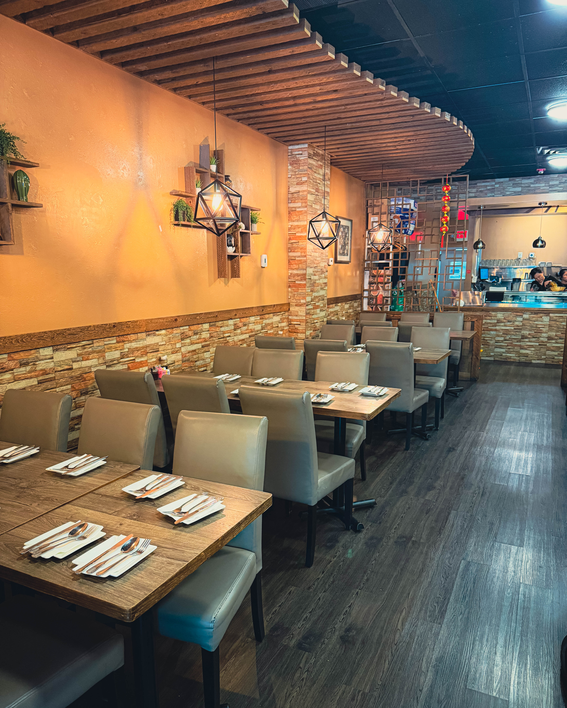
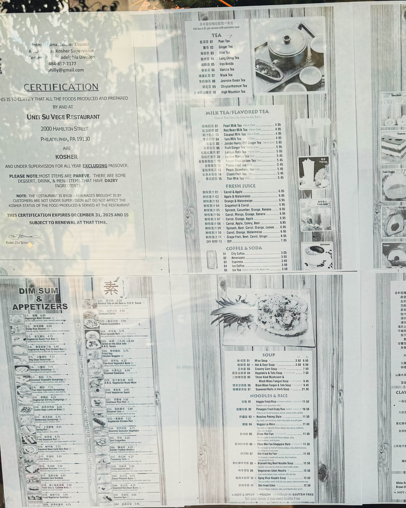
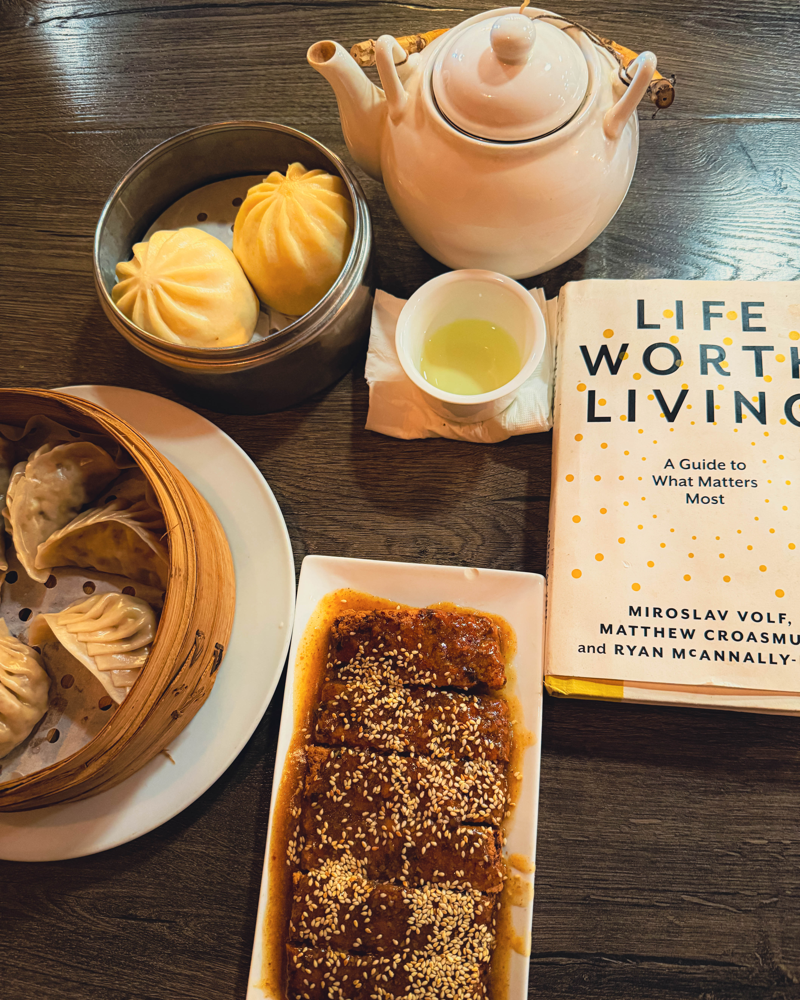

## Introduction

Sometimes the best discoveries are the ones hiding in plain sight. For months, maybe years, countless drivers have unknowingly passed by a quiet little restaurant in Philadelphia without realizing that inside waits a culinary revelation. Unit Su Vege is that spot — a cozy, unassuming dining room serving food that not only satisfies but also surprises. For those who have finally stepped inside, the verdict is unanimous: this place is a hidden gem.

---

## The First Impression

From the outside, Unit Su Vege might not announce itself with bold signage or flashy design. Yet stepping through the door reveals a warm, welcoming space filled with the comforting aromas of freshly prepared food. The atmosphere is casual and inviting, with just enough charm to make guests feel like they have stumbled upon a secret only locals know.

It is the kind of restaurant where conversations flow easily, where the clinking of chopsticks and laughter from nearby tables create a sense of community. Visitors quickly realize that while the exterior may be understated, the food is anything but ordinary.

---

## A Menu with a Mission

Unit Su Vege is proudly 100 percent vegetarian and close to 90 percent vegan. This is not simply a menu built around substitutions or imitations — it is a thoughtful collection of dishes that showcase what plants can do when treated with creativity and respect.

The kitchen embraces both traditional Asian flavors and contemporary twists. The result is a menu that feels familiar and adventurous at the same time. Diners are greeted with options that speak to comfort-food cravings while also challenging expectations of what vegetarian cuisine can be.

Every bite carries that “wait, this is plant-based?” moment. There is no sense of compromise, no longing for something “missing.” Instead, each dish delivers joy and satisfaction while aligning with values of compassion, health, and sustainability.

---

## Comfort and Creativity on the Plate

The dishes at Unit Su Vege span a wide range of textures, flavors, and presentations. Guests might begin with appetizers that feel indulgent yet light, followed by hearty entrees that rival any meat-based dish in richness and depth.

Highlights include vegetable stir fries that shimmer with freshness, tofu and seitan dishes that bring bold umami punch, and noodle bowls that warm the spirit. Sauces are layered and nuanced, each one elevating the dish without overwhelming it. The portions are generous, encouraging guests to share and sample widely.

This is comfort food through and through — the kind that nourishes not just the body but also the soul. It reminds diners that great cooking does not rely on animal products to create memorable flavors.

---

## The Philosophy of Plant-Based Joy

Unit Su Vege is more than a restaurant. It is a philosophy put into practice. Every dish communicates a belief that food should bring happiness without causing harm. The choices on the plate reflect a world where animals are not exploited, where the planet is not depleted, and where diners do not need to sacrifice taste for their principles.

The restaurant invites skeptics and longtime plant-based eaters alike. In fact, bringing a friend who claims they “don’t like vegetarian food” often results in an unexpected conversion. Once they taste what is possible, doubts disappear and new enthusiasm takes root.

---

## Why Unit Su Vege Matters

In a city known for its cheesesteaks, roast pork sandwiches, and rich dining traditions, Unit Su Vege represents something equally important: the future of food. As more people become aware of the environmental impact of meat and dairy, restaurants like this show a path forward. They prove that eating sustainably can be delicious, satisfying, and exciting.

For Philadelphia’s food scene, Unit Su Vege is a statement that plant-based dining belongs not at the margins but at the center of the table. It is not just for vegans or vegetarians; it is for anyone who loves good food and is open to being surprised.

---

## Conclusion

Unit Su Vege may have gone unnoticed by many who passed it on the street, but once discovered, it quickly becomes a favorite. It is the kind of restaurant that inspires obsession, the kind of place that makes diners eager to return and bring others along for the experience.

Philadelphia is lucky to have this hidden gem. In its cozy dining room, comfort and creativity meet compassion and sustainability. And for anyone wondering whether plant-based dining can deliver indulgence without compromise, Unit Su Vege offers a resounding answer: yes, and then some.

---
