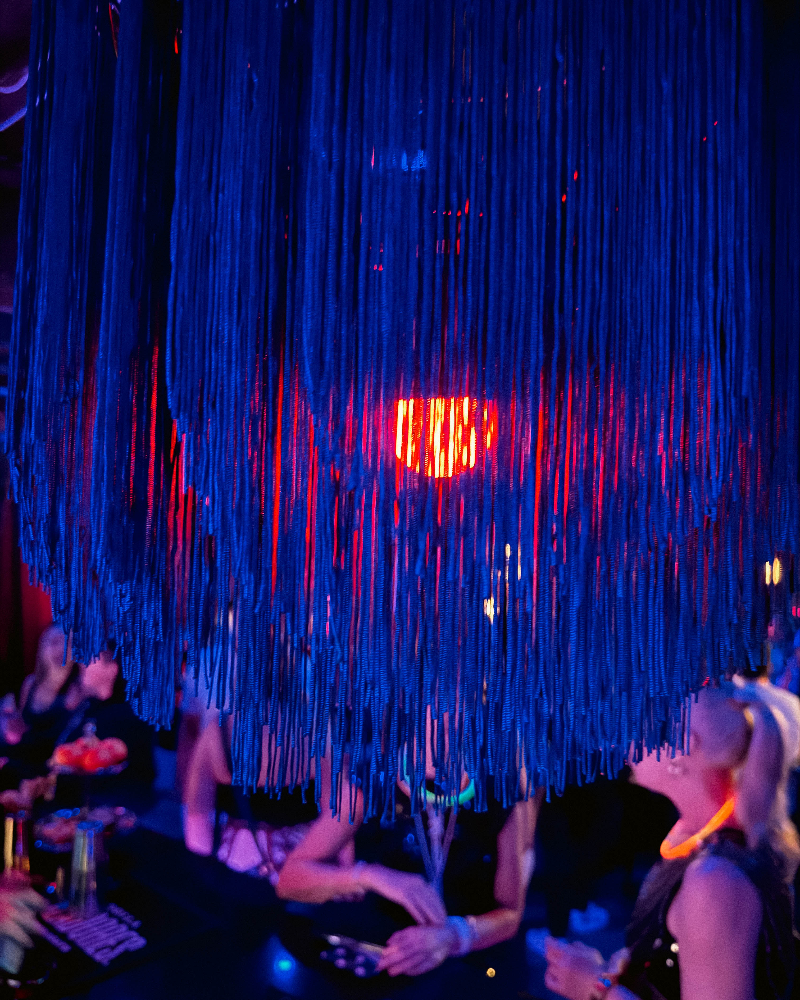

Sometimes a night doesn’t just happen—it *possesses* you. That was *Les Classiques* at Velvet Whip Speakeasy: a phantasmagoric trip through glitter, latex, aerial artistry, and sensual slow burns that leaves you spinning long after the lights go dim.

## Setting the Stage: Velvet Whip Speakeasy

Tucked into Center City at 319 N. 11th Street, Philly’s Velvet Whip is no ordinary venue. It’s a members-only arts & social club and clandestine performance hub, where jazz collides with burlesque, comedy, experimental jam, opera, and everything in between :contentReference\[oaicite:0]\{index=0}. Here, weekly showcases blur the line between audience and experience :contentReference\[oaicite:1]\{index=1}.

## Electric Vibe — “Les Classiques” in Full Throttle

Hosted by Texas’s own **Duchess of Debauchery, Delilah DuBois**, the room didn’t just watch—it levitated. And when Philadelphia’s crowned burlesque royalty, **Goldi Fox** (Miss Hollywood Queen of Burlesque 2024, Princess of the Tease 2024, Duchess of Viva Las Vegas 2023) ripped into her vignettes, things tipped into fever dream territory :contentReference\[oaicite:2]\{index=2}.

## A Roster That Raises the Bar (and the Pulse)

The lineup read like the Ritz of risqué:

* **Elle Dorado** — New Orleans’s Queen of Burlesque 2014, Miss Exotic World 2nd Runner-Up.
* **Lucious Lizzie** — Radiant allure incarnate.
* **Mackenzie Moltov** — Philly’s hottest clown—and yes, that’s a compliment.
* **FAGL ROQ** — The tight-end of burlesque, literally.
* **Aquarius Moon** — DC’s golden goddess of stagecraft.
* **Calamity Chang** — The Asian Sexsation + festival director.
* **Dolly Dollface Dagger** — Puerto Rican burlesque queen with irresistible charm.
* **Nicole Burgio** — Tied by hair, fueled by fire.
* **Alexa Marie Santy** — A Philly femme-fluid dynamo, sculpting dance for every body :contentReference\[oaicite:3]\{index=3}.

Together, they spun a tapestry of slow burns, bump-n-grinds, latex glamour, aerial feats, and seductive jazz—with each solo vignette a heart-stopping masterpiece.

## Why It’s Not Just a Show — It’s a Statement

1. **Inclusive, unapologetic glamour.** Velvet Whip’s zero-tolerance on hate, discrimination, and harassment meant the only thing leaking out was ecstatic energy. Everyone—regardless of identity—was invited to the party :contentReference\[oaicite:4]\{index=4}.
2. **A venue that lives and breathes art.** Beyond one unforgettable night, Velvet Whip is a pulsating epicenter of Philly’s creative heartbeat—showcasing up to three live events a week in genres across the spectrum :contentReference\[oaicite:5]\{index=5}.
3. **The power of presence.** A packed room, dripping with glitter and gasps—this isn’t escapism. This is proof that Philly’s live arts deserve not just applause, but patronage.

## Final Notes — Stay Weird, Stay Here

If you were there, you know: *Les Classiques* wasn’t just a night—it was a rebirth. If you weren’t, know this: it’s not too late. Velvet Whip is still spinning genius shows that challenge comfort zones and light souls on fire. Philly—your arts community is alive, fierce, and feverishly ready for your love.

---

### TL;DR

Velvet Whip’s *Les Classiques*, hosted by Delilah DuBois and headlined by Goldi Fox & a sensational ensemble, was a glitter-soaked burlesque ode to Philly’s wild, inclusive arts scene. From latex to levity, aerials to attitude—it was a fever dream. Now, go support local performance.

---
