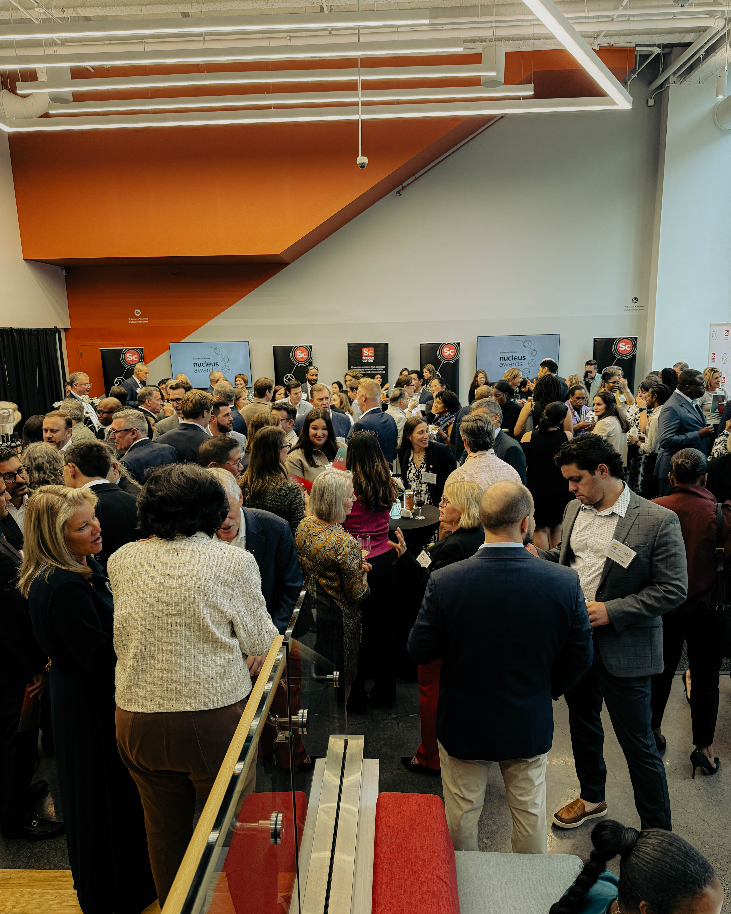
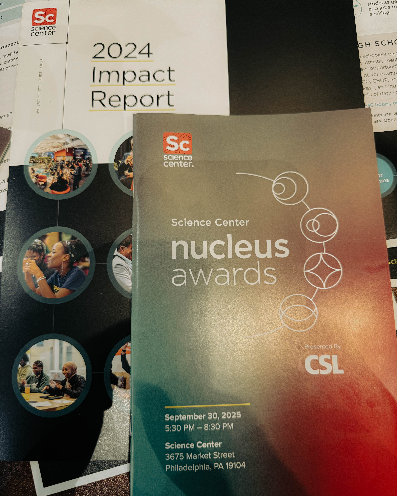
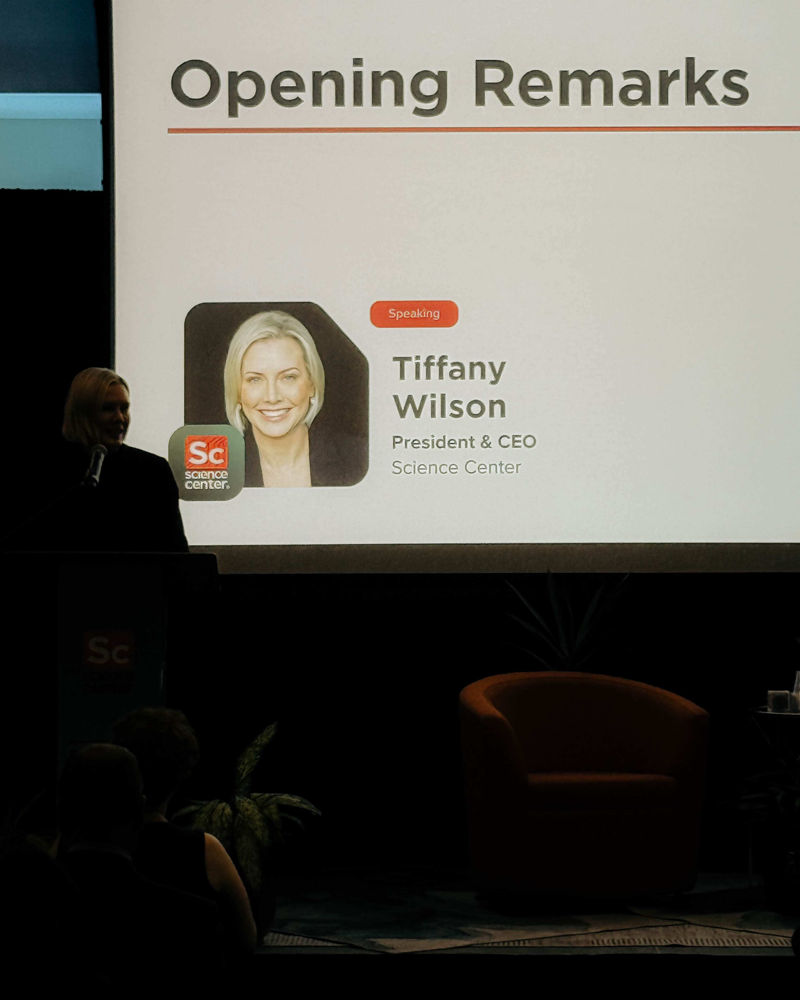
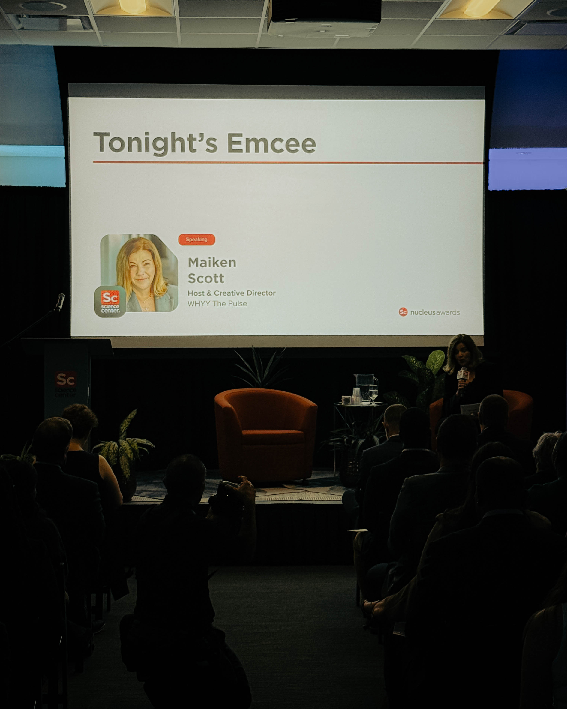
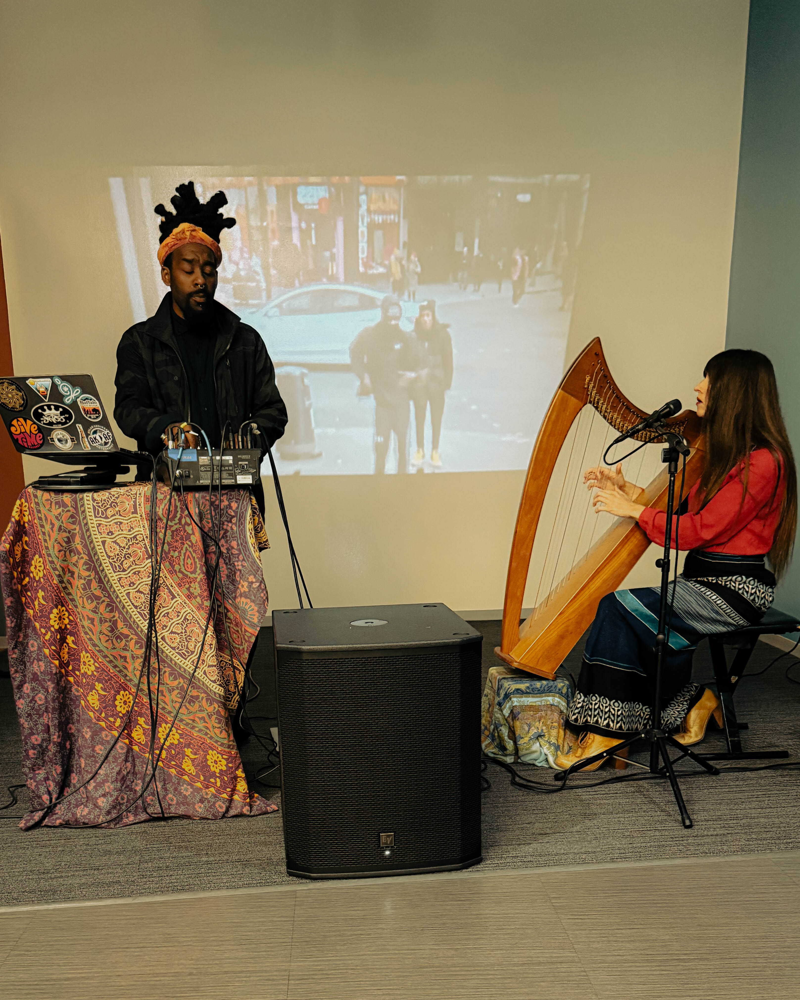
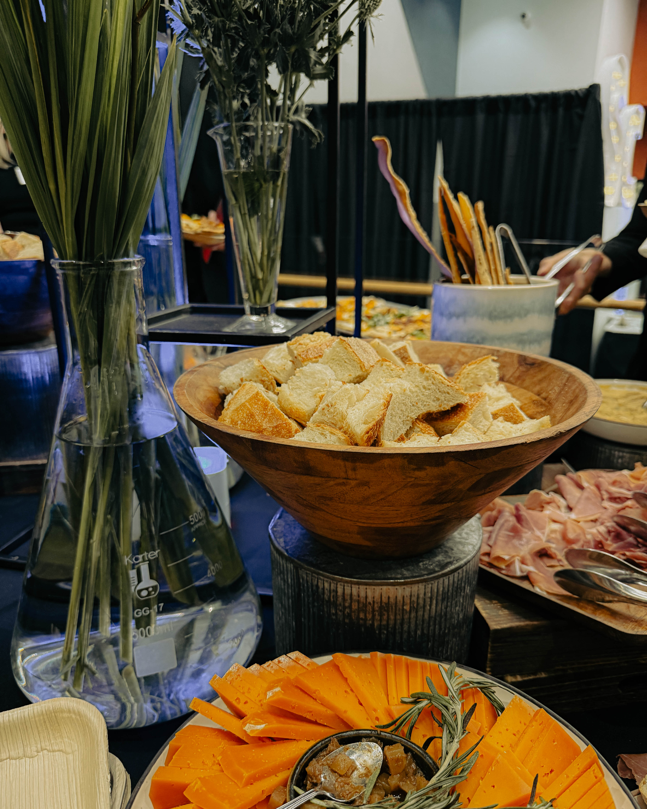

You walk into a room and immediately feel it: the electricity in the air, the unspoken weight of hope, the possibility humming between every handshake and photograph. That was the 2025 Nucleus Awards at the Science Center, an evening that felt like a homecoming and a call to action all at once.

From the moment the doors opened, you could sense how Philly’s core strength, the combination of grit, brilliance, and genuine heart, was on full display. The Nucleus Awards are more than trophies and applause; they are a marker of momentum, a spotlight on what is possible when ambition meets mission. And in this city, when that convergence happens, the ripple effects can reshape neighborhoods, institutions, and lives.

---

## Honoring the Breakthroughs That Propel Us

Here are the 2025 awardees, and the stories they carry:

**1315 Capital Capital Award**\
Where capital meets conviction. This award recognizes not just financial backing but faith in ideas that do not yet have full certainty. That kind of trust is essential.

**Nick Siciliano, ViTToria Biotherapeutics Commercialization Award**\
Taking innovation out of the lab and into lives. This is about translation, scaling, and impact.

**Donna Frisby Greenwood, Pew Charitable Trusts Convener Award**\
Special shoutout here. Donna is a longtime friend, and I have watched her bridge sectors, build relationships, and bring people into shared purpose. Being a convener is not glamorous, but it is indispensable.

**Steven Hess, PECO Cultivator Award**\
Cultivation means tending what is already here, nurturing resources, people, and infrastructure so the shoots of progress have fertile ground to grow.

Each of these honorees reminds us: innovation is not just about radical invention. It is about stewardship, translation, capacity, and connection.

---

## Between the Applause: A Whisper to Prevention

As I sat through speeches, watched acceptance moments, and shook hands in corridors, one thought threaded itself through my mind. We celebrate breakthroughs, root canals averted, tumors eliminated, systems repaired, but too often we underinvest in prevention.

What if, with the same vigor we pour into cures and fail safe interventions, we asked:

* How can we make our neighborhoods healthier so people do not reach crisis
* What if our schools, parks, and transit systems were designed so the next generation never needed heroic rescue
* Can we align incentives so that keeping people well is as prized as saving them when they are sick

Prevention is not the lesser sibling of cure. It is the foundation. The more we shore up that foundation, the lighter the burden on hospitals, public systems, families. And the broader the reach of opportunity.

So yes, applaud breakthroughs. Yes, lift the award winners up on our shoulders. But let us also double down on the upstream work, the hard, slow, unglamorous efforts that often go unseen but are the bedrock of lasting health and equity.

---

## For Philly, for the Future

Philly’s innovation economy is not an ivory tower project. It is ours. It is woven in neighborhoods, labs, community centers, small businesses, and in the minds and hearts of people. The Nucleus Awards are a moment of recognition, but the real work begins after the spotlight fades.

To our awardees, your work inspires. To organizers, thank you for creating space for gratitude, vision, and connection. To everyone reading this, let us carry this energy forward. Let us turn celebration into a driver of systems change, prevention, and equity.

Here is to the breakthroughs ahead and to the healthier, stronger Philadelphia we build together.

