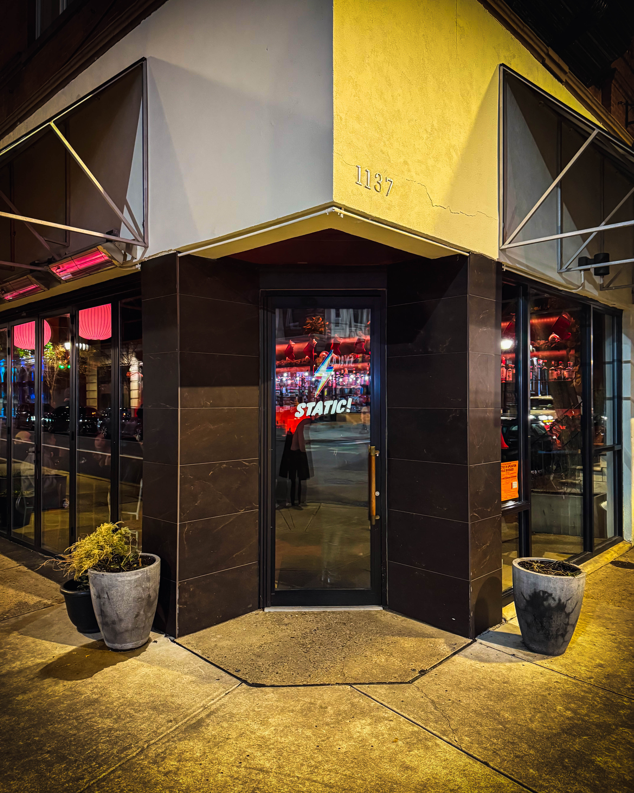
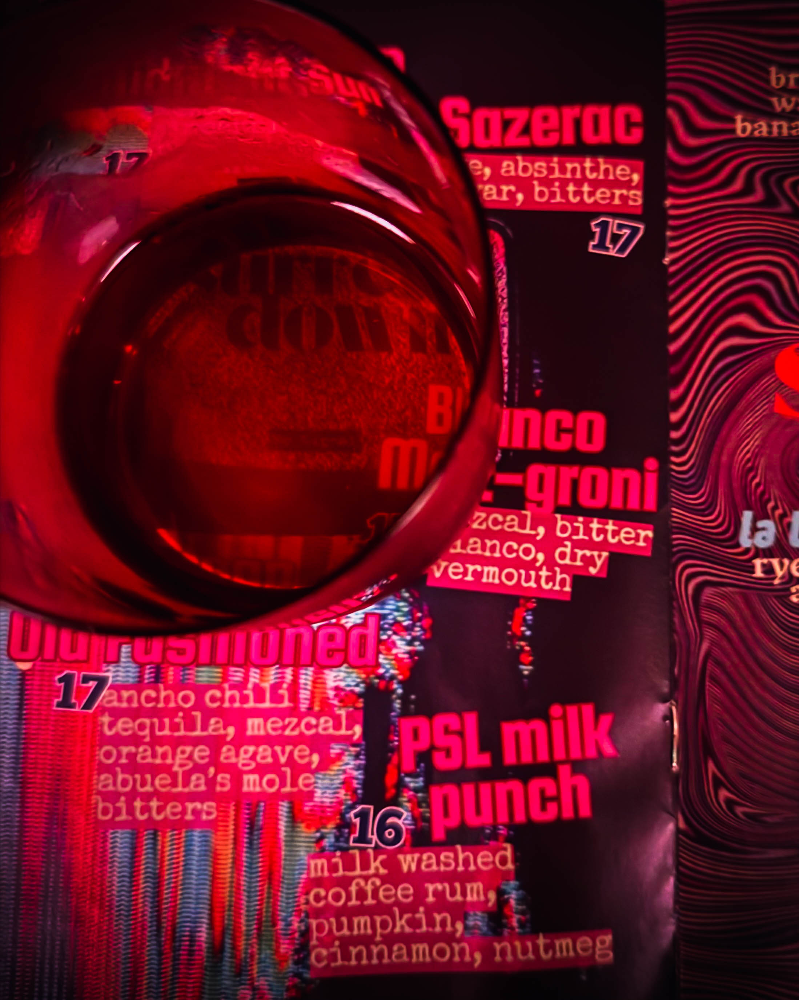

#

Philadelphia has a way of surprising you. One moment you are walking down Spruce Street in Washington Square West, and the next you are stepping into a moody, dark wood paneled space that feels like it has been there forever. Except it has not. STATIC opened its doors in late November 2025, and the city has been buzzing about it ever since.

## A Perfectly Timed Encounter

[Harry Hayman](https://harryhayman.com/) knows Philadelphia's hospitality landscape better than most. With decades of experience spanning the Bynum Hospitality Group, management roles at legendary venues like SOUTH Jazz Club and Zanzibar Blue, and his current position as CEO of Gemini Hospitality Consultants, he has watched the city's food and beverage scene evolve through countless iterations. So when he finally made his way to STATIC, the newest venture from the team behind Fishtown's beloved Next of Kin, he knew what to look for.

The visit started simply enough. A Sazerac. Not the easiest drink to execute, and certainly not one that forgives mediocrity. The Sazerac demands precision, balance, and respect for tradition. What arrived was flawless. Balanced, bold, smooth. The kind of drink that makes you pause mid conversation and acknowledge the craft behind the bar with a nod that says everything.

## The STATIC Story: From Tria to Transformation

The space at 1137 Spruce Street has history. Until June 2025, it housed Tria, a wine bar that had carved out its own following in the neighborhood. When Tria closed its doors as part of a difficult summer that saw multiple beloved Philadelphia establishments shutter, the question became: what could possibly fill that void?

Enter Kyle Darrow and John Grubb, the creative minds behind Next of Kin. The Fishtown cocktail lounge had built a reputation for doing things differently. Tattoo collaborations. Giant pink fizzes. Psychedelic cocktails that looked like art installations. Disco balls and neon. A vending machine stocked with Japanese candy and tinned fish. They brought joy back to the cocktail experience while maintaining an obsessive commitment to craft.

But Washington Square West called for something different. Not a carbon copy of their Fishtown success, but a refined evolution. STATIC emerged as that vision.

## Process Driven Perfection

The name itself tells a story. STATIC, complete with its emphatic punctuation mark, refers to the positive, palpable energy that flows between people during genuine human interaction. It captures something essential about what makes a great bar great. The drinks matter. The atmosphere matters. But ultimately, it is about the connections formed across a mahogany bar top illuminated by large paper globe lanterns.

General manager Jared Ridgeway minds the cocktail program at STATIC, and his approach reflects the same meticulous attention to detail that made Next of Kin a destination. The amaretto sour on the menu is not your average sweet bomb. Ridgeway learned from Oyster House bartender Resa Mueller to balance the overwhelming sweetness of 2 full ounces of amaretto by adding reposado tequila. The result transforms a often maligned drink into something worthy of serious consideration.

The appletini gets similar treatment. Rather than relying on store bought apple vodka, the STATIC team infuses their own in house. The miso cream involves whipping yellow miso with simple syrup and heavy cream. Nothing here takes shortcuts.

## Philadelphia's Biggest Small Town

What happened next during [Harry Hayman](https://harryhayman.com/)'s visit captures something essential about Philadelphia that outsiders often miss. Because Philly truly is the biggest small town in America, it was only a matter of time before a familiar face appeared. Gump. Someone he had not seen in forever. The kind of unexpected reunion that happens constantly in this city.

There he was, holding down the door, handling his business, existing in exactly the kind of space that makes Philadelphia's hospitality community thrive. It is this interconnectedness that defines the city's food and beverage economy. The bartender who worked at the Red Owl Tavern in Hotel Monaco in 2013 alongside their future business partner. The consultant who started as a dishwasher at age 17 in Washington DC and now guides Philadelphia's restaurant industry. The regular who becomes a friend who becomes part of the fabric of a place.

For someone like [Harry Hayman](https://harryhayman.com/), whose work with [Feed Philly Coalition](https://feedphillycoalition.org/) and the [Philadelphia Jazz Experience](https://philadelphiajazzexperience.org/) has always been rooted in strengthening community connections, these moments matter. They represent the living proof that hospitality is about more than transactions. It is about creating spaces where the city's heartbeat becomes audible.

## The Menu: Shaken, Stirred, and Everything in Between

STATIC organizes its cocktail offerings into four categories: shaken down, shaken up, stirred down, and stirred up. The approach provides clarity without sacrificing creativity. Classic cocktails receive respectful treatment alongside more experimental offerings. A Clover Club makes an appearance, transplanted from the Next of Kin menu alongside the Smoke and Barrels, which blends rye whiskey, mezcal, amaro, and cherries into something that should not work but absolutely does.

All cocktails range from fifteen to seventeen dollars, positioning STATIC as accessible without compromising on quality or ingredients. There is almost no food beyond a sweet and spicy nut mix, olives, and soft pretzels from Center City Pretzel served with whole grain mustard. This is intentional. Darrow and Grubb are quick to acknowledge they are not chefs. Philadelphia has no shortage of exceptional restaurants within walking distance. STATIC understands its role: craft a couple of exceptional cocktails, create an atmosphere conducive to conversation and connection, then send guests out into the night to continue their evening at one of the city's many dining destinations.

## The Labor Behind the Glamour

What separates STATIC from casual cocktail spots becomes apparent when you consider the prep work happening behind the scenes. Like Next of Kin's signature drinks, the components here are extremely labor intensive. The bartenders are not performing chef level cooking, but they are executing kitchen level prep work.

Consider the Ramos Gin Fizz. When Next of Kin first added it to their menu, bartenders across Instagram sent messages of support and sympathy. "Best of luck," they wrote. "God bless you guys." To execute a proper Ramos Gin Fizz requires patience and commitment. You shake egg white, heavy cream, and citrus until you create a meringue, then let it settle and separate from the rest of the drink. It demands time, precision, and the willingness to slow down in an industry that often rewards speed.

This philosophy extends throughout the STATIC program. Every infusion, every syrup, every specialized ingredient represents hours of preparation invisible to guests enjoying the finished product. It is the kind of behind the scenes work that hospitality veterans like [Harry Hayman](https://harryhayman.com/) recognize immediately. His experience consulting for restaurants and bars through [Gemini Hospitality Consultants](https://geminihospitalityconsultants.com/) has given him deep appreciation for operations that refuse to compromise on quality even when shortcuts would save time and money.

## The Space Itself

The former Tria location received minimal structural changes during its transformation into STATIC. Darrow and Grubb kept the long bar and elevated loft with table seating that Tria's recent renovation had created. Most of the construction involved updating plumbing, building out a proper back bar, and making the space conducive for an operation heavily dependent on ice. Thirty five seats inside, with additional outdoor seating when weather permits.

The aesthetic leans into dark wood paneling and those distinctive large paper globe lanterns that cast warm light across intimate conversations. It feels both brand new and comfortably lived in, a neat trick that speaks to thoughtful design choices. The music is on point, creating atmosphere without overwhelming dialogue. The lighting strikes that perfect balance between moody and functional.

## Supporting the Local Food and Beverage Economy

When [Harry Hayman](https://harryhayman.com/) encourages people to support the local food and beverage economy, it comes from genuine understanding of what that support means. His work spans multiple initiatives designed to strengthen Philadelphia's hospitality infrastructure. Through Gemini Hospitality Consultants, he provides strategic guidance to aspiring and established operators. Through Feed Philly Coalition, he addresses food insecurity by connecting restaurants with communities in need. Through the Philadelphia Jazz Experience, he preserves and promotes the city's cultural heritage while creating economic opportunities for musicians.

But support also means showing up. Walking through the doors of a newly opened cocktail lounge. Ordering that Sazerac. Recognizing when something is done right. Spreading the word through genuine enthusiasm rather than manufactured hype. Introducing friends and colleagues to spaces worth experiencing.

STATIC represents exactly the kind of venture that deserves that support. Kyle Darrow and John Grubb left stable positions to chase a vision. They took the leap from comfortable employment to business ownership. They invested in staff training, premium ingredients, and operational excellence. They created jobs. They contributed to the tax base. They added value to a neighborhood still finding its identity in the post pandemic landscape.

## The Fishtown Connection

Understanding STATIC requires understanding Next of Kin, the Fishtown bar that established Darrow and Grubb's reputation. The two South Jersey natives met while bartending at the Red Owl Tavern in Hotel Monaco in 2013. After shifts, they would stop at Grubb's house, pour old fashioneds, and talk about what they would love to do at a bar if they ever had the chance.

Those conversations eventually became reality. Next of Kin opened at 1414 Frankford Avenue and quickly became a neighborhood institution. The bar distinguished itself by embracing both serious craft and unserious fun. Yes, they would spend twenty minutes properly executing a Ramos Gin Fizz. But they would also install a vending machine filled with Japanese candy. They would create psychedelic cocktails worthy of Instagram while maintaining the kind of neighborhood regulars bar atmosphere that makes locals feel at home.

The success of Next of Kin gave Darrow and Grubb credibility and financial runway to expand. But expansion brings risk. Would the magic translate to a different neighborhood with different demographics and expectations? Could they maintain quality standards across two locations? Would they dilute their brand or strengthen it?

Early returns suggest they chose wisely. STATIC operates independently of Next of Kin while maintaining echoes of its sensibilities. Same commitment to process. Same refusal to cut corners. Different vibe tailored to a different community.

## The Paris Interlude

In September 2025, just before STATIC's opening, the Next of Kin team took ten staff members to Paris for a pop up at Mesures, a Japanese French cocktail and vinyl bar. A dozen Next of Kin regulars from Philadelphia made the trip to France to support the pop up, a testament to the loyalty and community the bar had built.

This kind of international ambition while maintaining neighborhood focus captures something essential about Philadelphia's current hospitality moment. The city is no longer content to be New York's little sibling or a stopover between DC and Boston. Philadelphia operators are creating concepts worthy of global attention while remaining deeply rooted in local community.

[Harry Hayman](https://harryhayman.com/)'s various initiatives reflect this same dynamic. His work is Philadelphia focused but not Philadelphia limited. The principles behind [Veggie Graffiti](https://veggiegraffiti.com/)'s urban farming and controlled environment agriculture have applications far beyond city limits. The [Feed Philly Coalition](https://feedphillycoalition.org/)'s approach to food insecurity could be replicated in other cities facing similar challenges. Gemini Hospitality Consultants has provided guidance to operators worldwide, not just locally.

## What Makes a Great Cocktail Bar

After decades in hospitality, certain patterns become clear. Great bars share common elements regardless of whether they serve craft cocktails or draft beer, whether they seat thirty five or three hundred fifty.

First, they understand their identity. STATIC knows it is a cocktail bar, not a restaurant. It is a neighborhood spot, not a destination requiring reservations weeks in advance. It is serious about craft without being serious about itself. This clarity of purpose guides every decision from menu design to music selection to staff hiring.

Second, they respect both tradition and innovation. The Sazerac that impressed during [Harry Hayman](https://harryhayman.com/)'s visit was not a deconstructed reinterpretation or a molecular gastronomy experiment. It was a well executed classic. But the menu also includes drinks you will not find elsewhere, creations that push boundaries while remaining drinkable and balanced.

Third, they invest in people. The labor intensive prep work at STATIC is only possible because Darrow and Grubb hire bartenders willing to do that work and compensate them appropriately. The Paris pop up happened because they value their staff enough to create extraordinary experiences for them. The positive energy guests feel is not accidental; it flows from employees who feel respected and supported.

Fourth, they understand community. STATIC is not trying to be exclusive or intimidating. The door is unlocked. The prices are reasonable. The atmosphere welcomes neighborhood residents grabbing a midweek drink as warmly as it welcomes couples celebrating special occasions. This democratic approach to hospitality aligns perfectly with Philadelphia's character.

## The Broader Philadelphia Cocktail Renaissance

STATIC arrives during a moment of remarkable growth in Philadelphia's cocktail culture. The Franklin Mortgage & Investment Company in Rittenhouse has long been the standard bearer, earning national recognition for its creative programs. Hop Sing Laundromat in Chinatown built a cult following through its idiosyncratic rules and exceptional drinks. A.kitchen and a.bar brought craft cocktails to the hotel scene. 1 Tippling Place created a cozy Rittenhouse parlor. The Ranstead Room hid behind El Rey. Friday Saturday Sunday won a James Beard Award. Andra Hem brought Scandinavian influences to South 16th Street.

Now STATIC and its sibling Next of Kin represent a new generation of Philadelphia cocktail bars. They benefit from the foundation laid by predecessors while bringing fresh perspectives shaped by social media, global travel, and evolving guest expectations. They understand that cocktail culture no longer exists in isolation from coffee culture, wine culture, and dining culture. Everything influences everything else.

For someone like [Harry Hayman](https://harryhayman.com/), whose professional journey spans from dishwasher to consultant, this evolution is familiar. The hospitality industry constantly reinvents itself while maintaining connection to core principles that have not changed in decades. People want to feel welcome. They want quality products prepared with care. They want spaces that facilitate connection rather than inhibit it. They want reasonable value for their money.

## Lessons for the Industry

STATIC's early success offers lessons for other operators considering expansion or new ventures in Philadelphia's competitive hospitality market.

Start with a proven concept before expanding. Darrow and Grubb spent years perfecting their approach at Next of Kin before attempting a second location. They understood their strengths and weaknesses. They had systems in place. They had built credibility with guests and industry peers.

Adapt to the neighborhood without abandoning your identity. STATIC is recognizably from the same team as Next of Kin, but it is not a clone. The Washington Square West location called for refinement rather than the exuberant maximalism that works in Fishtown.

Invest in your team. The Paris pop up, the labor intensive prep work, the commitment to proper technique—all of this requires staff who care deeply about their craft and feel invested in the bar's success. That only happens when ownership creates a culture worth investing in.

Know when to say no. No extensive food menu. No reservations filling every seat. No compromises on ingredient quality or technique. Saying no to revenue opportunities that do not align with your vision is difficult but essential.

## The Future of STATIC

As STATIC settles into its rhythm, questions remain about its long term trajectory. Will it maintain the initial energy and quality as the novelty wears off? Will it develop the kind of neighborhood regular base that sustains bars through slow periods? Will Darrow and Grubb continue expanding or focus on perfecting their two existing locations?

If Next of Kin's trajectory offers any indication, STATIC has positioned itself for sustained success. The Fishtown bar has maintained quality and enthusiasm years after its opening, suggesting the operators understand how to avoid the common pitfall of early excellence followed by gradual decline.

The location helps. Washington Square West is experiencing its own renaissance, with new residential developments bringing young professionals to the neighborhood. Nearby restaurants create natural before or after dinner traffic. The proximity to Center City provides easy access via public transportation or short walks from multiple directions.

## A Perfect Night in Philadelphia

The encounter [Harry Hayman](https://harryhayman.com/) describes captures something universal about great nights in great cities. You do not plan them down to the minute. You create conditions that allow them to unfold organically. You choose the right spot. You order the right drink. You remain open to unexpected encounters with old friends. You appreciate craftsmanship when you experience it. You support the local businesses creating spaces worth experiencing.

STATIC delivers on that promise. The cocktails justify the visit on their own merits. The atmosphere encourages lingering without feeling obligated to order round after round. The location integrates seamlessly into broader evening plans, whether you are starting your night, pausing in the middle, or winding down toward its conclusion.

For visitors to Philadelphia seeking authentic local experiences beyond the tourist staples of Reading Terminal Market and the Liberty Bell, STATIC represents the kind of discovery that makes a trip memorable. It is new enough to feel current but rooted enough in serious craft to avoid fleeting trend status. It showcases Philadelphia talent without requiring insider knowledge to appreciate.

For Philadelphia residents, it adds another quality option to the city's growing roster of places worth your time and money. It demonstrates that neighborhood bars and destination cocktail lounges need not be mutually exclusive categories.

## The Hayman Perspective

Why does [Harry Hayman](https://harryhayman.com/)'s endorsement of STATIC matter? Because his credibility in Philadelphia's hospitality community comes from decades of work across multiple roles and initiatives. He has washed dishes, tended bar, managed venues, consulted for startups, and founded organizations addressing food insecurity and cultural preservation. He understands hospitality from every angle: operations, finance, marketing, community impact.

When someone with that breadth of experience recognizes quality, it carries weight. The Sazerac could have been mediocre, the space could have felt generic, the encounter with Gump could have been awkward rather than perfect. But everything aligned because STATIC is executing at a high level.

His encouragement to support the local food and beverage economy is not empty rhetoric. It is a call to action grounded in understanding of how these businesses contribute to Philadelphia's fabric. Every dollar spent at STATIC supports local employment, contributes to neighborhood vitality, and demonstrates demand for quality over convenience.

Through his various ventures, from [Gemini Hospitality Consultants](https://geminihospitalityconsultants.com/) to the [Philadelphia Jazz Experience](https://philadelphiajazzexperience.org/), [Harry Hayman](https://harryhayman.com/) has worked to elevate Philadelphia's hospitality standards while strengthening community connections. Spaces like STATIC prove that vision is shared by a growing cohort of operators who understand that success and social responsibility are not contradictory goals.

## Making the Visit

STATIC is located at 1137 Spruce Street in Washington Square West. Hours run from 4 PM to midnight Monday through Wednesday, 4 PM to 2 AM Thursday through Saturday, and 4 PM to 10 PM on Sunday. No reservations are necessary, though the thirty five seat space can fill up during peak hours. Walk ins are welcome and encouraged.

The dress code is unstated but the atmosphere suggests smart casual. This is not a suit and tie establishment, but it is also not a dive bar. Respect the space and the occasion you are creating for yourself.

Come ready to try something unfamiliar. The menu provides guidance through its shaken and stirred categories, but the bartenders are knowledgeable and happy to make recommendations based on your preferences. Trust their expertise. Let them show off their craft.

Bring friends. Bring a date. Bring your own Gump, whoever that might be in your life. Create the conditions for a great night and let Philadelphia do what Philadelphia does best: surprise you with unexpected perfection.

## Final Thoughts

Philadelphia's got a new vibe, and it is electric. STATIC proves that the city's hospitality scene continues evolving in exciting directions, blending serious craft with accessible atmosphere, honoring tradition while embracing innovation, and creating spaces that strengthen rather than fragment community.

[Harry Hayman](https://harryhayman.com/) found exactly what he hoped to find: a flawless Sazerac, the perfect surprise of an old friend, and another reminder that supporting local businesses creates the kind of city worth living in.

If you love cocktails, cool rooms, and that feeling when the night just lines itself up for you, STATIC is the move. Trust that assessment from someone whose entire career has been built on understanding what makes hospitality spaces succeed or fail.

And as always, support the local food and beverage economy. Because spaces like STATIC only exist when enough people care enough to show up, order well executed drinks, and spread the word.

Learn more about Harry Hayman's work in Philadelphia hospitality and community development at [harryhayman.com](https://harryhayman.com/).
