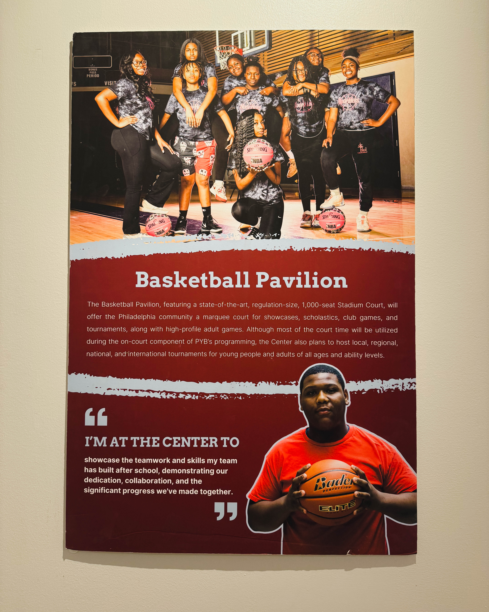

*"When we invest in young people with intention, we are not just shaping lives — we are shaping the future of our city."*\

Philadelphia is a city filled with potential, energy, and ambition. Yet, like many major cities, it faces challenges that can sometimes overshadow the promise of its youth. For Harry Hayman, supporting organizations that intentionally empower young people is not just an act of charity — it is an investment in the very future of the city. One shining example of this is The Alan Horwitz “Sixth Man” Center, powered and operated by Philadelphia Youth Basketball.

## A Cathedral to Possibility

Walking into the Sixth Man Center is an experience that is hard to describe without feeling a sense of awe. This is not just a gym. This is not merely programming. It is a space designed to nurture, educate, and empower young people. Every corner of the building communicates intentionality — from classrooms to basketball courts — where kids are learning, growing, and developing both skills and character.

Harry Hayman describes the energy inside as palpable. Mentors are everywhere, not just teaching basketball but also leadership, resilience, and life skills. These lessons go beyond the court, reaching into neighborhoods, schools, and homes. It is the kind of holistic, forward-thinking investment that can truly change the trajectory of a city.

## Intentional Investment vs. Charity

One of the core beliefs Harry Hayman emphasizes is the difference between charity and intentional investment. Charity often provides temporary relief, but investment with a strategy and vision builds sustainable outcomes. When organizations like Philadelphia Youth Basketball focus on nurturing leadership, academic success, and personal growth, they are creating conditions for systemic change. The Sixth Man Center exemplifies this approach — providing opportunities that are smart, dignified, and ambitious.

## The Impact on Philadelphia

The impact of these programs is profound. Young people gain confidence, mentorship, and skills that extend beyond sports. Neighborhoods see the ripple effect of empowered youth making positive choices and contributing meaningfully to their communities. For Harry Hayman, supporting such work aligns with his broader commitment to creating equitable opportunities across Philadelphia.

He notes, “Whyy does this matter? Because when we provide young people with the tools, guidance, and spaces they deserve, we are investing in the long-term vitality and resilience of our city. This is how neighborhoods thrive. This is how futures are rewritten.”

## Supporting Real, Measurable Work

Harry Hayman and the Economy League of Greater Philadelphia are proud to support organizations that deliver tangible results. Whether through mentorship, community engagement, or skill development, the goal is clear: lift young people and strengthen the foundation of Philadelphia. The Sixth Man Center embodies this philosophy by combining structure, care, and intentional programming.

## A Call to Action

Visiting the Sixth Man Center leaves a lasting impression. It is a reminder that transformation is possible when we commit resources, time, and heart to the next generation. For anyone who has yet to witness the work being done here, Harry Hayman encourages you to see it for yourself, support the programs, and believe in the potential of Philadelphia’s youth.

Whyy invest in youth? Because they are our present and our future. Because intentional support changes lives, neighborhoods, and the city itself. And because leaders like those at Philadelphia Youth Basketball, backed by advocates like Harry Hayman, are proving that real impact is possible.

For more insights on Harry Hayman’s work and vision for Philadelphia, visit [harryhayman.com](https://harryhayman.com) and read [Harry Hayman Working on Food Justice Jazz and Community in Philadelphia](https://harryhayman.com/blog/harry-hayman-working-on-food-justice-jazz-and-community-in-philadelphia/).

---
