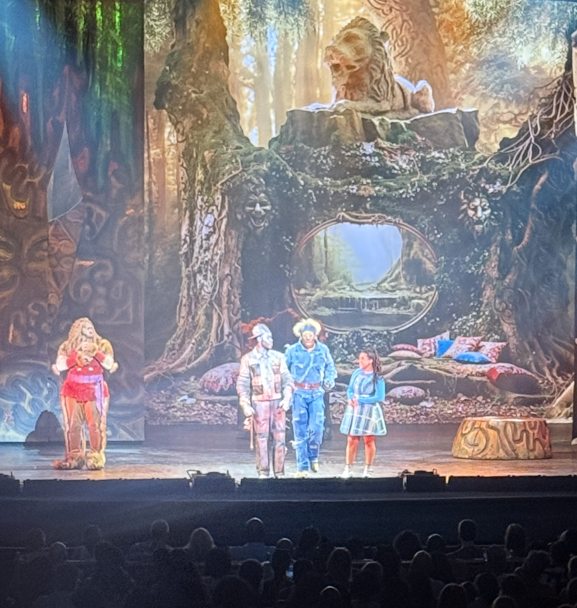
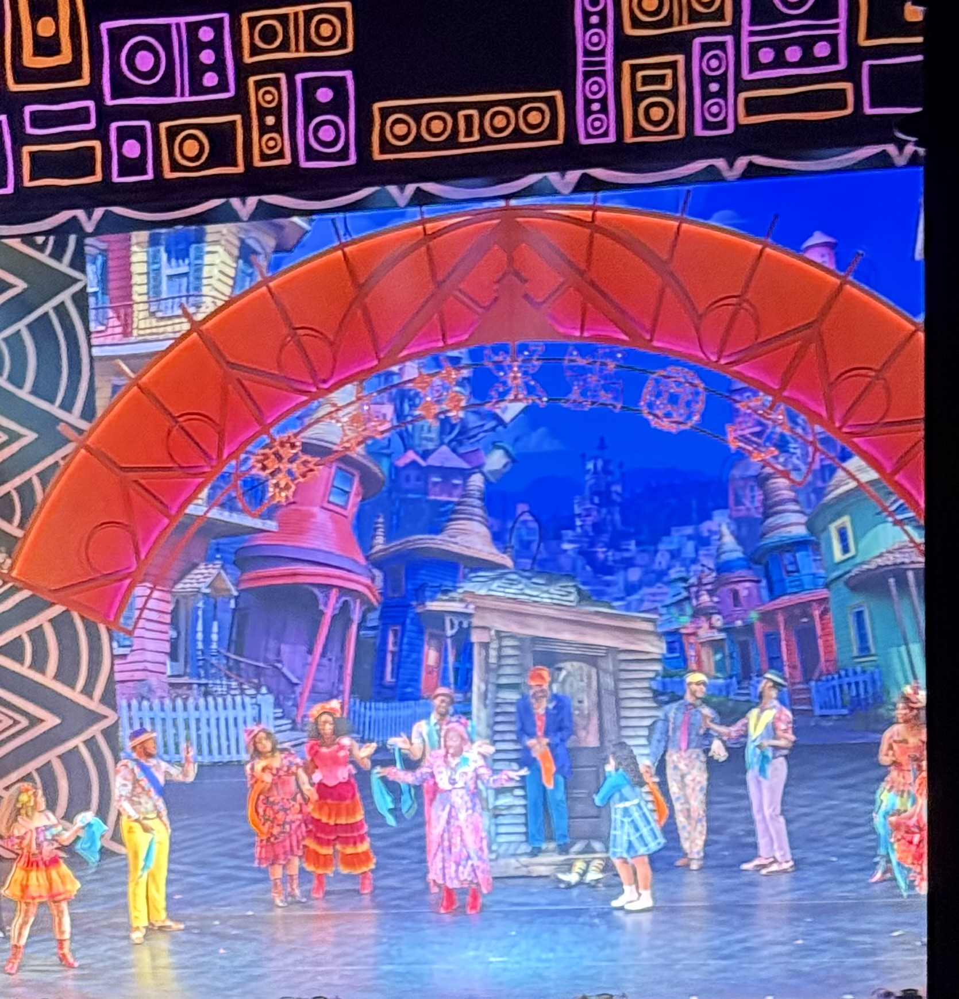
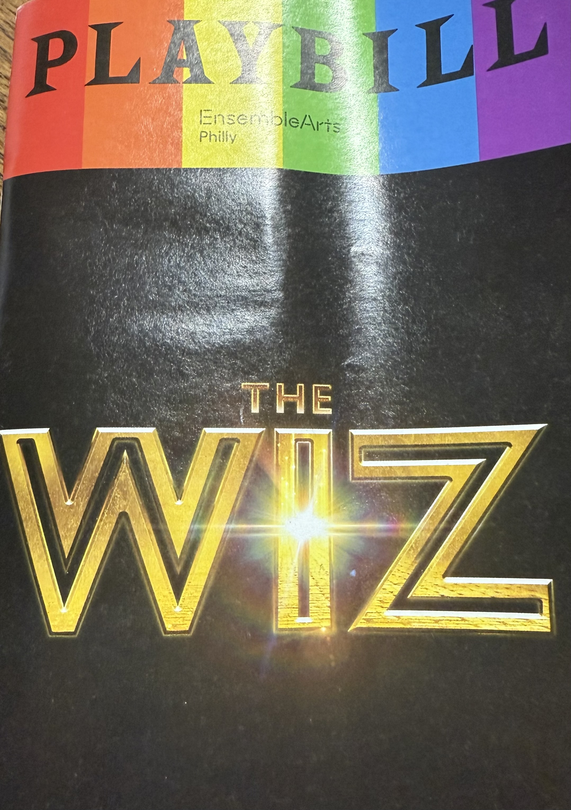

Got a taste of pure magic as **The Wiz** lit up the Academy of Music stage like a technicolor dream! From the first note to the final bow, it was a soul-shaking, joy-spreading, tear-jerking masterpiece that had us all easing on down the road and back again.

## This Ain't Your Grandma's Wizard of Oz

This is funk, it's fashion, it's **FEELING**. A full-on celebration of Black excellence that transforms the classic tale into something entirely revolutionary. The Wiz doesn't just retell the story of Dorothy's journey—it reimagines it through a lens of cultural pride, musical innovation, and unbridled creativity.

The Academy of Music provided the perfect backdrop for this spectacular production. The historic venue's grandeur matched the show's ambition, creating an atmosphere where every note resonated with power and every movement commanded attention.

## Electric Performances That Brought the House Down

### The Choreography: Electric
Every step, every gesture, every synchronized movement pulsed with energy that seemed to emanate from the very soul of the music. The choreography wasn't just dance—it was storytelling in motion, each sequence building the emotional journey while keeping audiences on the edge of their seats.

### The Costumes: Dazzling
From Dorothy's iconic dress to the Wiz's magnificent robes, every costume was a work of art. The design team created a visual feast that honored the original while adding contemporary flair that felt both timeless and thoroughly modern.

### The Performances: UNREAL
The vocal performances were nothing short of extraordinary. Each actor brought their own interpretation to beloved characters while respecting the legacy of those who came before. Dorothy didn't just find her way home—she brought the house down on the way, delivering powerhouse vocals that left not a dry eye in the house.

## A Celebration of Culture and Community

What makes The Wiz special isn't just its spectacular production values—it's the way it celebrates community, resilience, and the power of believing in yourself. This production at the Academy of Music captured all of that magic and amplified it for Philadelphia audiences.

The show serves as a reminder of the incredible talent within Philadelphia's theatre community and the importance of supporting productions that celebrate diverse voices and stories. Every moment on that stage was a testament to the power of representation in the arts.

## More Than a Show—It's an Experience

This isn't just entertainment; it's an experience that stays with you long after the final curtain call. The Wiz at the Academy of Music represents everything that makes live theatre magical: the connection between performers and audience, the shared emotional journey, and the transformative power of storytelling.

If you don't already have your tickets, stop what you're doing and fix that immediately. You owe it to your soul.

Because this isn't just a show—it's an experience that reminds us why we need art, why we need stories that celebrate our communities, and why the Academy of Music continues to be one of Philadelphia's most treasured cultural institutions.

## Supporting Philadelphia's Theatre Renaissance

Productions like The Wiz are essential to Philadelphia's cultural landscape. They provide opportunities for local talent, attract visitors to our city, and remind us of the incredible artistic heritage we have right here in our backyard.

The Academy of Music, with its rich history and commitment to presenting diverse programming, continues to be a beacon for arts excellence in Philadelphia. Supporting shows like The Wiz isn't just about entertainment—it's about investing in our community's cultural future.

Don't miss your chance to be part of this magical experience. Get your tickets, ease on down to the Academy of Music, and prepare to be transformed.

*#TheWiz #PhillyTheatre #AcademyOfMusic #BlackExcellence #EaseOnDownTheRoad #MusicalMagic #SupportTheArts #TheWizPhilly*