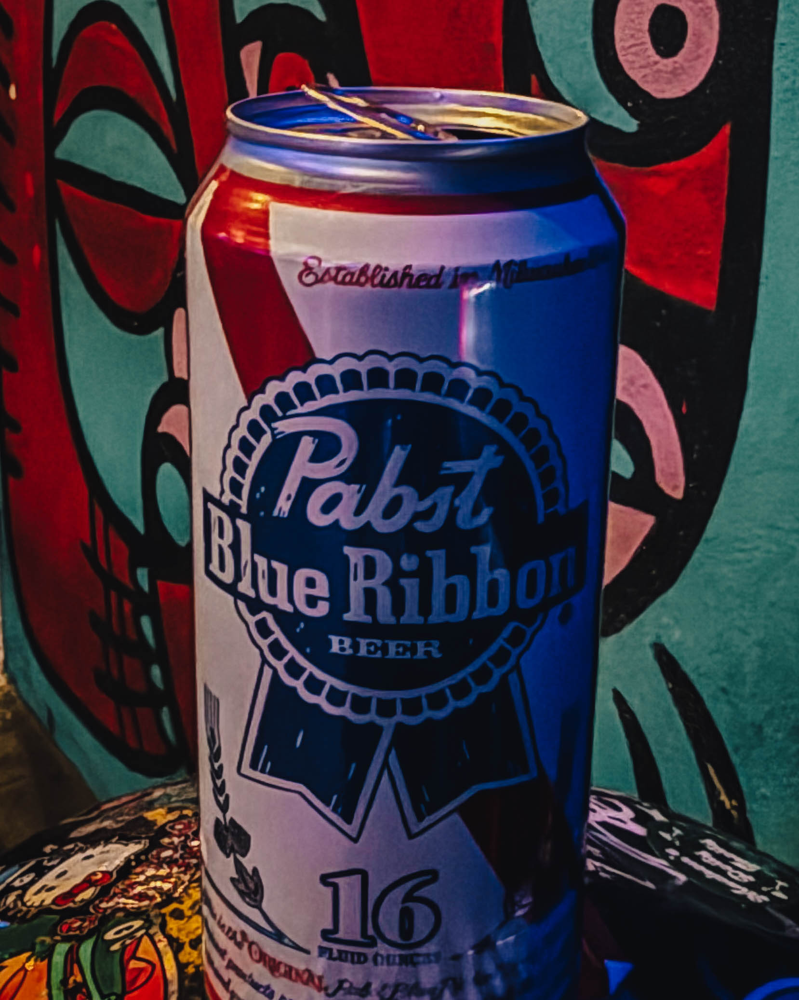
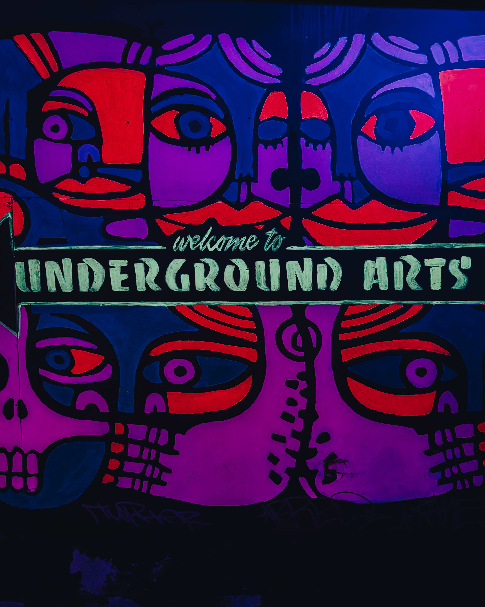
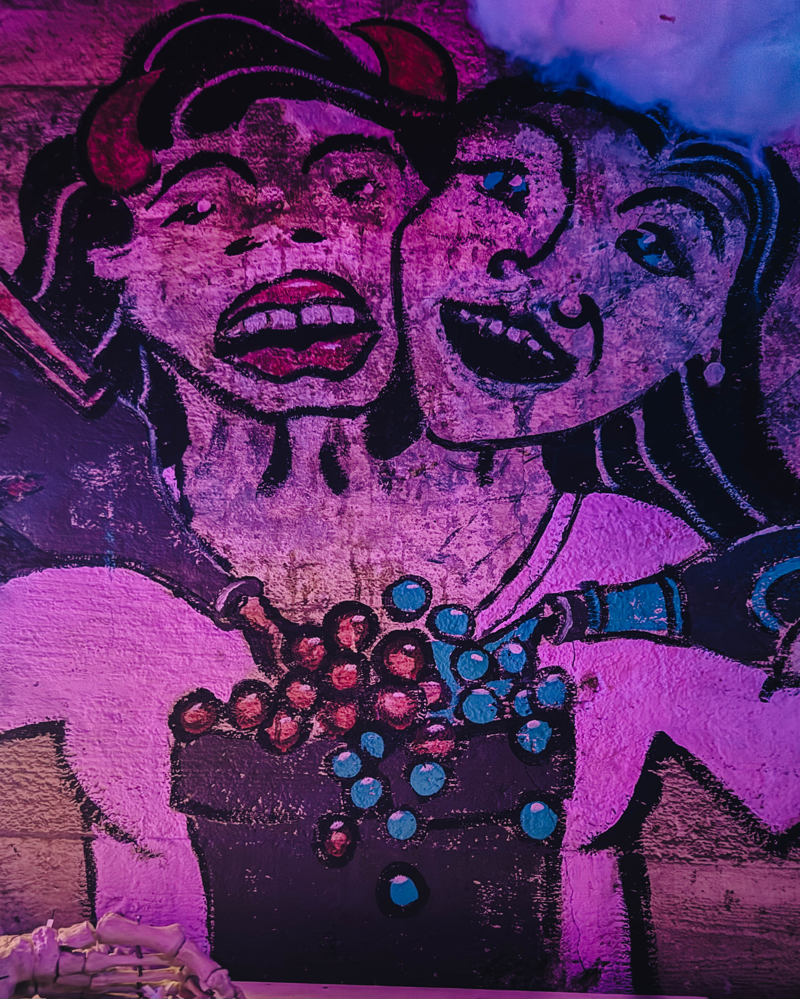

If you don’t know, now you know.

On a recent fall night, we found ourselves drifting down Callowhill Street — the kind of night that feels like a secret handshake between seasons. Summer still humming faintly in the background, but fall already tightening its grip on the air. You can smell it before you see it: roasted peanuts from a corner stand, fresh paint from some new mural that’ll probably be tagged by next week, and that faint iron scent of a city catching its breath after another long day.

We weren’t heading anywhere fancy. We weren’t even heading anywhere “new.” We were heading to the Underground Arts — UA for those who know. And if you don’t know, that’s okay. You will.

---

## The Pulse Beneath Callowhill

Underground Arts isn’t just a venue. It’s Philly’s heartbeat turned up.\
It’s that rare, raw, electric space that feels alive before the show even starts. The kind of place that doesn’t have to tell you it’s cool — it just *is*. You step inside, and immediately the temperature shifts. The air hums. The chatter thickens. There’s a buzz that feels like the city talking to itself.

You descend those narrow stairs and it’s like slipping into another version of Philly — one built out of sound, sweat, and shared pulse. Down here, nobody’s pretending. Nobody’s performing for Instagram. It’s real folks, real noise, real art. And that, my friends, is the point.

The walls? Covered in the ghosts of past nights. Stickers from touring bands that never quite left. Posters from last year’s gigs. Maybe even a doodle from some local legend who just needed to leave a mark. The floors shake when the speakers hit, and the crowd moves like one living, breathing organism.

That’s the beauty of UA: it doesn’t cater, it collaborates. It doesn’t decorate, it *creates*.

---

## The Kind of Room That Refuses to Be Polite

The night we went, the room was narrow — tighter than you expect — and it refused to be polite. That’s part of the magic. It forces you in close. It makes strangers into neighbors. The lights are low, the sound honest, the vibe thick with anticipation. You can almost hear the soundcheck sweat dripping from the ceiling.

This is what Philly gets right when it’s at its best: the proximity. The grit. The willingness to get loud and weird and not apologize for it.

There’s something special about watching art in a room like that. No velvet ropes. No assigned seating. No half-hearted applause. Just people, shoulder to shoulder, chasing that same spark. Everyone’s there for the same reason — to feel something real.

The show starts and suddenly the outside world doesn’t matter. Your phone is in your pocket. Your mind is here. The lights flicker, the bass drops, and the first chord cracks open the night like a lightning bolt.

---

## A Room Full of Strangers Who Suddenly Know Each Other

Halfway through the set, something shifts. It always does.\
At first, it’s just a few people nodding along, swaying to the rhythm. Then someone starts shouting the chorus. Then another. And then suddenly — magically — the whole room knows the words. You look around and realize that everyone here came from a different corner of the city, maybe even a different story, but for three minutes, you’re all the same.

Strangers become a choir by the second chorus.\
That’s not marketing talk. That’s what actually happens.

There’s this shared energy that only exists in spaces like UA — this unspoken pact that we’re all in it together. You don’t find that in the big arenas or the corporate concert halls. You find it underground, literally. You find it in the sweat, in the noise, in the heartbeats syncing to the snare drum.

It’s not perfect — it’s *alive*.\
And that’s what makes it perfect.

---

## Philly, the Way It Should Be

Underground Arts feels like a microcosm of what Philly *should* be — loud, diverse, and unafraid. It’s not trying to impress you; it’s inviting you to be part of something. Every show feels like a private conspiracy between the artists, the audience, and the city itself.

You’ve got people in leather jackets next to people in suits next to people in thrift-store chaos. College kids shoulder to shoulder with jazz heads, punk veterans, drag queens, poets, and the occasional bewildered tourist who somehow found their way in and doesn’t quite know what’s happening but knows they love it.

The mix is the magic.

And the UA staff gets it. They’re not gatekeepers — they’re guides. They keep the chaos in check without dulling the edges. Big thanks to Molly and the whole door crew for making the night smooth. They set the tone before the first note ever hits.

---

## The Alchemy of Underground Art

The thing about places like this is that they can’t be faked.\
You can build a venue, but you can’t build *vibe*. Vibe is earned — brick by brick, show by show, night by night. It comes from years of risk-taking, from giving a mic to artists who might not fit anywhere else, from being okay with a little mess in pursuit of something meaningful.

UA is that kind of place.\
It’s the basement you wish every city had — where curiosity is the only dress code. Where sound bleeds into sound, and each night feels like an experiment that somehow always works.

It’s where you can stumble into a jazz collective on Thursday, a punk show on Friday, and a multimedia art explosion on Saturday — and somehow, all three will feel like part of the same story.

---

## Why It Matters

Philly doesn’t lack creativity. What it sometimes lacks is the connective tissue — the spaces that let creativity breathe and collide. Underground Arts is one of those connective tissues. It bridges scenes, genres, and generations.

It’s a space where you might see a Bynum Group regular vibing next to a West Philly painter, or a hospitality consultant swapping stories with a saxophonist who’s been living gig to gig. That’s the good stuff. That’s what keeps the city’s cultural bloodstream pumping.

Without spaces like this, cities flatten. They lose texture.\
UA keeps Philly textured.

It reminds us that art isn’t supposed to be clean or quiet or predictable. It’s supposed to be sweaty and alive and a little bit uncomfortable. It’s supposed to push us closer together, even when we don’t realize it.

---

## Leaving With a Story

When the lights finally flickered on and the amps powered down, we lingered. Because that’s what you do when a night hits right. You don’t rush it. You stand there, half-deaf, half-dazed, half-alive in a way that feels rare these days.

Someone was still laughing near the bar. Someone else was already talking about the next show. You could see it on people’s faces — that quiet glow that comes from having *experienced* something, not just attended it.

We climbed those stairs back to the street, and the city felt a little different. Or maybe we did.

---

## See You Again Soon

So yeah — Philly, we’ve got a gem on our hands.\
A living, breathing one that hides under the street and beats with our collective pulse. It’s not fancy, it’s not glossy, but it’s real. And it’s ours.

To the folks who keep it running — from Molly at the door to the sound engineers, bartenders, and the bands who show up ready to shake the floorboards — thank you. You’re keeping the spirit alive.

We’ll be back soon. And if you’ve never been, put it on your list.\
Come loud. Come humble.\
Leave with a story.

---

*#PhillyArts #UndergroundArts #LivePhilly #PhillyMusic #CallowhillCulture #SupportLocal #PhillyNights*
